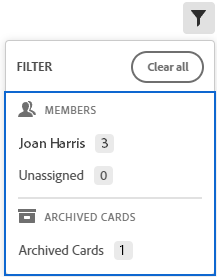

# Filter in a board

The information on this page refers to functionality not yet generally available. It is available only in the Preview Sandbox environment.

You can filter a board to only display cards assigned to certain people. You can also choose to display archived cards in the filter.

<!--

 Searching also helps you locate a specific card on the board.

-->

## Access requirements

You must have the following access to perform the steps in this article:

<table cellspacing="0"> 
 <col> 
 <col> 
 <tbody> 
  <tr> 
   <td role="rowheader">Adobe Workfront plan*</td> 
   <td> 
Any
 </td> 
  </tr> 
  <tr> 
   <td role="rowheader">Adobe Workfront license*</td> 
   <td> 
Request or higher
 </td> 
  </tr> 
 </tbody> 
</table>

&#42;To find out what plan, license type, or access you have, contact your Workfront administrator.

## Filter a board by assignees

1. Click the **Main Menu** icon  in the upper-right corner of Adobe Workfront, then click **Boards**.
1. Access a board. For information, see [Create or edit a board](../../agile/get-started-with-boards/create-edit-board.md).
1. Click the filter icon  and select the person or people whose cards you want to see. You can also display unassigned cards.

   Only the cards for those assignees are displayed.

   

## Filter a board to show archived cards

By default, only active cards are displayed on a board. You can filter the board to also display any archived cards.

1. Access the board.
1. Click the filter icon  and select **Archived cards** to display any archived cards.

   The filter shows the number of archived cards.

   

1. Select **Archived cards** again to clear the option and display only active cards.

<!--
<h2 data-mc-conditions="QuicksilverOrClassic.Draft mode">Search in a board</h2>
-->

   <!--
   <li value="1" data-mc-conditions="QuicksilverOrClassic.Draft mode">Access the board.</li>
   -->

1. 

   <!--
   
Click the search icon  and type a search term. Then, press Enter.

   -->

   <!--
   
The search locates all cards that contain the search term.

   -->

   <!--
   
Click the X to clear the search.

   -->

   <!--
   
  

   -->

