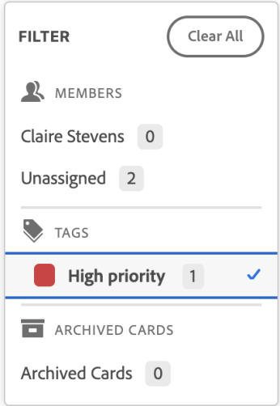
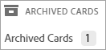

# Filter and search in a board

You can filter a board to only display cards assigned to certain people. You can also choose to display archived or tagged cards in the filter. When filters are applied on the board, an indicator is displayed on the filter icon .

Searching also helps you locate a specific card on the board.

## Access requirements

You must have the following access to perform the steps in this article:

<table cellspacing="0"> 
 <col> 
 <col> 
 <tbody> 
  <tr> 
   <td role="rowheader">Adobe Workfront plan*</td> 
   <td> 
Any
 </td> 
  </tr> 
  <tr> 
   <td role="rowheader">Adobe Workfront license*</td> 
   <td> 
Request or higher
 </td> 
  </tr> 
 </tbody> 
</table>

&#42;To find out what plan, license type, or access you have, contact your Workfront administrator.

## Filter a board by assignees

1. Click the **Main Menu** icon  in the upper-right corner of Adobe Workfront, then click **Boards**.
1. Access a board. For information, see [Create or edit a board](../../agile/get-started-with-boards/create-edit-board.md).
1. Click the filter icon  and select the person or people whose cards you want to see. You can also display unassigned cards.

## Filter a board by tags

1. Click the **Main Menu** icon  in the upper-right corner of Adobe Workfront, then click **Boards**.
1. Access a board. For information, see [Create or edit a board](../../agile/get-started-with-boards/create-edit-board.md).
1. Click the filter icon  and select the tags you want to see.

   

## Filter a board to show archived cards

By default, only active cards are displayed on a board. You can filter the board to also display any archived cards.

1. Access the board.
1. Click the filter icon  and select **Archived cards** to display any archived cards.

   The filter shows the number of archived cards.

   

1. Select **Archived cards** again to clear the option and display only active cards.

## Search in a board

1. Access the board.
1. Click the search icon  and type a search term. Then, press Enter.

   The search locates all cards that contain the search term.

   Click the X to clear the search.

   

