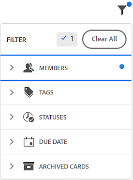
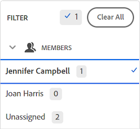
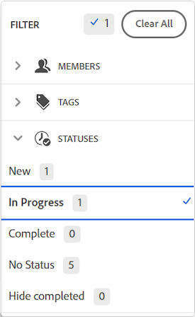
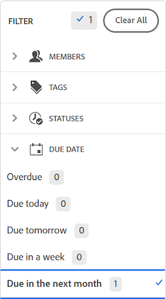

# Filter and search in a board

You can filter a board to only display:

* Cards assigned to certain people
* Cards with certain tags
* Cards with a specific status
* Cards due in a certain time frame
* Archived cards

When filters are applied on the board, an indicator is displayed on the filter icon . The indicator also appears in a section with applied filters, and the number at the top of the filter shows the total number of selected filters. Click **Clear All** to remove all filters from the board.

Searching also helps you locate a specific card on the board.

## Access requirements

You must have the following access to perform the steps in this article:

<table> 
 <col> 
 <col> 
 <tbody> 
  <tr> 
   <td role="rowheader"><strong>Adobe Workfront plan*</strong></td> 
   <td> 
Any
 </td> 
  </tr> 
  <tr> 
   <td role="rowheader"><strong>Adobe Workfront license*</strong></td> 
   <td> 
Request or higher
 </td> 
  </tr> 
 </tbody> 
</table>

&#42;To find out what plan, license type, or access you have, contact your Workfront administrator.

## Filter a board by assignees

1. Click the **Main Menu** icon  in the upper-right corner of Adobe Workfront, then click **Boards**.
1. Access a board. For information, see [Create or edit a board](../../agile/get-started-with-boards/create-edit-board.md).
1. Click the filter icon , expand the Members section, and select the person or people whose cards you want to see. You can also display unassigned cards.

    

## Filter a board by tags

1. Access the board.
1. Click the filter icon , expand the Tags section, and select the tags you want to see.

   

## Filter a board by status

1. Access the board.
1. Click the filter icon , expand the Statuses section, and select the status types you want to see.

   

## Filter a board by due date

1. Access the board.
1. Click the filter icon , expand the Due Date section, and select the date options you want to see.

   Only cards in the selected date ranges are displayed.

   

## Filter a board to show archived cards

By default, only active cards are displayed on a board. You can filter the board to also display any archived cards.

1. Access the board.
1. Click the filter icon , expand the Archived Cards section, and select **Archived cards** to display any archived cards.

   The filter shows the number of archived cards.

   

1. Select **Archived cards** again to clear the option and display only active cards.

## Search in a board

1. Access the board.
1. Click the search icon  and type a search term. Then, press Enter.

   All cards that contain the search term are displayed.

   Click the X to clear the search.

   

