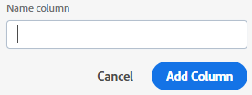
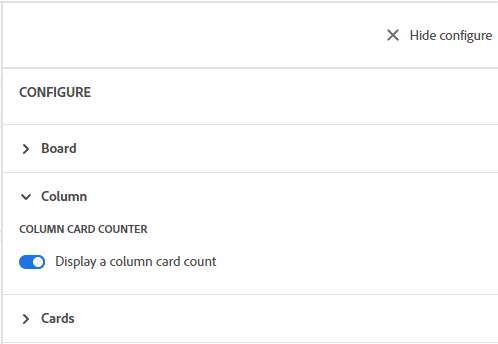
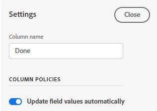
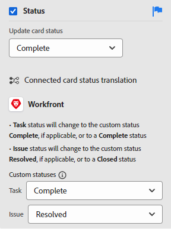
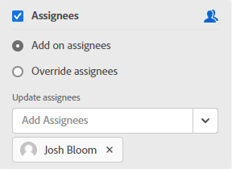
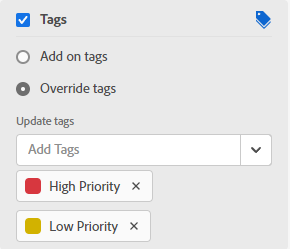

# Manage board columns

A new board contains three columns by default. You can add more columns, change the order of the columns, rename columns, and delete any columns that you don't need.

Column settings include policies, which allow you to define options for what happens to a card when it is moved into that column.

For information about sorting the cards in columns, see [Filter and search in a board](/help/quicksilver/agile/get-started-with-boards/filter-search-in-board.md).

## Access requirements

You must have the following access to perform the steps in this article:

<table style="table-layout:auto"> 
 <col> 
 </col> 
 <col> 
 </col> 
 <tbody> 
  <tr> 
   <td role="rowheader"><strong>[!DNL Adobe Workfront] plan*</strong></td> 
   <td> 
Any
 </td> 
  </tr> 
  <tr> 
   <td role="rowheader"><strong>[!DNL Adobe Workfront] license*</strong></td> 
   <td> 
[!UICONTROL Request] or higher
 </td> 
  </tr> 
 </tbody> 
</table>

&#42;To find out what plan, license type, or access you have, contact your [!DNL Workfront] administrator.

## Add a column to a board

1. Click the **[!UICONTROL Main Menu]** icon  in the upper-right corner of [!DNL Adobe Workfront], then click **[!UICONTROL Boards]**.
1. Access a board. For information, see [Create or edit a board](../../agile/get-started-with-boards/create-edit-board.md).
1. Click **[!UICONTROL Add Column]** to the right of the existing columns.
1. In the new column, type a name and click **[!UICONTROL Add Column]**.

   

>[!TIP]
>
>To add an intake column, see [Add an intake column to a board](/help/quicksilver/agile/use-boards-agile-planning-tools/add-intake-column-to-board.md).

## Reorder columns on a board

1. Access the board.
1. Drag and drop the columns into the correct order. Be sure to select the top of the column before dragging it to another location.

   

## Rename a board column

1. Access the board.
1. Click on the column name, type the new name, and press Enter.

   Or

   Click the **[!UICONTROL More]** menu  on the column and select **[!UICONTROL Edit]**. In the Settings area, type the new name in the **[!UICONTROL Column name]** field, and click **[!UICONTROL Close]**.

## Delete a board column

When you delete a column from a board, it can't be recovered.

1. Access the board.
1. Click the **[!UICONTROL More]** menu  on the column, and select **[!UICONTROL Delete]**.

   >[!NOTE]
   >
   >Columns that contain cards, including archived cards, can't be deleted. If you try to delete a column that contains cards, you must choose another column for those cards.

## Display card count

You can use a configuration setting to display the number of cards in each column.

If you are using the WIP limit on a column, a separate card counter is not added. For more information on WIP limits, see [Manage the [!UICONTROL Work in Progress] (WIP) limit on a board](/help/quicksilver/agile/use-boards-agile-planning-tools/manage-wip-limit-on-board.md).

1. Access the board.
1. Click **[!UICONTROL Configure]** on the right of the board to open the Configure panel.
1. Expand **[!UICONTROL Column]**.
1. Turn on **[!UICONTROL Display a column card count]**.

   

   The card counter appears at the top of each column.

1. Click **[!UICONTROL Hide configure]** to close the [!UICONTROL Configure] panel.

## Define column settings and policies

>[!NOTE]
>
>Dynamic boards always place cards in the column that matches their status, regardless of whether column policies are enabled or disabled. Cards will return to their assigned columns when you refresh the board.
> 
>Also, for all board types, if you move a card from one column to another column with the same status, the card will return to the original column when you refresh the board.

1. Access the board.
1. Click the **[!UICONTROL More]** menu  on the column, and select **[!UICONTROL Edit]**.

   The [!UICONTROL Settings] area appears. The **[!UICONTROL Column name]** lets you know which column you are defining settings for.

1. Enable the **[!UICONTROL Update field values automatically]** policy to change certain field values automatically when a card is moved to this column.

   

1. (Optional) Set a value for the card status:

   1. Select the **[!UICONTROL Status]** check box.

   1. Select the status to apply to a card when it is moved to this column.

      

      The status translation options for connected cards are also displayed. (Status translation does not apply to ad hoc cards.) These options determine the custom status applied to the task or issue in [!DNL Workfront] when a connected card is moved to this column.

   1. Select a [!UICONTROL **Custom**] status to apply to the card for tasks and for issues.

      When a card is moved to this column, [!DNL Workfront] first tries to apply the custom status (for example, Resolved). If the selected custom status is not available for that card, you are prompted to choose another status that corresponds to the system status (from step b above). For more information on statuses, see [Statuses overview](/help/quicksilver/administration-and-setup/customize-workfront/creating-custom-status-and-priority-labels/statuses-overview.md).

      Also, if the status on the connected task or issue is changed to the custom or system status set in the column policy, the card is automatically moved to the column.

1. (Optional) Set a value for the card assignees:

   1. Select the **[!UICONTROL Assignees]** check box.
   1. Select an action.

      * **[!UICONTROL Add on assignees]:** The assignees you select are added to the existing list of assignees on a card when it is moved to this column.
      * **[!UICONTROL Override assignees]:** The assignees you select override all other assignees, and become the only assignees on a card when it is moved to this column.

   1. Click [!UICONTROL **Add Assignment**] and search for a user. Select the assignees from the search results. All Workfront users and teams are available to choose from.

      

1. (Optional) Set a value for the card tags:

   1. Select the **[!UICONTROL Cards]** check box.
   1. Select an action.

      * **[!UICONTROL Add on tags]:** The tags you select are added to the existing list of tags on a card when it is moved to this column.
      * **[!UICONTROL Override tags]:** The tags you select override all other tags, and become the only tags on a card when it is moved to this column.

   1. Select the tags from the drop-down list. Only tags already created in the [!UICONTROL Tag Manager] are available to choose from. For information on adding new tags, see [Add tags](/help/quicksilver/agile/get-started-with-boards/add-tags.md).

      

1. Enable the **[!UICONTROL Work in progress limit]** policy to limit the number of cards that can be added to the column. Then, type the limit number in the **[!UICONTROL Set limit]** field.

   

   For more information, see [Manage the Work in Progress (WIP) limit on a board](/help/quicksilver/agile/use-boards-agile-planning-tools/manage-wip-limit-on-board.md).

1. Click **[!UICONTROL Close]** to exit the Settings area and view the column and its cards.
