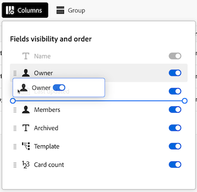

# Manage the Boards Admin View

The Boards Admin View contains a list of every Board in your account that System Administrators can use to get a quick snapshot of the overall Boards details, including when they were last updated, how many cards each one has, and more.

From this area, you can perform the following actions: 

* Filter the Boards list
* Configure the Boards list columns
* Group the Boards list 

## Access requirements

+++ Expand to view access requirements.

<table style="table-layout:auto"> 
 <col> 
 </col> 
 <col> 
 </col> 
 <tbody> 
  <tr> 
   <td role="rowheader">Adobe Workfront plan</td> 
   <td> 
Any
 </td> 
  </tr> 
  <tr> 
   <td role="rowheader">Adobe Workfront license</td> 
   <td> 
Standard

        
 Plan 
</td> 
  </tr> 
    <tr> 
   <td role="rowheader">Access level configurations</td> 
   <td> 
System Administrator 

        </td> 
  </tr> 
 </tbody> 
</table>

For more detail about the information in this table, see [Access requirements in Workfront documentation](/help/quicksilver/administration-and-setup/add-users/access-levels-and-object-permissions/access-level-requirements-in-documentation.md).

+++

## Prerequisites 

You must create a Board before you can view it from the Admin View.  

For more information, see [Create or edit a board](/help/quicksilver/agile/get-started-with-boards/create-edit-board.md).  

## Filter the Boards list 

{{step1-to-boards}}

1. On the **Boards** page, select the **Admin View** tab. 

1. Select **Filter**. The **Filters** panel opens. 

1. Follow the steps below to configure the filter: 

    1. (Optional) Click the **Calendar** icon  and then select a date range to filter by Boards that were last modified within that timeframe.  

    1. (Optional) In the **Template** section, select the type of Board template that the list will filter by. You can select more than one template type. 
    For more information about Board template types, see [Create or edit a board](/help/quicksilver/agile/get-started-with-boards/create-edit-board.md). 

    1. (Optional) In the **Is Archived** section, select if archived or non-archived Boards will display. You can select more than one option. 

        
    
1. Click outside the **Filters** panel to close it. Your filter selections will remain applied to the Boards list until it's changed back to the default view. 

    >[!NOTE]
    >
    >To remove a filter, open the **Filters** panel and click **Back to default** in the upper-right corner.  
 
## Configure the Boards list columns 

{{step1-to-boards}}

1. On the **Boards** page, select the **Admin View** tab. 

1. Select **Columns**. The **Fields visibility and order** panel opens.  

1. Configure which columns appear in the Boards list by selecting or deselecting the toggle in-line with each column: 

    * **Owner**
    * **Last updated** 
    * **Members** 
    * **Archived** 
    * **Template** 
    * **Card count** 

1. (Optional) To adjust the order the fields appear in, click and hold the **Drag** icon to the left of a field, then drag it to a new position. 

    

1. Click outside the **Fields visibility and order** panel to close it. Your column configurations will remain applied to the Boards list until they're modified.  

    >[!NOTE]
    >
    > When the Boards list columns display is modified, a blue dot appears above the **Columns** icon to indicate that the current view has been modified from the default.

## Group the Boards list by a specific field 

{{step1-to-boards}}

1. On the **Boards** page, select the **Admin View** tab. 

1. Select **Group**. The **Group by** panel opens. 

1. Select the field you want to group the Boards list by:

    * **Archived**
    * **Owner** 
    * **Template**

1. (Optional) To expand or collapse the grouping from the **Group by** panel, click **Collapse all** or **Expand all**.  

    
 
1. (Optional) To change the grouping's display order from A-Z to Z-A, select the field the list is currently grouped by, then select **Z-A** from the drop-down.  

    

1. Click outside the **Group by** panel to close it. From here, you can collapse or expand the applied grouping in the list by selecting the arrow next to the grouping title. 

    

    >[!NOTE]
    >   
    >When the Boards list grouping display is modified, a blue dot appears above the **Group** icon to indicate that the current view is different from the default.  
    >If you want to remove a grouping, open the **Group by** panel and select **Clear all** in the upper-right corner.
