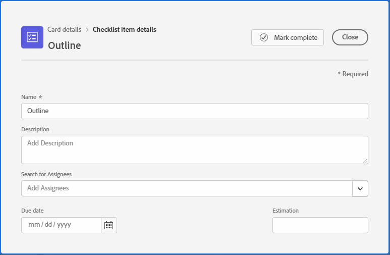
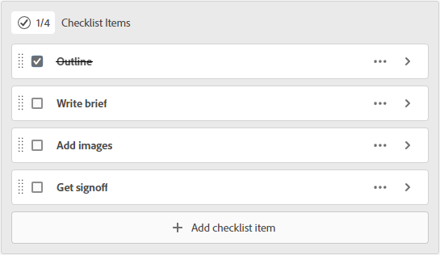

# Manage checklist items on cards

Using a checklist on a card allows you to break down work into smaller increments or add notes to the card. Checklist items are available on both ad hoc and connected cards.

For information on cards, see [Add an ad hoc card to a board](/help/quicksilver/agile/get-started-with-boards/add-card-to-board.md), [Use connected cards on boards](/help/quicksilver/agile/get-started-with-boards/connected-cards.md), and [Manage cards](/help/quicksilver/agile/get-started-with-boards/move-board-items.md).

## Access requirements

+++ Expand to view access requirements for the functionality in this article.

You must have the following access to perform the steps in this article:

<table style="table-layout:auto"> 
 <col> 
 <col> 
 <tbody> 
  <tr> 
   <td role="rowheader">[!DNL Adobe Workfront]</td> 
   <td> 
Any
 </td> 
  </tr> 
  <tr> 
   <td role="rowheader">[!DNL Adobe Workfront] license</td> 
   <td> 
   
New: [!UICONTROL Contributor] or higher
 
   
or

   
Current: [!UICONTROL Request] or higher

   </td> 
  </tr> 
 </tbody> 
</table>

For more detail about the information in this table, see [Access requirements in Workfront documentation](/help/quicksilver/administration-and-setup/add-users/access-levels-and-object-permissions/access-level-requirements-in-documentation.md).

+++

## Add a checklist to a card

{{step1-to-boards}}

1. Access a board. For information, see [Create or edit a board](../../agile/get-started-with-boards/create-edit-board.md).
1. Click the card to open the [!UICONTROL Card Details] box.

   Or

   Click the **[!UICONTROL More]** menu  on the card, and select **[!UICONTROL Edit]**.

1. To add a new item, click **[!UICONTROL Add checklist item]**. Then, type the title of the item and press Enter. Another item is automatically added. Continue entering titles to add more items.   

   The counter at the top of the checklist shows the number of completed items and the total number of items.

1. Click  to open the [!UICONTROL Checklist Item Details] box.

   

1. (Optional) Add a description, assignees, due date, and estimation hours for the checklist item.

   For information about any of these fields, see [Add an ad hoc card to a board](/help/quicksilver/agile/get-started-with-boards/add-card-to-board.md) or [Use connected cards on boards](/help/quicksilver/agile/get-started-with-boards/connected-cards.md).

1. Click **[!UICONTROL Close]** to return to the card details and the full list of checklist items.

   The assignees and due date appear on the item.

1. To copy an item, click the **[!UICONTROL More]** menu  on the item and select **[!UICONTROL Copy]**.
1. To delete a checklist item, click the **[!UICONTROL More]** menu  on the item and select **[!UICONTROL Delete]**.

## Complete checklist items

1. Access the board and locate the card the checklist is on.
1. Click the card to open the [!UICONTROL Card Details] box.

   Or

   Click the **[!UICONTROL More]** menu  on the card, and select **[!UICONTROL Edit]**.

1. Select the check box next to the item that is complete.

   The counter updates to show the completed items.

   You can clear the check box if you need to add the item back to the list.

   

1. Click **[!UICONTROL Close]** to return to the board.

   The counter on the card is also updated.
