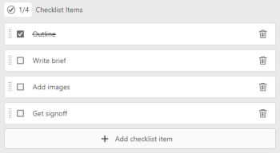

# Manage checklist items on cards

{{highlighted-preview}}

Using a checklist on a card allows you to break down work into smaller increments or add notes to the card. Checklist items are available on both ad hoc and connected cards.

For information on cards, see [Add an ad hoc card to a board](/help/quicksilver/agile/get-started-with-boards/add-card-to-board.md), [Use connected cards on boards](/help/quicksilver/agile/get-started-with-boards/connected-cards.md), and [Manage cards](/help/quicksilver/agile/get-started-with-boards/move-board-items.md).

## Access requirements

You must have the following access to perform the steps in this article:

<table style="table-layout:auto"> 
 <col> 
 </col> 
 <col> 
 </col> 
 <tbody> 
  <tr> 
   <td role="rowheader"><strong>Adobe Workfront plan*</strong></td> 
   <td> 
Any
 </td> 
  </tr> 
  <tr> 
   <td role="rowheader"><strong>Adobe Workfront license*</strong></td> 
   <td> 
Request or higher
 </td> 
  </tr> 
 </tbody> 
</table>

&#42;To find out what plan, license type, or access you have, contact your Workfront administrator.

## Add a checklist to a card

1. Click the **Main Menu** icon  in the upper-right corner of Adobe Workfront, then click **Boards**.
1. Access a board. For information, see [Create or edit a board](../../agile/get-started-with-boards/create-edit-board.md).
1. Click the card to open the Card Details box.

   Or

   Click the **More** menu  on the card, and select **Edit**.

1. To add a new item, click **Add checklist item**. Then, type the title of the item and press Enter. Another item is automatically added. Continue entering titles to add more items.   

   The counter at the top of the checklist shows the number of completed items and the total number of items.

1. Click  to open the Checklist Item Details box.

   >[!NOTE]
   >
   >Checklist item details are available only via the early feature opt-in. For details, see [Early feature opt-in for Adobe Workfront Boards](/help/quicksilver/agile/get-started-with-boards/boards-early-feature-opt-in.md).

   

1. (Optional) Add a description, assignees, due date, and estimation hours for the checklist item.

   For information about any of these fields, see [Add an ad hoc card to a board](/help/quicksilver/agile/get-started-with-boards/add-card-to-board.md) or [Use connected cards on boards](/help/quicksilver/agile/get-started-with-boards/connected-cards.md).

1. Click **Close** to return to the card details and the full list of checklist items.
1. To copy an item, click the **More** menu  on the item and select **Copy**.
1. To delete a checklist item in the Production environment, click the **Delete** icon .
1. To delete a checklist item in the Preview environment, click the **More** menu  on the item and select **Delete**.

## Complete checklist items

1. Access the board and locate the card the checklist is on.
1. Click the card to open the Card Details box.

   Or

   Click the **More** menu  on the card, and select **Edit**.

1. Select the check box next to the item that is complete.

   The counter updates to show the completed items.

   You can clear the check box if you need to add the item back to the list.

   Sample image in the Production environment:
   

   Sample image in the Preview environment:
   

1. Click **Close** to return to the board.

   The counter on the card is also updated.
