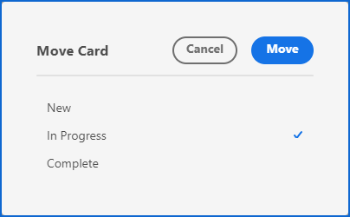
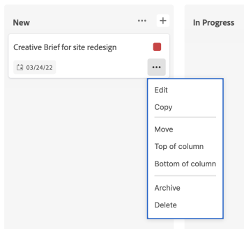

# Manage cards

You can move a card to any column on the board, or copy a card.

If you have column policies enabled for updating field values, the status, assignees, and tags could be updated automatically when you move a card from one column to another. For more information, see "Define column settings and policies" in the article [Manage board columns](/help/quicksilver/agile/get-started-with-boards/manage-board-columns.md).

>[!NOTE]
>
>You can't move a card from one board to another board.

## Access requirements

+++ Expand to view access requirements for the functionality in this article.

You must have the following access to perform the steps in this article:

<table style="table-layout:auto"> 
 <col> 
 <col> 
 <tbody> 
  <tr> 
   <td role="rowheader">[!DNL Adobe Workfront]</td> 
   <td> 
Any
 </td> 
  </tr> 
  <tr> 
   <td role="rowheader">[!DNL Adobe Workfront] license</td> 
   <td> 
   
New: [!UICONTROL Contributor] or higher
 
   
or

   
Current: [!UICONTROL Request] or higher

   </td> 
  </tr> 
 </tbody> 
</table>

For more detail about the information in this table, see [Access requirements in Workfront documentation](/help/quicksilver/administration-and-setup/add-users/access-levels-and-object-permissions/access-level-requirements-in-documentation.md).

+++

## Move cards between columns

{{step1-to-boards}}

1. Access a board. For information, see [Create or edit a board](../../agile/get-started-with-boards/create-edit-board.md).
1. Drag and drop the card into another column, in the position you want it to appear.

   Or

   Click the **[!UICONTROL More]** menu  on the card, and select **[!UICONTROL Move]**. Then, on the **[!UICONTROL Move Item]** box, choose another column and select **[!UICONTROL Move]**.

   

   >[!NOTE]
   >
   >When you use the **[!UICONTROL Move Item]** box, the card is always moved to the top of the column.

## Move cards to the top or bottom of a column

1. Access the board.
1. Drag and drop the card into the position you want it to appear in the column.

   Or

   Click the **[!UICONTROL More]** menu  on the card, and select **[!UICONTROL Top of column]** or **[!UICONTROL Bottom of column]**.

   

## Copy a card

Copying an ad hoc card duplicates all fields on the card, including checklist items.

>[!NOTE]
>
>You can't copy connected cards.

1. Access the board.
1. Click the **[!UICONTROL More]** menu ![[!UICONTROL More menu]](assets/more-icon-spectrum.png) on the card, and select **[!UICONTROL Copy]**.

   

   A new card is added in the same column with the title "copy of - [original card name]."
