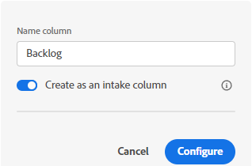
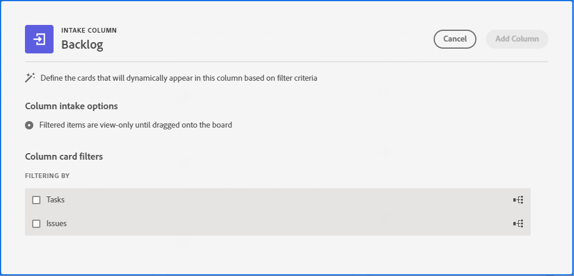
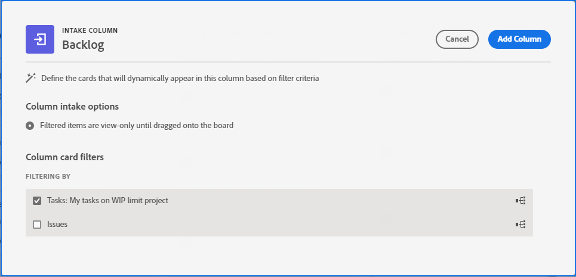
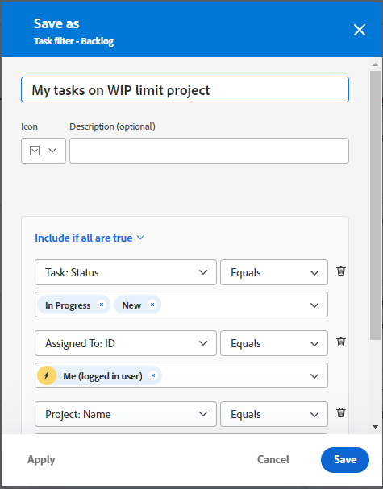
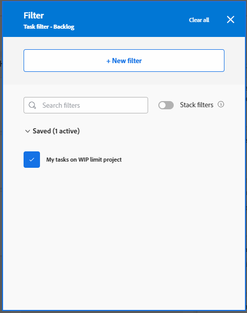
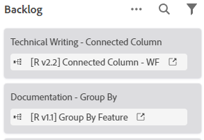

# Add an intake column to a board

>[!NOTE]
>
>An intake column is available only in the Preview environment.

You can optionally add an intake column to your board that automatically pulls in tasks and issues as connected cards when they are added in Workfront, based on filters that you defin. The intake column can serve as a backlog column for a Kanban team, an intake location for a support team to see issues as they are added to a request queue, or any other purpose you need.

Only one intake column is permitted on a board, and it always appears as the left-most column.

>[!NOTE]
>
>An intake column is available only via the early feature opt-in. For details, see [Early feature opt-in for Adobe Workfront Boards](/help/quicksilver/agile/get-started-with-boards/boards-early-feature-opt-in.md).

For more information on columns, see [Manage board columns](/help/quicksilver/agile/get-started-with-boards/manage-board-columns.md). For information on connected cards, see [Use connected cards on boards](/help/quicksilver/agile/get-started-with-boards/connected-cards.md).

## Access requirements

You must have the following access to perform the steps in this article:

<table style="table-layout:auto"> 
 <col> 
 </col> 
 <col> 
 </col> 
 <tbody> 
  <tr> 
   <td role="rowheader"><strong>Adobe Workfront plan*</strong></td> 
   <td> 
Any
 </td> 
  </tr> 
  <tr> 
   <td role="rowheader"><strong>Adobe Workfront license*</strong></td> 
   <td> 
Request or higher
 </td> 
  </tr> 
 </tbody> 
</table>

&#42;To find out what plan, license type, or access you have, contact your Workfront administrator.

## Create an intake column

1. Click the **Main Menu** icon  in the upper-right corner of Adobe Workfront, then click **Boards**.
1. Access a board. For information, see [Create or edit a board](../../agile/get-started-with-boards/create-edit-board.md).
1. Click **Add Column** to the right of the existing columns.
1. Type a name for the column.
1. Enable the **Create as an intake column** field.

   

1. Click **Configure**.
1. On the Intake Column dialog, select whether you want to filter by tasks or issues.

   

1. The filter panel appears. Click **New filter** to get started.

   

1. Build your filter and click **Save as new**.

   

   This example shows a filter for tasks from a specific project that are in the status of New or In Progress, and are assigned to me.

   For details about building a filter, see the section “Create or edit a filter in the beta builder” in the article [Create or edit filters in Adobe Workfront](/help/quicksilver/reports-and-dashboards/reports/reporting-elements/create-filters.md).

1. Name the filter and click **Save**.

   

   Giving the filter a unique name allows you to search for it later.

1. The filter appears in your list of saved filters. Click the X at the top of the filter panel to close it.

   

   >[!NOTE]
   >
   >The filter you added is visible and editable for all members of the board.

   On the Intake Column dialog, the Filtering By section shows the name of the filter you added.

   

1. (Optional) To include both tasks and issues on the intake column, select the other object to create another filter.
1. When you are finished adding filters, click **Add column** on the Intake Column dialog.

   The column is added on the left of the board. All items on the intake column are view-only until you move them into other board columns. You can manually re-order the items on the intake column.

   

1. (Optional) To search for an item in the intake column, click  on the column.
1. (Optional) To edit the filters and change which items are pulled into the column, click  on the column and select **Task filter** or **Issue filter**.
1. (Optional) To delete the column, click the **More** menu  on the column and select **Delete**.
