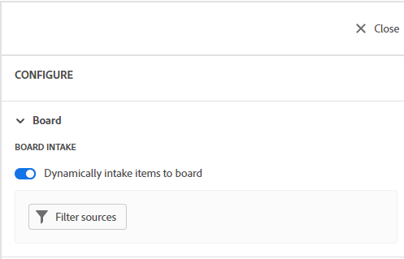
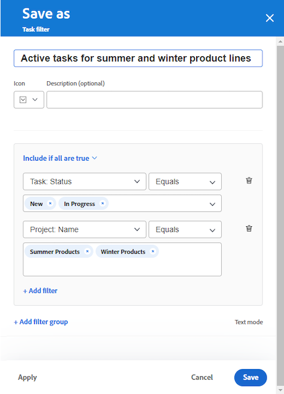
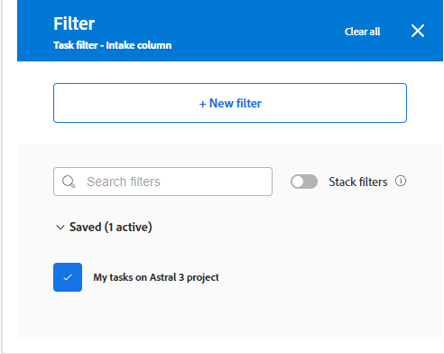
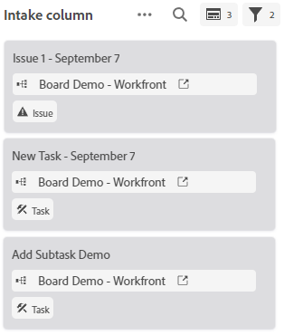

# Add an intake column to a board

You can optionally add an intake column to your board that automatically pulls in tasks and issues as connected cards when they are added in [!DNL Workfront], based on filters that you define. The intake column can serve as a backlog column for a Kanban team, an intake location for a support team to see issues as they are added to a request queue, or any other purpose you need.

Only one [!UICONTROL intake] column is permitted on a board, and it always appears as the left-most column.

The intake column is limited to 300 tasks and 300 issues. They are sorted by the priority defined on the items. For information about priority, see [Update task priority](/help/quicksilver/manage-work/tasks/task-information/task-priority.md) and [Update issue priority](/help/quicksilver/manage-work/issues/issue-information/update-issue-priority.md).

For more information on columns, see [Manage board columns](/help/quicksilver/agile/get-started-with-boards/manage-board-columns.md). For information on connected cards, see [Use connected cards on boards](/help/quicksilver/agile/get-started-with-boards/connected-cards.md).

## Access requirements

You must have the following access to perform the steps in this article:

<table style="table-layout:auto"> 
 <col> 
 </col> 
 <col> 
 </col> 
 <tbody> 
  <tr> 
   <td role="rowheader"><strong>[!DNL Adobe Workfront plan*]</strong></td> 
   <td> 
Any
 </td> 
  </tr> 
  <tr> 
   <td role="rowheader"><strong>[!DNL Adobe Workfront] license*</strong></td> 
   <td> 
Request or higher
 </td> 
  </tr> 
 </tbody> 
</table>

&#42;To find out what plan, license type, or access you have, contact your [!DNL Workfront] administrator.

## Create an intake column

1. Click the **Main Menu** icon  in the upper-right corner of Adobe Workfront, then click **Boards**.
1. Access a board. For information, see [Create or edit a board](../../agile/get-started-with-boards/create-edit-board.md).
1. Click **[!UICONTROL Configure]** on the right of the board to open the Configure panel.
1. Expand **Board**.
1. Turn on **Dynamically intake items to board**.

   

   The [!UICONTROL intake] column is added on the left of the board. It remains blank until you apply filters to it.

1. Click **[!UICONTROL Filter sources]** and select **Tasks** or **Issues**.

   >[!NOTE]
   >
   >You can filter the intake column to include both tasks and issues, but you must set up the filters separately for each object type.

1. On the filter panel, click **[!UICONTROL New filter]** to get started.

   ![Click [!UICONTROL New filter]](assets/intake-filter-dialog5.png)

1. Build your filter and click **Save as new**.

   

   This example shows a filter for tasks from a specific project that are in the status of New or [!UICONTROL In Progress], and are assigned to me.

   For details about building a filter, see the section "Create or edit a filter in the beta builder" in the article [[!UICONTROL Create or edit filters] in Adobe Workfront](/help/quicksilver/reports-and-dashboards/reports/reporting-elements/create-filters.md).

1. Name the filter and click **Save**.

   

   Giving the filter a unique name allows you to search for it later.

1. The filter appears in your list of saved filters, and it is automatically applied to the intake column. Click the X at the top of the filter panel to close it.

   

   >[!NOTE]
   >
   >The filter you added is visible and editable for all members of the board.

1. (Optional) To include both tasks and issues on the intake column, click **[!UICONTROL Filter sources]** and select the other object to create another filter.
1. When you are finished adding filters, review the [!UICONTROL intake] column to verify that the correct tasks and issues appear.

   

   Cards in the intake column are not editable until you move them into other board columns, although you can click ![[!UICONTROL Open task] or [!UICONTROL issue]](assets/boards-launch-icon.png) to open the task or issue. You can manually re-order the items on the intake column.

   The icons on the top right of the [!UICONTROL intake] column show you how many cards are currently in the column, and how many filters are applied.

   >[!NOTE]
   >
   >You can update the filters at any time by opening the [!UICONTROL Configure] panel, clicking **[!UICONTROL Filter sources]**, and selecting **Tasks** or **Issues**.

1. (Optional) To search for an item in the intake column, click ![[!UICONTROL Search] icon](assets/search-icon.png) on the column.
1. (Optional) To delete the intake column, click the **More** menu  and select **Delete**.
