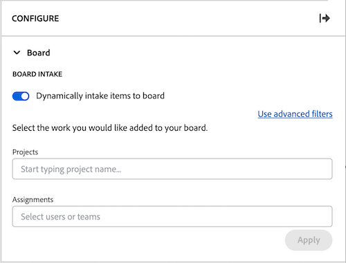
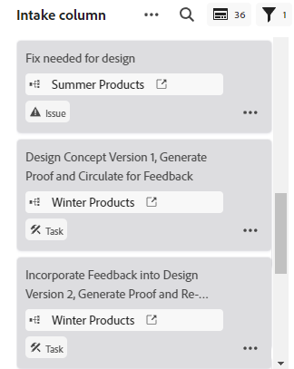
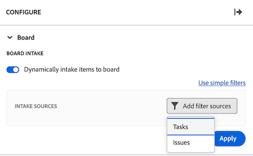
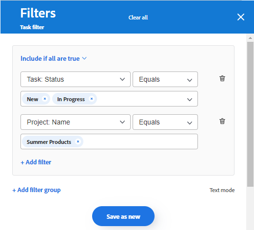
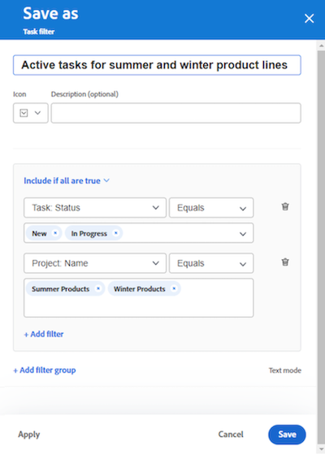

# Add an intake column to a board

<!-- Audited: 5/2025 -->

You can optionally add an intake column to your board that automatically pulls in tasks and issues as connected cards when they are added in [!DNL Workfront] based on filters that you define. The intake column can serve as a backlog column for a Kanban team, an intake location for a support team to see issues as they are added to a request queue, or any other purpose you need.

Only one intake column is permitted on a board, and it always appears as the left-most column.

The intake column is not available on a dynamic board. However, you can update the filters that define which cards are brought onto a dynamic board. When you change these filters on a dynamic board, card settings that are not part of the Workfront task or issue (such as tags) are reset.

>[!NOTE]
>
>For security reasons, only the owner of a board can change the board filters in the Configure panel.

The intake column is limited to 300 tasks and 300 issues. The default ordering of items in the intake column is as follows:

Tasks:

* Primary order: Project name
* Secondary order: Work Breakdown Structure

Issues:

* Primary order: Project name
* Secondary order: Reference number

>[!IMPORTANT]
>
>It is recommended to refresh the board frequently if multiple users are working on the board at the same time. Refreshing the page helps to keep the visual changes on the board up to date and prevents issues such as duplicate cards being moved onto the board from the intake column.
>
>To synchronize with Workfront and bring new tasks and issues onto the board or intake column, click the More menu ![[!UICONTROL More menu]](assets/more-menu.png) next to the board name and select Sync connected items.

For more information on columns, see [Manage board columns](/help/quicksilver/agile/get-started-with-boards/manage-board-columns.md). For information on connected cards, see [Use connected cards on boards](/help/quicksilver/agile/get-started-with-boards/connected-cards.md).

## Access requirements

+++ Expand to view access requirements for the functionality in this article.

<table style="table-layout:auto"> 
 <col> 
 <col> 
 <tbody> 
  <tr> 
   <td role="rowheader">Adobe Workfront package</td> 
   <td> 
Any
 </td> 
  </tr> 
  <tr> 
   <td role="rowheader">Adobe Workfront license</td> 
   <td> 
   
Contributor or higher
 
   
Request or higher

   </td> 
  </tr> 
 </tbody> 
</table>

For more detail about the information in this table, see [Access requirements in Workfront documentation](/help/quicksilver/administration-and-setup/add-users/access-levels-and-object-permissions/access-level-requirements-in-documentation.md).

+++

## Create an intake column using simple filters

{{step1-to-boards}}

1. On the dashboard, select a board. 
1. Click **Configure** on the right of the board to open the **Configure** panel.
1. Select the **Board** section. New fields appear. 
1. Turn on **Dynamically intake items to board**. The blank intake column appears on the left side of the board.

   

1. (Optional) Search for and select [!DNL Workfront] [!UICONTROL **Projects**].
1. (Optional) Search for and select user or team [!UICONTROL **Assignments**].
1. Click **Apply**. The objects appear in the board intake column as connected cards.

   

## Create an intake column using advanced filters

{{step1-to-boards}}

1. On the dashboard, select a board. 
1. Click **Configure** on the right of the board to open the **Configure** panel.
1. Select the **Board** section. New fields appear. 
1. Turn on **Dynamically intake items to board**. The blank intake column appears on the left side of the board.

1. Click [!UICONTROL **Use advanced filters**].

1. Click **[!UICONTROL Add filter sources]**, then select **[!UICONTROL Tasks]** or **[!UICONTROL Issues]**.

   

   >[!NOTE]
   >
   >You can filter the intake column to include both tasks and issues, but you must set up the filters separately for each object type.
   >
   >Additionally, saved filters and system default filters are available for you to select.

1. On the filter panel, click **[!UICONTROL New filter]**.

1. Build your filter, then click **[!UICONTROL Save as new]**.

   

   The example above shows a filter for tasks from a specific project that are in the status of [!UICONTROL New] or [!UICONTROL In Progress].

   >[!NOTE]
   >
   >It is recommended to not use the "Me" (logged in user) wildcard on a board filter, because it is not guaranteed to always display tasks or issues for the logged in user. After the board is set up with the correct tasks and issues, you can filter the board to show items for a specific assignee. For more information, see [Filter and search in a board](/help/quicksilver/agile/get-started-with-boards/filter-search-in-board.md).

   For more details about building a filter, see the section Create or edit a filter in the standard builder in the article [Create or edit filters in [!DNL Adobe Workfront]](/help/quicksilver/reports-and-dashboards/reports/reporting-elements/create-filters.md).

1. Name the filter, then click **[!UICONTROL Save]**. The filter appears in your list of saved filters and is automatically applied to the intake column.

   

1. Click the X at the top of the filter panel to close it.

1. (Optional) To share the filter with others, hover over the saved filter, click the **[!UICONTROL More]** menu , and select **[!UICONTROL Share]**. Choose the users or teams to share with in the **Filter sharing** box. For more information, see [Share a filter, view, or grouping](/help/quicksilver/reports-and-dashboards/reports/reporting-elements/share-filter-view-grouping.md).
1. (Optional) To include both tasks and issues on the intake column, click **[!UICONTROL Filter sources]** and select the other object to create another filter.
1. When you are finished adding filters, review the intake column to verify that the correct tasks and issues appear.

   

   >[!NOTE]
   >
   >You can update the filters at any time by opening the Configure panel, clicking **[!UICONTROL Filter sources]**, and selecting **[!UICONTROL Tasks]** or **[!UICONTROL Issues]**.

## Use the intake column

Cards in the intake column are not editable until you move them into other board columns. You can click on the card to open it in a read-only view, or click  to open the task or issue in a new browser tab.

You can manually re-order the items on the intake column.

The icons on the top right of the intake column show you how many cards are currently in the column, and how many filters are applied.

1. (Optional) To search for an item in the intake column, click  on the column.
1. (Optional) To move a card from the intake column into another column, drag and drop the card into the position you want it to appear.

   Or

   Click the **[!UICONTROL More]** menu  on the card, and select **[!UICONTROL Move]**. Then, on the **Move [ITEM]** box, choose another column and select **[!UICONTROL Move]**.

1. (Optional) To delete the intake column, click the **[!UICONTROL More]** menu  and select **[!UICONTROL Delete]**.
