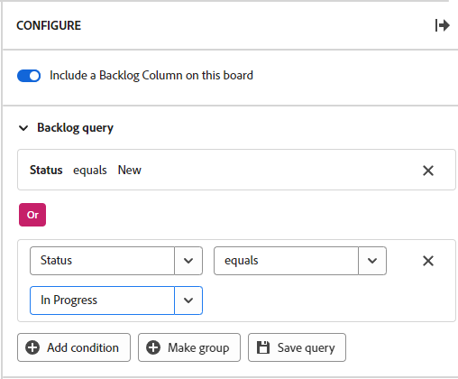

# Configure the backlog on a workstream board

You can choose to display a backlog column on a board in a workstream, and define a query for the cards that are pulled into the board backlog from the workstream card list.

>[!NOTE]
>
>If you add a new card in the backlog column that does not match the query criteria, the card will disappear from the backlog when the board is refreshed and it will only be available in the card list. You can change the query at any time to adjust which cards appear in the backlog column.

The backlog column and query are not available on standalone boards. For information about adding an intake column to a standalone board, see [Add an intake column to a board](/help/quicksilver/agile/use-boards-agile-planning-tools/add-intake-column-to-board.md).

## Access requirements

You must have the following access to perform the steps in this article:

<table style="table-layout:auto"> 
 <col> 
 </col> 
 <col> 
 </col> 
 <tbody> 
  <tr> 
   <td role="rowheader"><strong>[!DNL Adobe Workfront] plan*</strong></td> 
   <td> 
Any
 </td> 
  </tr> 
  <tr> 
   <td role="rowheader"><strong>[!DNL Adobe Workfront] license*</strong></td> 
   <td> 
[!UICONTROL Request] or higher
 </td> 
  </tr> 
 </tbody> 
</table>

&#42;To find out what plan, license type, or access you have, contact your [!DNL Workfront] administrator.

## Configure the backlog on a workstream board

{{step1-to-boards}}

1. Open the workstream you want to work in. To open a workstream, click [!UICONTROL **View workstream**].
1. Click any board in the workstream to open it.
1. Click [!UICONTROL **Configure**] on the right of the board to open the Configure panel.
1. Turn on [!UICONTROL **Include a backlog column on this board**].

   The backlog column is added on the left of the board. It remains blank until you apply a query to it.

1. Expand [!UICONTROL **Backlog query**].

   >[!NOTE]
   >
   >A default query may already be applied to the backlog, showing all work items from the card list that have a status and the status is not Complete.

1. Click [!UICONTROL **Add condition**] and click in the "empty" field.
1. Select the field to query by.

   The fields you can choose from are the default fields on a card.

1. Select the query modifier.

   The modifier options depend on the fields they can apply to. For example, the "name" field does not have "greater than" or "less than" as modifier choices because those modifiers only apply to numbers.

1. Select the value.

   The value is not available when you use "exists" or "not exists" as the modifier.

   For example, if you choose "Due date" and "exists," the backlog will display cards with assigned due dates. Any card without a due date will not be pulled in to the backlog.

1. (Optional) Click [!UICONTROL **Add condition**] to add another condition to the query.

   

1. (Optional) Click [!UICONTROL **Make group**] to add a group of conditions connected to the first condition with an OR operator.
1. Click [!UICONTROL **Save query**].

   The query is applied and cards meeting the criteria appear in the backlog column.
