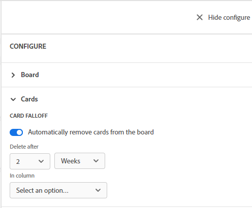

# Configure card falloff

You can configure a board so that cards are archived, or "fall off" the board, on a schedule. You can set cards in a particular column to fall off the board in a certain number of days or weeks.

When a card falls off the board, it is archived. You can display archived cards with a filter. For more information, see [Filter and search in a board](/help/quicksilver/agile/get-started-with-boards/filter-search-in-board.md).

## Access requirements

You must have the following access to perform the steps in this article:

<table style="table-layout:auto"> 
 <col> 
 </col> 
 <col> 
 </col> 
 <tbody> 
  <tr> 
   <td role="rowheader"><strong>[!DNL Adobe Workfront] plan*</strong></td> 
   <td> 
Any
 </td> 
  </tr> 
  <tr> 
   <td role="rowheader"><strong>[!DNL Adobe Workfront] license*</strong></td> 
   <td> 
[!UICONTROL Request] or higher
 </td> 
  </tr> 
 </tbody> 
</table>

&#42;To find out what plan, license type, or access you have, contact your [!DNL Workfront] administrator.

## Configure card falloff

1. Click the **[!UICONTROL Main Menu]** icon  in the upper-right corner of [!DNL Adobe Workfront], then click **[!UICONTROL Boards]**.
1. Access a board. For information, see [Create or edit a board](../../agile/get-started-with-boards/create-edit-board.md).
1. Click **[!UICONTROL Configure]** on the right of the board to open the Configure panel.
1. Expand **[!UICONTROL Cards]**.
1. Turn on **[!UICONTROL Automatically archive cards from the board]**.

   

1. Select when to archive cards from the board. You can choose up to 8 weeks or up to 60 days.

   The date is determined from when the card was last modified.

1. Select which column to remove cards from.
1. Click **[!UICONTROL Save]** on the confirmation message.
1. Click **[!UICONTROL Hide configure]** to close the [!UICONTROL Configure] panel. The configuration settings are applied automatically when you refresh the board.
