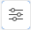

# Create an iteration in a workstream

>[!IMPORTANT]
>
>Workstreams are only available to a specific group of customers.

An iteration is a set amount of time reserved for completing work. Some agile teams may refer to an iteration as a sprint.

## Access requirements

You must have the following access to perform the steps in this article:

<table style="table-layout:auto"> 
 <col> 
 </col> 
 <col> 
 </col> 
 <tbody> 
  <tr> 
   <td role="rowheader"><strong>[!DNL Adobe Workfront] plan*</strong></td> 
   <td> 
Any
 </td> 
  </tr> 
  <tr> 
   <td role="rowheader"><strong>[!DNL Adobe Workfront] license*</strong></td> 
   <td> 
[!UICONTROL Request] or higher
 </td> 
  </tr> 
 </tbody> 
</table>

## Create an iteration in a workstream

{{step1-to-boards}}

1. Open the workstream where you want to add the iteration. To open a workstream, click [!UICONTROL **View workstream**].
1. Create an iteration using one of these methods:

   * On the Card List tab, in the iteration view, click [!UICONTROL **Create iteration**].
   * On the Card List tab, in the list view, click [!UICONTROL **Create iteration**].
   * On the Boards tab, click [!UICONTROL **Add board**] and select [!UICONTROL **Iteration Process**] as the board template. Then, open the iteration board and click [!UICONTROL **Configure iterations**].

1. In the Iteration Details dialog, add the following information:

   <table style="table-layout:auto"> 
    <tbody> 
     <tr> 
      <td><strong>[!UICONTROL Iteration name]</strong></td> 
      <td>The name of the iteration, such as "Sprint 1."</td> 
     </tr> 
     <tr> 
      <td><strong>[!UICONTROL Iteration length]</strong></td> 
      <td>The length of the iteration, in days, weeks, or months.</td> 
     </tr>
     <tr> 
      <td><strong>[!UICONTROL Start date]</strong></td> 
      <td>The date the iteration begins. The end date is automatically entered based on the iteration length.</td> 
     </tr> 
    </tbody> 
   </table>

1. Click [!UICONTROL **Save**].

   The iteration now appears in the iteration view of the card list, and in the metrics area on the iteration board.

   To add cards to an iteration, see [Use the card list](/help/quicksilver/agile/use-boards-agile-planning-tools/use-card-list.md).

## Edit an existing iteration

1. To open a workstream, click [!UICONTROL **View workstream**].
1. Open the iteration using one of these methods:

   * On the Card List tab, in the iteration view, click the [!UICONTROL **Iteration details**] icon .
   * On the iteration board, click the [!UICONTROL **Iteration details**] icon  in the metrics area on the top right.

1. In the [!UICONTROL Iteration Configuration] panel, edit the iteration as needed.
1. To change the iteration name, expand [!UICONTROL **Iteration details**].

   Once an iteration has started, you can only change the iteration name and not the dates or iteration length.

<!--   

1. To add goals to the iteration, expand [!UICONTROL **Goals**].
1. Click [!UICONTROL **Add goal**], and type the goal name.

   As goals are completed during the iteration, you can select the check box to mark them complete, or click the **Delete** icon  to delete a goal. The metrics area on the top right of the iteration shows how many goals exist and how many have been completed.

## Assign cards to the next iteration

Use the [!UICONTROL Next Iteration] column to move cards from the current iteration to the next iteration, without sending them to the backlog first.

1. Move a card to the [!UICONTROL **Next Iteration**] column, or add a new card directly in the column.
1. Access the next iteration by clicking the [!UICONTROL **Next Iteration**] column title, or by clicking the up-pointing arrow next to the iteration name on the top of the screen.

   The cards that you marked to come over to the next iteration are placed in the columns that correspond with their status.

-->

## Delete an iteration

1. Click the [!UICONTROL **Card List**] tab on the workstream and open the iteration view.
1. Click the **Delete** icon  next to the iteration.
1. Click [!UICONTROL **Delete iteration**] on the confirmation message.
