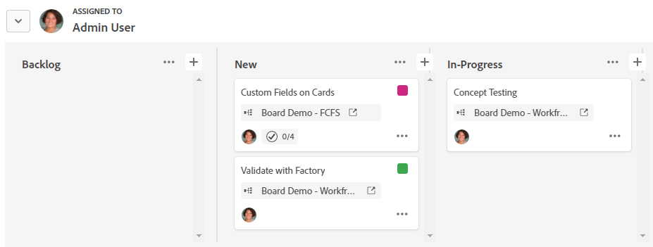

# Use groups on a board

You can group cards on a board by assignee or by tag. When you select an option to group by, the cards appear in a swimlane format. Unassigned cards or cards without tags appear in their own swimlane.

>[!NOTE]
>
>Any cards in the intake column are not included in a group, and the intake column is hidden when a group is applied. For information on the intake column, see [Add an intake column to a board](/help/quicksilver/agile/use-boards-agile-planning-tools/add-intake-column-to-board.md).

## Access requirements

You must have the following access to perform the steps in this article:

<table style="table-layout:auto"> 
 <col> 
 </col> 
 <col> 
 </col> 
 <tbody> 
  <tr> 
   <td role="rowheader"><strong>[!DNL Adobe Workfront] plan*</strong></td> 
   <td> 
Any
 </td> 
  </tr> 
  <tr> 
   <td role="rowheader"><strong>[!DNL Adobe Workfront] license*</strong></td> 
   <td> 
[!UICONTROL Request] or higher
 </td> 
  </tr> 
 </tbody> 
</table>

&#42;To find out what plan, license type, or access you have, contact your [!DNL Workfront] administrator.

## Group cards on a board

1. Click the **[!UICONTROL Main Menu]** icon  in the upper-right corner of [!DNL Adobe Workfront], then click **[!UICONTROL Boards]**.
1. Access a board. For information, see [Create or edit a board](../../agile/get-started-with-boards/create-edit-board.md).
1. Click **[!UICONTROL Group]** to open the group panel on the left of the board.

   >[!NOTE]
   >
   >The default setting to group by is **[!UICONTROL None]**. You can select this option at any time to remove a group and show only the columns on the board.

1. To group the cards, select **[!UICONTROL Assignees]** or **[!UICONTROL Tags]**.

   The cards are grouped automatically. Click the arrow next to the group name to collapse and expand the group.

   

1. Select what happens when a card is moved to another group.

   * **[!UICONTROL Add on assignees] / [!UICONTROL Add on tags]:** The assignees or tags in the new group are added to the existing list of assignees or tags on the card.
   * **[!UICONTROL Override assignees] / [!UICONTROL Override tags]:** The assignees or tags in the new group override all other assignees or tags, and become the only assignees or tags on the card.

   ![[!UICONTROL Group by options]](assets/group-by-rail.png)

1. Click **[!UICONTROL Hide groups]** to hide the group panel and display the full board.
