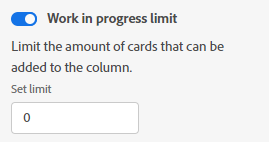

# Manage the [!UICONTROL Work in Progress] (WIP) limit on a board

You can configure a [!UICONTROL Work In Progress] (WIP) limit for each column on a board.

The WIP limit is simply a visual warning and does not restrict you from having more items in each column than the limit you set.

## Access requirements

+++ Expand to view access requirements for the functionality in this article.

You must have the following access to perform the steps in this article:

<table style="table-layout:auto"> 
 <col> 
 <col> 
 <tbody> 
  <tr> 
   <td role="rowheader">[!DNL Adobe Workfront]</td> 
   <td> 
Any
 </td> 
  </tr> 
  <tr> 
   <td role="rowheader">[!DNL Adobe Workfront] license</td> 
   <td> 
   
New: [!UICONTROL Contributor] or higher
 
   
or

   
Current: [!UICONTROL Request] or higher

   </td> 
  </tr> 
 </tbody> 
</table>

For more detail about the information in this table, see [Access requirements in Workfront documentation](/help/quicksilver/administration-and-setup/add-users/access-levels-and-object-permissions/access-level-requirements-in-documentation.md).

+++

## Set the WIP limit on a column

{{step1-to-boards}}

1. Access a board. For information, see [Create or edit a board](../../agile/get-started-with-boards/create-edit-board.md).
1. Locate the column you want to add the WIP limit to.

   To add a new column, see [Manage board columns](/help/quicksilver/agile/get-started-with-boards/manage-board-columns.md).

1. Click the **[!UICONTROL More]** menu on the column, and select **[!UICONTROL Edit]** to open the Settings area.
1. Under [!UICONTROL Column Policies], enable the **[!UICONTROL Work in progress] limit** policy to limit the number of cards that can be added to the column.
1. Type the limit number in the **[!UICONTROL Set limit]** field.

   

   The number of cards and the limit display at the top of the column. If the column contains more cards than the limit, the counter turns red.

   

1. Click **[!UICONTROL Close]** to exit the [!UICONTROL Settings] area and view the column and its cards.
