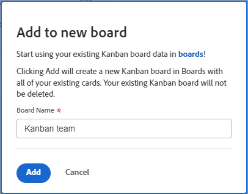
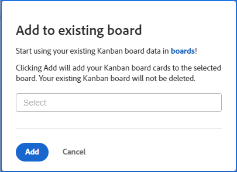

# Migrate agile team Kanban cards to Workfront boards

You can migrate your work items from an agile team Kanban board to a new or existing Workfront board. When you run the migration, all of the cards on the Kanban board are copied to the Workfront board. You are not permitted to choose specific cards.

The placement of cards on the Workfront board is based on column policies. (For example, a policy could move all cards with a status of "In Progress" to a specific column. For more information on column policies, see [Manage board columns](/help/quicksilver/agile/get-started-with-boards/manage-board-columns.md).) If there are no policies or the cards don't match the policies, the cards are placed in the leftmost column on the board. At this time, cards in the Backlog column on the legacy board are not added to the Workfront board.

The cards are not removed from the agile team Kanban board, and card status changes will sync to both boards. You can keep both boards active until you are ready to switch to Workfront Boards.

## Access requirements

You must have the following access to perform the steps in this article:

<table style="table-layout:auto">
 <col>
 </col>
 <col>
 </col>
 <tbody>
  <tr>
   <td role="rowheader"><strong>[!DNL Adobe Workfront] plan*</strong></td>
   <td> 
Any
 </td>
  </tr>
  <tr>
   <td role="rowheader"><strong>[!DNL Adobe Workfront] license*</strong></td>
   <td> 
[!UICONTROL Request] or higher
 </td>
  </tr>
 </tbody>
</table>

&#42;To find out what plan, license type, or access you have, contact your [!DNL Workfront] administrator.

## Migrate Kanban cards to a new board

{{step1-to-team}}

1. Access a Kanban board.
1. Click [!UICONTROL **Add to Boards**] and select [!UICONTROL **New Board**].
1. On the [!UICONTROL Add to new board] dialog, type a name for the new board (the name of the current [!UICONTROL Kanban] board is automatically displayed) and click [!UICONTROL **Add**].

   

1. (Optional) On the success message that appears, click the link to open the new board.

## Migrate Kanban cards to an existing board

{{step1-to-team}}

1. Access a Kanban board.
1. Click [!UICONTROL **Add to Boards**] and select [!UICONTROL **Existing Board**].
1. On the [!UICONTROL Add to existing board] dialog, search for and select the board to migrate the cards to. Then, click [!UICONTROL **Add**].

   

1. (Optional) On the success message that appears, click the link to open the board.
