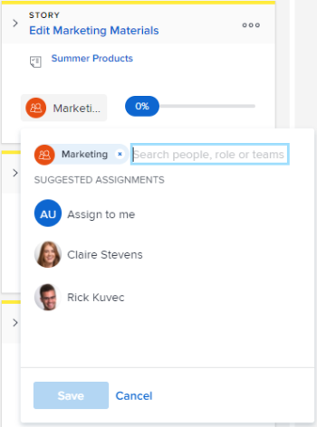

# Assign users to a story on the [!UICONTROL Kanban] board

You can assign users to stories directly on the Kanban board.

## Access requirements

+++ Expand to view access requirements for the functionality in this article.

You must have the following access to perform the steps in this article:

<table style="table-layout:auto"> 
 <col> 
 </col> 
 <col> 
 </col> 
 <tbody> 
  <tr> 
   <td role="rowheader">[!DNL Adobe Workfront] plan</td> 
   <td> 
Any
 </td> 
  </tr> 
  <tr> 
   <td role="rowheader">[!DNL Adobe Workfront] license</td> 
   <td> 
New: [!UICONTROL Standard]
 
   or
   
Current: [!UICONTROL Work] or higher
 </td> 
  </tr>
 </tbody> 
</table>

For more detail about the information in this table, see [Access requirements in Workfront documentation](/help/quicksilver/administration-and-setup/add-users/access-levels-and-object-permissions/access-level-requirements-in-documentation.md).

+++

## Assign users to a story on the [!UICONTROL Kanban] board

{{step1-to-team}}

1. (Optional) Click the **[!UICONTROL Switch team]** icon , then either select a new Kanban team from the drop-down menu or search for a team in the search bar.

1. Go to the agile [!UICONTROL Kanban] board where you want to assign users.
1. Go to the story tile on the [!UICONTROL Kanban] board where you want to add a user.
1. Click the team avatar on the story tile (or a user avatar if one is already assigned), begin typing the name of the user you want to assign to the story, then click the name when it appears. You can also choose a suggested user.

   >[!TIP]
   >
   >You can also assign a job role to a story. You can only assign active users and active roles.

   
