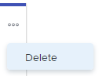

# Delete stories or issues from the [!UICONTROL Kanban] board

You can delete a story or issue from the [!UICONTROL Kanban] board. When you delete a story or issue, it is moved to the Recycle Bin for 30 days and can be recovered only by the system administrator.

## Access requirements

+++ Expand to view access requirements for the functionality in this article.

You must have the following access to perform the steps in this article:

<table style="table-layout:auto"> 
 <col> 
 </col> 
 <col> 
 </col> 
 <tbody> 
  <tr> 
   <td role="rowheader">[!DNL Adobe Workfront] plan</td> 
   <td> 
Any
 </td> 
  </tr> 
  <tr> 
   <td role="rowheader">[!DNL Adobe Workfront] license</td> 
   <td> 
New: [!UICONTROL Standard]
 
   or
   
Current: [!UICONTROL Work] or higher
 </td> 
  </tr>
  <tr> 
   <td role="rowheader">Object permissions</td> 
   <td>[!UICONTROL Manage] access to the task or issue </td> 
  </tr> 
 </tbody> 
</table>

For more detail about the information in this table, see [Access requirements in Workfront documentation](/help/quicksilver/administration-and-setup/add-users/access-levels-and-object-permissions/access-level-requirements-in-documentation.md).

+++

## Delete a story or issue

{{step1-to-team}}

1. (Optional) Click the **[!UICONTROL Switch team]** icon , then either select a new [!UICONTROL Kanban] team from the drop-down menu or search for a team in the search bar.
1. Click the **[!UICONTROL More]** icon on the story or issue, and select **[!UICONTROL Delete]**.

   

1. On the confirmation message, click **[!UICONTROL Yes, delete it]**.
