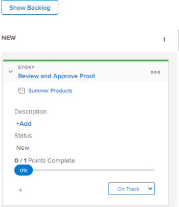

# Edit story information

## Understand what information can be viewed and edited {#understand-what-information-can-be-viewed-and-edited}

When viewing a story tile on the [!UICONTROL Kanban] board, the information in the following table is available. You can edit most information inline, directly from the story tile.

<table style="table-layout:auto"> 
 <col> 
 <col> 
 <col> 
 <thead> 
  <tr> 
   <th><strong>Information</strong> </th> 
   <th><strong>Visible</strong> </th> 
   <th><strong>Editable Inline</strong> </th> 
  </tr> 
 </thead> 
 <tbody> 
  <tr> 
   <td>The story name with a link directly to the task or issue</td> 
   <td>✓</td> 
   <td> </td> 
  </tr> 
  <tr> 
   <td> 
The project name with a link directly to the project
 </td> 
   <td>✓ </td> 
   <td> </td> 
  </tr> 
  <tr> 
   <td> 
The number of points or hours complete on the story and the number of points or hours assigned to the story These numbers are used to calculate and display the Percent Complete for each story.
 </td> 
   <td>✓</td> 
   <td> </td> 
  </tr> 
  <tr> 
   <td> 
The [!UICONTROL Percent Complete] for each story and issue. [!UICONTROL The Percent Complete] for the iteration is calculated based on the [!UICONTROL Percent Complete] for each story. 
 
When updating [!UICONTROL Percent Complete] for a story or issue, you can choose any number between 0 and 100.
 </td> 
   <td>✓</td> 
   <td>✓</td> 
  </tr> 
  <tr> 
   <td> 
Who the story is assigned to
 </td> 
   <td>✓</td> 
   <td>✓</td> 
  </tr> 
  <tr> 
   <td> 
The color or category of the tile
 </td> 
   <td>✓</td> 
   <td>✓</td> 
  </tr> 
  <tr> 
   <td> 
Any additional fields (including custom fields) that might have been added to the agile view by modifying the agile view, as described in "Creating and Customizing an Agile View" in <a href="../../reports-and-dashboards/reports/reporting-elements/views-overview.md" class="MCXref xref">Views overview in [!DNL Adobe Workfront]</a>
 </td> 
   <td>✓</td> 
   <td>✓</td> 
  </tr> 
 </tbody> 
</table>

## Access requirements

+++ Expand to view access requirements for the functionality in this article.

You must have the following access to perform the steps in this article:

<table style="table-layout:auto"> 
 <col> 
 </col> 
 <col> 
 </col> 
 <tbody> 
  <tr> 
   <td role="rowheader">[!DNL Adobe Workfront] plan</td> 
   <td> 
Any
 </td> 
  </tr> 
  <tr> 
   <td role="rowheader">[!DNL Adobe Workfront] license</td> 
   <td> 
New: [!UICONTROL Standard]
 
   or
   
Current: [!UICONTROL Work] or higher
 </td> 
  </tr>
 </tbody> 
</table>

For more detail about the information in this table, see [Access requirements in Workfront documentation](/help/quicksilver/administration-and-setup/add-users/access-levels-and-object-permissions/access-level-requirements-in-documentation.md).

+++

## View and edit information on a story tile

{{step1-to-team}}

1. (Optional) Click the **[!UICONTROL Switch team]** icon , then either select a new Kanban team from the drop-down menu or search for a team in the search bar.

1. Go to the [!UICONTROL Kanban] board.
1. Expand the story tile to view all fields associated with the story.

   

1. (Optional) To edit a field, click the field, then make any changes.
   You must have [!UICONTROL Edit] rights to the task or issue in order to edit the story tile.
   For more information about each field and whether it can be edited, see [Understand what information can be viewed and edited](#understand-what-information-can-be-viewed-and-edited).

>[!NOTE]
>
>To change the [!UICONTROL Percent Complete], you must type a number between 0 and 100. The field is not a slider that you can move.
