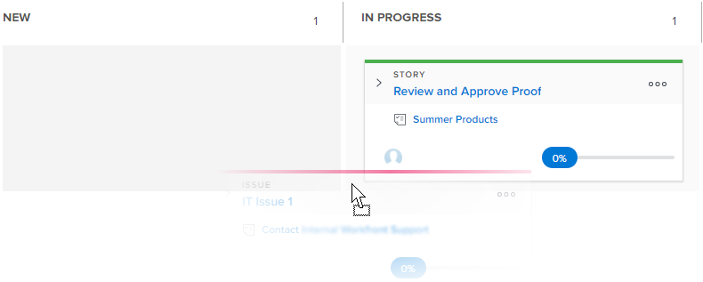

# Update the status of stories on the [!UICONTROL Kanban] board

You can change the status of a story directly from the [!UICONTROL Kanban] board in order to reflect how the stories are progressing.

>[!NOTE]
>
>Only statuses selected in the [!UICONTROL Story Board] section in the [!UICONTROL team settings] area are available on the [!UICONTROL Kanban] board and in the status drop-down menu. For more information, see [Configure Kanban](../../agile/get-started-with-agile-in-workfront/configure-kanban.md)

## Access requirements

+++ Expand to view access requirements for the functionality in this article.

<table style="table-layout:auto"> 
 <col> 
 </col> 
 <col> 
 </col> 
 <tbody> 
  <tr> 
   <td role="rowheader">Adobe Workfront package</td> 
   <td> 
Any
 </td> 
  </tr> 
  <tr> 
   <td role="rowheader">Adobe Workfront license</td> 
   <td> 
Standard
 
   
Work or higher
 </td> 
  </tr>
 </tbody> 
</table>

For information, see [Access requirements in Workfront documentation](/help/quicksilver/administration-and-setup/add-users/access-levels-and-object-permissions/access-level-requirements-in-documentation.md).

+++

## Update the status of stories on the Kanban board

{{step1-to-team}}

1. (Optional) Click the **[!UICONTROL Switch team]** icon , then either select a new [!UICONTROL Kanban] team from the drop-down menu or search for a team in the search bar.

1. Go to the [!UICONTROL Kanban] board where you want to update the status of a story.
1. Drag a story from one status column on the [!UICONTROL Kanban] board and into another column.
   A story remains in the [!UICONTROL Complete] column for two weeks after it is added.
   
