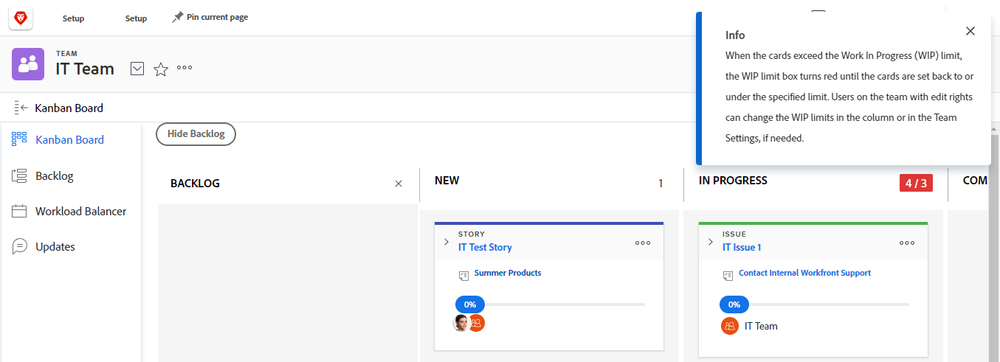

# Manage the [!UICONTROL work in progress] (WIP) limit on the Kanban board

You can configure a [!UICONTROL Work In Progress] (WIP) limit for each column on the [!UICONTROL Kanban] board, as described in the article [Configure Kanban](../../agile/get-started-with-agile-in-workfront/configure-kanban.md).

The WIP limit is simply a visual warning and does not restrict your team from having more items in each status column than the limit you set.

## Access requirements

+++ Expand to view access requirements for the functionality in this article.

You must have the following access to perform the steps in this article:

<table style="table-layout:auto"> 
 <col> 
 </col> 
 <col> 
 </col> 
 <tbody> 
  <tr> 
   <td role="rowheader">[!DNL Adobe Workfront] plan</td> 
   <td> 
Any
 </td> 
  </tr> 
  <tr> 
   <td role="rowheader">[!DNL Adobe Workfront] license</td> 
   <td> 
New: [!UICONTROL Standard]
 
   or
   
Current: [!UICONTROL Work] or higher
 </td> 
  </tr>
 </tbody> 
</table>

For more detail about the information in this table, see [Access requirements in Workfront documentation](/help/quicksilver/administration-and-setup/add-users/access-levels-and-object-permissions/access-level-requirements-in-documentation.md).

+++

## View the [!UICONTROL Work In Progress] (WIP) limit on the [!UICONTROL Kanban] board

When a WIP limit is configured for your agile team, it is displayed in the upper-right corner of each column on the Kanban board (except for the [!UICONTROL Complete] column).

Any time the limit is exceeded for any column on the [!UICONTROL Kanban] board, the limit is highlighted in red and a message is displayed.

## Update the [!UICONTROL Work In Progress] (WIP) limit from the [!UICONTROL Kanban] board

Team members with [!UICONTROL Edit] rights can update the WIP limit for each status column directly from the [!UICONTROL Kanban] board. Alternatively, you can update the WIP limit as described in the article [Configure Kanban](../../agile/get-started-with-agile-in-workfront/configure-kanban.md).

{{step1-to-team}}

1. (Optional) Click the **[!UICONTROL Switch team]** icon , then either select a new [!UICONTROL Kanban] team from the drop-down menu or search for a team in the search bar.

1. On the [!UICONTROL Kanban] board, locate the WIP limit in the upper-right corner of each column on the Kanban board.
1. Click the WIP limit you want to modify, then specify a new limit.
1. Press **[!UICONTROL Enter]**.
