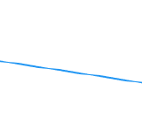
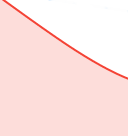

# Agile burndown chart overview

The burndown chart provides a visual representation of how stories are progressing through the iteration. The actual burndown rate is measured against the ideal burndown rate for the iteration timeline.

The burndown chart adjusts based on the selected day. The current day is the default. When a previous day is selected, all data in the burndown chart and all values in the [!UICONTROL completion status] section above the burndown chart are recalculated to represent the data as it was at the end of the selected day. (You can select past days or the current day; you cannot select days in the future.)

## Visual indicators

The burndown chart contains the following visual indicators:

<table style="table-layout:auto"> 
 <col> 
 <col> 
 <tbody> 
  <tr> 
   <td role="rowheader">  </td> 
   <td> 
Ideal burndown rate based on when the iteration began.
 
This line is not displayed if the scope of the iteration never changes (hours or points are never added or removed).
 
This line is displayed as flat when work is done on a day off. For more information, see <a title="Using the Agile Burndown Chart" href="#how-days-off-affect-the-burndown-chart" class="MCXref xref">How days off affect the burndown chart</a>.
 </td> 
  </tr> 
  <tr> 
   <td role="rowheader">  </td> 
   <td> 
Ideal burndown rate based on current stories or tasks.
 
The current ideal burndown rate (solid blue line) differs from the original ideal burndown rate (dotted blue line) when hours or points are added to or removed from the iteration after the iteration begins.
 
This line is displayed as flat when work is done on a day off.
 
For more information, see <a title="Using the Agile Burndown Chart" href="#how-days-off-affect-the-burndown-chart" class="MCXref xref">How days off affect the burndown chart</a>.
 </td> 
  </tr> 
  <tr> 
   <td role="rowheader">  </td> 
   <td> 
Actual burndown rate is shown in red when the burndown rate is less than the ideal (more points or hours remaining per day than the ideal burndown calculation).
 
The following formula is used to calculate the actual burndown rate:
 
[SUM(Point or Hour Value of In-Progress Work * Percent Complete) + Point or Hour Value of Completed Work]
 </td> 
  </tr> 
  <tr> 
   <td role="rowheader">  </td> 
   <td> 
Actual burndown rate is shown in green when the burndown rate is equal to or better than the ideal (equal or fewer points remaining per day than the ideal burndown calculation).
 
The following formula is used to calculate the actual burndown rate:
 
[SUM(Point or Hour Value of In-Progress Work * Percent Complete) + Point or Hour Value of Completed Work]
 </td> 
  </tr> 
  <tr> 
   <td role="rowheader">  </td> 
   <td> 
Change in scope (hours or points are added or removed from the iteration).
 
Scope changes are always shown as a vertical line in the middle of the day. In addition, a blue dot is displayed in the middle of any day where a scope change has occurred.
 
The vertical axis of the burndown chart shows the story points or hours.
 </td> 
  </tr> 
  <tr> 
   <td role="rowheader">  </td> 
   <td> 
Change in date range (iteration duration is either increased or decreased).
 
A blue dot is displayed in the middle of any day where the iteration duration was changed.
 </td> 
  </tr> 
  <tr> 
   <td role="rowheader">  </td> 
   <td> 
A green or red dot is displayed on the actual burndown rate any time work is burned down. (When the actual burndown rate on that day is red, the dot is red; when the actual burndown rate on that day is green, the dot is green.)
 
Work is burned down when any of the following occur:
 
    <ul> 
     <li> The [!UICONTROL Percent Complete] is increased on the story. [!UICONTROL Percent Complete] is increased when: 
      <ul> 
       <li> 
Manually changed
 </li> 
       <li> 
The number of points or hours are updated on the story
 </li> 
      </ul></li>  
     <li>The status of the story is changed to [!UICONTROL Complete]</li> 
    </ul> </td> 
  </tr> 
 </tbody> 
</table>

## How days off affect the burndown chart {#how-days-off-affect-the-burndown-chart}

The default schedule defined in [!DNL Workfront] affects the burndown&nbsp;chart&nbsp;by excluding days off (weekends and holidays) from the burndown. The burndown chart uses the&nbsp;default schedule to define working days (as described in&nbsp; [Create a schedule](../../../administration-and-setup/set-up-workfront/configure-timesheets-schedules/create-schedules.md)).

Agile teams can incorporate team-specific non-working days by defining&nbsp;an alternate schedule (as described in the article [Use an alternate team schedule for burndown charts](../../../agile/use-scrum-in-an-agile-team/burndown/use-alt-team-schedule-burndown-charts.md)). This alternate schedule is then reflected in the burndown chart of any iteration assigned to the team. The alternate schedule affects only the burndown chart.

Days off are reflected in the burndown chart only if:

* Work was previously logged on a day off. (The day when work was logged is displayed.)

   When work is logged on a day off:

   * Any work logged is not included when calculating&nbsp;the ideal burndown because the team is not scheduled to do any work.
   * The ideal burndown lines (the solid blue line and dashed blue line) are displayed as flat in the burndown chart for any day when work was done or on the day you are viewing the burndown chart (if you are viewing on a day off).
   * Work logged is included when calculating other burndown statistics such as the&nbsp;estimated completion and the average points or hours per day.

* You are viewing the burndown chart on a day off. (The day that you are viewing is shown on the burndown chart.)
* You complete the total remaining work for the iteration on a day off.

   When a user completes the total remaining work for the iteration on a day off, the [!UICONTROL Estimated Completion] field displays the date the iteration was completed.

   When planning the iteration, if you set the iteration end date for a non-working day and the iteration is tracking to finish on time, the [!UICONTROL Estimated Completion] date is set for the last working day prior to the iteration end date that you set (because work is not scheduled to be burned down on non-working days).

   The end date for the iteration is specified when the iteration is planned, as described in the article [Create an iteration](../../../agile/use-scrum-in-an-agile-team/iterations/create-an-iteration.md).
