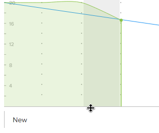

# Resize and collapse the burndown chart

You can resize or collapse the burndown chart to adjust how much room it occupies on the story board.

Any changes you make to the size or visibility of the burndown chart are visible only to you, and are reset when you clear your browser cache.

## Access requirements

+++ Expand to view access requirements for the functionality in this article.

You must have the following access to perform the steps in this article:

<table style="table-layout:auto"> 
 <col> 
 </col> 
 <col> 
 </col> 
 <tbody> 
  <tr> 
   <td role="rowheader">[!DNL Adobe Workfront] plan</td> 
   <td> 
Any
 </td> 
  </tr> 
  <tr> 
   <td role="rowheader">[!DNL Adobe Workfront] license</td> 
   <td> 
New: [!UICONTROL Light] or higher
 
   or
   
Current: [!UICONTROL Review] or higher
 </td> 
  </tr>
 </tbody> 
</table>

For more detail about the information in this table, see [Access requirements in Workfront documentation](/help/quicksilver/administration-and-setup/add-users/access-levels-and-object-permissions/access-level-requirements-in-documentation.md).

+++

## Resize the burndown chart

{{step1-to-team}}

1. (Optional) Click the **[!UICONTROL Switch team]** icon , then either select a new [!UICONTROL Scrum] team from the drop-down menu or search for a team in the search bar.

1. Go to the iteration that contains the burndown chart you want to resize.
1. Hover over the bottom line of the burndown chart, then drag the chart to the desired size.
   

## Collapse the burndown chart

{{step1-to-team}}

1. (Optional) Click the **[!UICONTROL Switch team]** icon , then either select a new [!UICONTROL Scrum] team from the drop-down menu or search for a team in the search bar.

1. Go to the iteration that contains the burndown chart you want to collapse.
1. Click the arrow icon in the left of the [!UICONTROL Percent Complete] status bar.
