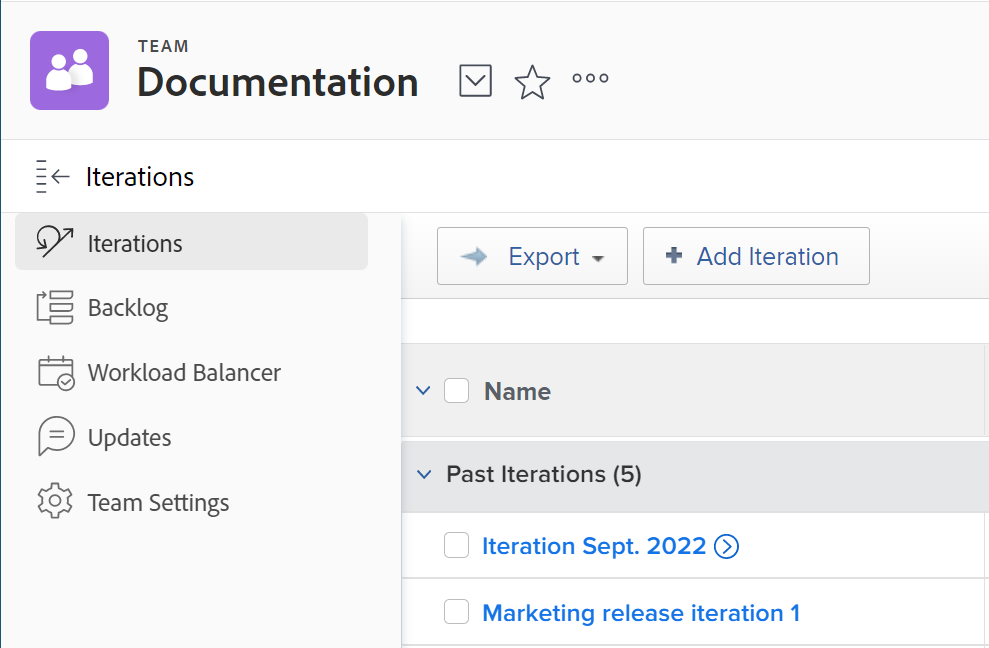

# Create an iteration

Iterations are a key component for Scrum agile teams in planning out work capacity. [!DNL Adobe Workfront] allows Scrum agile teams to manage their work by creating multiple iterations to accommodate team needs.

## Access requirements

+++ Expand to view access requirements for the functionality in this article.

You must have the following access to perform the steps in this article:

<table style="table-layout:auto"> 
 <col> 
 </col> 
 <col> 
 </col> 
 <tbody> 
  <tr> 
   <td role="rowheader">[!DNL Adobe Workfront] plan</td> 
   <td> 
Any
 </td> 
  </tr> 
  <tr> 
   <td role="rowheader">[!DNL Adobe Workfront] license</td> 
   <td> 
New: [!UICONTROL Light] or higher
 
   or
   
Current: [!UICONTROL Review] or higher
 </td> 
  </tr>
 </tbody> 
</table>

For more detail about the information in this table, see [Access requirements in Workfront documentation](/help/quicksilver/administration-and-setup/add-users/access-levels-and-object-permissions/access-level-requirements-in-documentation.md).

+++

## Add an iteration

Use the [!UICONTROL Add Iteration] feature to quickly create an iteration and add tasks and issues later.

{{step1-to-team}}

1. (Optional) Click the **[!UICONTROL Switch team]** icon , then either select a new Scrum team from the drop-down menu or search for a team in the search bar.

1. On the **[!UICONTROL Iterations]** tab, click **[!UICONTROL Add Iteration]**.
   

1. Specify the following:

   <table style="table-layout:auto"> 
    <col> 
    <col> 
    <tbody> 
     <tr> 
      <td role="rowheader"><strong>[!UICONTROL Iteration Name]</strong></td> 
      <td>Enter the name of the iteration.</td> 
     </tr> 
     <tr> 
      <td role="rowheader"><strong>[!UICONTROL Goal]</strong></td> 
      <td>Add any goals you have for the iteration.</td> 
     </tr> 
     <tr> 
      <td role="rowheader"><strong>[!UICONTROL Start Date]</strong></td> 
      <td>Enter the date the iteration should start.</td> 
     </tr> 
     <tr> 
      <td role="rowheader"><strong>[!UICONTROL End Date]</strong></td> 
      <td>
Enter the date the iteration should end. [!DNL Workfront] recommends setting an end date no longer than 4 weeks from the start date.

Tip: Make sure to choose a working day as the end date. The burndown chart uses only working days in its calculations. By default, the burndown chart uses the default schedule to define working days (as described in <a href="../../../administration-and-setup/set-up-workfront/configure-timesheets-schedules/create-schedules.md" class="MCXref xref">Create a schedule</a>). Or, to incorporate team-specific non-working days, agile teams can choose to use an alternate schedule (as described in"Defining an Alternate Team Schedule for Burndown Charts" in <a href="../../../agile/get-started-with-agile-in-workfront/create-an-agile-team.md" class="MCXref xref">Create an agile team</a>).
</td> 
     </tr> 
     <tr> 
      <td role="rowheader"><strong>[!UICONTROL Capacity]</strong></td> 
      <td> Specify the capacity for the iteration. This is the number of points or hours your team is able to accomplish in the iteration. The number you enter must be equal to or greater than the number of points or hours from the sum of all the stories in the iteration. [!DNL Workfront] pre-populates this field with 50 capacity by default. </td> 
     </tr> 
     <tr> 
      <td role="rowheader"><strong>[!UICONTROL Focus]</strong></td> 
      <td>Specify the focus percentage of the team. If all members of the team will be focused completely on this iteration, the focus would be 100%. [!DNL Workfront] pre-populates this field with 100% by default. </td> 
     </tr> 
    </tbody> 
   </table>

1. Click **[!UICONTROL Submit]**. Now that you've created an iteration, you need to add stories. For more information, see [Add stories to an existing iteration](../../../agile/use-scrum-in-an-agile-team/iterations/add-stories-to-existing-iteration.md).

## Plan an iteration on the [!UICONTROL Backlog] tab

Use the [!UICONTROL Plan Iteration] feature to create an iteration using tasks on your backlog.

{{step1-to-team}}

1. (Optional) Click the **[!UICONTROL Switch team]** icon , then either select a new Scrum team from the drop-down menu or search for a team in the search bar.

1. Select **[!UICONTROL Backlog]** on the left panel. Then, click **[!UICONTROL Plan Iteration]**.

1. Specify the following information:

   <table style="table-layout:auto"> 
    <col> 
    <col> 
    <tbody> 
     <tr> 
      <td role="rowheader"><strong>[!UICONTROL Iteration Name]</strong></td> 
      <td>Specify a name for the iteration.</td> 
     </tr> 
     <tr> 
      <td role="rowheader"><strong>[!UICONTROL Start Date]</strong></td> 
      <td> Specify the date the iteration should start.</td> 
     </tr> 
     <tr> 
      <td role="rowheader"><strong>[!UICONTROL End Date]</strong> </td> 
      <td>
Specify the date the iteration should end. [!DNL Workfront] recommends setting an end date no longer than 4 weeks from the start date.

Tip: Make sure to choose a working day as the end date. The burndown chart uses only working days in its calculations. By default, the burndown chart uses the default schedule to define working days (as described in <a href="../../../administration-and-setup/set-up-workfront/configure-timesheets-schedules/create-schedules.md" class="MCXref xref">Create a schedule</a>). Or, to incorporate team-specific non-working days, agile teams can choose to use an alternate schedule (as described in <a href="../../../agile/use-scrum-in-an-agile-team/burndown/use-alt-team-schedule-burndown-charts.md" class="MCXref xref">Use an alternate team schedule for burndown charts</a>).
</td> 
     </tr> 
     <tr> 
      <td role="rowheader"><strong>[!UICONTROL Focus]</strong></td> 
      <td>Specify the focus percentage of the team. If all members of the team will be focused completely on this iteration, the focus would be 100%. [!DNL Workfront] pre-populates this field with the average value from your team's past iterations. If this is your team's first iteration, this field value is 0 by default.</td> 
     </tr> 
     <tr> 
      <td role="rowheader"> <strong>[!UICONTROL Capacity]</strong></td> 
      <td> Specify the capacity for the iteration. This is the number of points or hours your team is able to accomplish in the iteration. The number you enter must be equal to or greater than the number of points or hours from the sum of all the stories in the iteration. [!DNL Workfront] pre-populates this field with the average value from your team's past iterations. If this is your team's first iteration, this field value is 0 by default.</td> 
     </tr> 
     <tr> 
      <td role="rowheader"> <strong>[!UICONTROL Goal]</strong></td> 
      <td> Specify a goal for the iteration. This field is not required.</td> 
     </tr> 
    </tbody> 
   </table>

1. (Optional) Select stories to add them to the iteration now, or you can skip this step and add stories to an iteration at a later time. The stories at the top of the backlog are higher priority. Stories are highlighted in green when they fit in the capacity; they are highlighted in red if they do not.
   You can add both tasks and issues to a single iteration:

   * **To add tasks to the iteration:** On the **[!UICONTROL Backlog]** tab, ensure that the **[!UICONTROL Stories]** tab is selected (this tab is selected by default when viewing the backlog). Select the stories you want to add to the iteration.

      When you add tasks to an iteration, the start date of the task is calculated as described in [[!UICONTROL Understand] how task start dates are calculated when added to an iteration](#understand-how-task-start-dates-are-calculated-when-added-to-an-iteration).

   * **To add issues to the iteration:** On the **[!UICONTROL Backlog]** tab, click the **[!UICONTROL Issues]** tab. Select the issues you want to add to the iteration.

1. Click **[!UICONTROL Save].**
The iteration is created.

1. (Optional) To add stories to an existing iteration, see [Add stories to an existing iteration](../../../agile/use-scrum-in-an-agile-team/iterations/add-stories-to-existing-iteration.md).

## Understand how task start dates are calculated when added to an iteration {#understand-how-task-start-dates-are-calculated-when-added-to-an-iteration}

When you add a task as a story to an iteration, the [!UICONTROL Must Finish On task] constraint is used for each story. In most cases, the planned start date of the task is calculated based on the following formula:

[!UICONTROL Iteration End Date] minus (-) [!UICONTROL Task Duration] equals (=) [!UICONTROL Task Planned Start Date]

The [!UICONTROL Project End Date] is used instead of the   if the project start date is after the iteration start date, and the project end date is after the iteration end date.

You can configure individual Scrum teams to use the project dates by default, rather than the iteration dates. For information, see the section [Configure how dates are applied when adding work items to an iteration](../../../agile/get-started-with-agile-in-workfront/configure-scrum.md#configure-how-dates-are-applied-when-adding-work-items-to-an-iteration) in the article [Configure Scrum](../../../agile/get-started-with-agile-in-workfront/configure-scrum.md).
