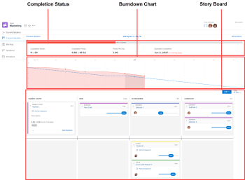

# Iterations overview

Agile iterations consist of three areas: completion status, burndown, and the story board.

For information about the burndown chart and completion status, see the [Burndown](../../../agile/use-scrum-in-an-agile-team/burndown/burndown.md) section.

For more information about the story board, see the [Scrum board](../../../agile/use-scrum-in-an-agile-team/scrum-board/scrum-board.md) section.
