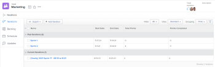
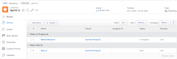

# View an iteration

You can view all iterations for a given team, or you can view an individual iteration.&nbsp;Iterations display data about the&nbsp;stories, issues, and documents that are contained in the iteration.

## Access requirements

You must have the following access to perform the steps in this article:

<table style="table-layout:auto"> 
 <col> 
 </col> 
 <col> 
 </col> 
 <tbody> 
  <tr> 
   <td role="rowheader">Adobe Workfront plan*</td> 
   <td> 
Any
 </td> 
  </tr> 
  <tr> 
   <td role="rowheader">Adobe Workfront license*</td> 
   <td> 
Review or higher
 </td> 
  </tr> 
 </tbody> 
</table>

&#42;To find out what plan or license type you have, contact your Workfront administrator.

## View iterations assigned to a given team

1. Click the **Main Menu** icon  in the upper-right corner of Adobe Workfront, then click **Teams**.

1. (Optional) Click the **Switch team** icon , then either select a new Scrum team from the drop-down menu or search for a team in the search bar.

1. In the left panel, select **Iterations** to choose a specific iteration, or select **Current Iteration**.

   

1. (Optional) Click the name of the specific iteration that you want to view.  
   The iteration stories display.

   

