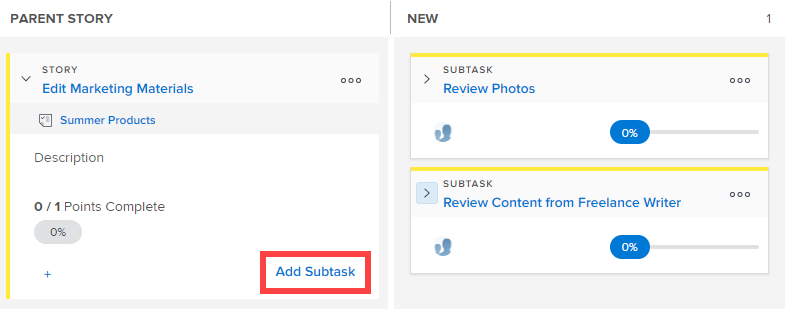
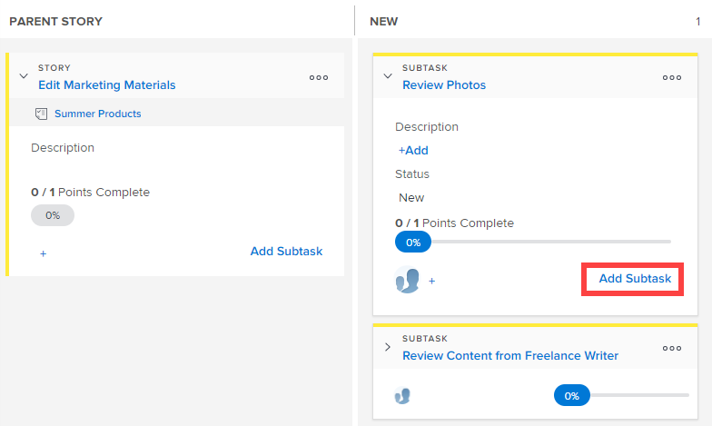

# Add a subtask to an existing story on the [!UICONTROL Scrum] board

When creating subtasks for existing stories, keep in mind the following:

**When the [!UICONTROL Completion Mode] setting for the project is set to [!UICONTROL Manual]:**

* Moving a parent story with subtasks to [!UICONTROL Complete] updates the parent story to 100% and the [!UICONTROL Status] to [!UICONTROL Complete]. Subtasks are not updated.
* To update the [!UICONTROL Percent Complete] for the story, you must update it from the [!UICONTROL Stories] tab or from the [!UICONTROL Details] page of the object.

**When the [!UICONTROL Completion Mode] setting for the project is set to [!UICONTROL Automatic]**:

* Moving a parent story with subtasks to [!UICONTROL Complete] updates the parent story to 100% and the [!UICONTROL Status] to [!UICONTROL Complete]. Subtasks are also updated to 100% and the [!UICONTROL Status] is updated to [!UICONTROL Complete].
* To update the [!UICONTROL Percent Complete] for the story, you must update the [!UICONTROL Percent Complete] for any subtasks. The [!UICONTROL Percent Complete] for the story is calculated based on the [!UICONTROL Percent Complete] of all subtasks.

## Access requirements

+++ Expand to view access requirements for the functionality in this article.

You must have the following access to perform the steps in this article:

<table style="table-layout:auto"> 
 <tbody> 
  <tr> 
   <td role="rowheader">[!DNL Adobe Workfront] plan</td> 
   <td> 
Any
 </td> 
  </tr> 
  <tr> 
   <td role="rowheader">[!DNL Adobe Workfront] license</td> 
   <td> 
New: [!UICONTROL Standard]
 
   or
   
Current: [!UICONTROL Work] or higher
 </td> 
  </tr>
   <tr> 
   <td role="rowheader">Object permissions</td> 
   <td>[!UICONTROL Contribute] or [!UICONTROL Manage] access to the task the subtask is on </td> 
  </tr>
 </tbody> 
</table>

For more detail about the information in this table, see [Access requirements in Workfront documentation](/help/quicksilver/administration-and-setup/add-users/access-levels-and-object-permissions/access-level-requirements-in-documentation.md).

+++

## Add a subtask to an existing story on the Scrum board

{{step1-to-team}}

1. (Optional) Click the **[!UICONTROL Switch team]** icon , then either select a new Scrum team from the drop-down menu or search for a team in the search bar.

1. Go to the agile iteration or project that contains the story where you want to add a subtask. For information about how to navigate to an iteration, see [View an iteration](../../../agile/use-scrum-in-an-agile-team/iterations/view-iteration.md).
1. Go to the story tile on the story board where you want to add a subtask.
1. Click **[!UICONTROL Add Subtask]** on the main story card to create a subtask to the story.

   

   Or

   Click **[!UICONTROL Add Subtask]** on a subtask tile to create a subtask to the subtask.

   [!DNL Workfront] supports infinite levels of subtasks, but only two levels (subtasks of subtasks) are displayed on the agile story board.

   

   When adding a subtask to a story that currently does not have a swimlane, the parent task is promoted to the [!UICONTROL Parent Story] column and the subtask moves inside the swimlane.

1. Specify the following information:

   <table style="table-layout:auto">
    <col>
    <col>
    <tbody>
     <tr>
      <td role="rowheader"><strong>[!UICONTROL Subtask Name]</strong></td>
      <td> Specify a name for the subtask.</td>
     </tr>
     <tr>
      <td role="rowheader"><strong>[!UICONTROL Description]</strong></td>
      <td>Specify a description for the subtask.</td>
     </tr>
     <tr>
      <td role="rowheader"><strong>[!UICONTROL Estimate]</strong></td>
      <td>Specify the estimate for the subtask. 
Keep in mind the following when creating estimates:

       <ul>
        <li>If your agile team is configured to estimate stories in points, then by default 1 point equals 8 hours. Estimates are added as [!UICONTROL Planned Hours] on the story.</li>
        <li>The combined estimates for all subtasks determines the estimate of the parent story. For more information, see <a href="../../../agile/use-scrum-in-an-agile-team/scrum-board/update-status-of-stories-and-subtasks.md" class="MCXref xref">Update the status of stories and subtasks on the Scrum board</a>.</li>
        <li>When you create a new subtask, the [!UICONTROL Estimate] field is already set. If you reset the estimate on the subtask, you are resetting the estimate on the parent story (because the parent story is the sum of all its subtasks).</li>
       </ul> </td>
     </tr>
     <tr>
      <td role="rowheader"><strong>[!UICONTROL Planned Hours]</strong></td>
      <td> (Available only in projects) Specify the number of planned hours for the task.</td>
     </tr>
     <tr>
      <td role="rowheader"><strong>[!UICONTROL Assignment]</strong></td>
      <td>Begin typing the name of the team where you want to assign the subtask, then click it when it appears in the drop-down list.</td>
     </tr>
    </tbody>
   </table>

1. Click **[!UICONTROL Create]**.
