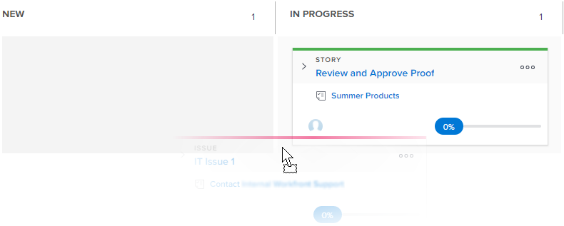

# Update the status of stories and subtasks on the [!UICONTROL Scrum] board

You can change the status of a story directly from the agile story board to reflect how the stories are progressing through the iteration or project.

>[!NOTE]
>
>Only statuses selected in the [!UICONTROL Story Board] section in the team settings area are available on the [!UICONTROL Scrum] board and in the status drop-down menu. For more information, see [Configure Scrum](../../../agile/get-started-with-agile-in-workfront/configure-scrum.md).

## Access requirements

+++ Expand to view access requirements for the functionality in this article.

You must have the following access to perform the steps in this article:

<table style="table-layout:auto"> 
 <tbody> 
  <tr> 
   <td role="rowheader">[!DNL Adobe Workfront] plan</td> 
   <td> 
Any
 </td> 
  </tr> 
  <tr> 
   <td role="rowheader">[!DNL Adobe Workfront] license</td> 
   <td> 
New: [!UICONTROL Standard]
 
   or
   
Current: [!UICONTROL Work] or higher
 </td> 
  </tr>
 </tbody> 
</table>

For more detail about the information in this table, see [Access requirements in Workfront documentation](/help/quicksilver/administration-and-setup/add-users/access-levels-and-object-permissions/access-level-requirements-in-documentation.md).

+++

## Update the status of a story or subtask

{{step1-to-team}}

1. (Optional) Click the **[!UICONTROL Switch team]** icon , then either select a new Scrum team from the drop-down menu or search for a team in the search bar.

1. Navigate to an active iteration.
1. Drag a story from one status column on the story board into another column.\
   
