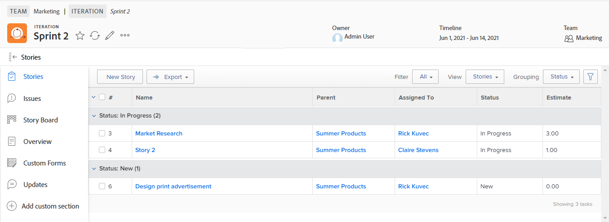

# Create an agile story

You can create an agile story on an iteration in various ways. After you create an agile story, you can add subtasks to the story.

When you add a story or subtask in an iteration, the Duration Type is set to [!UICONTROL Simple] and the Task Constraint is set to Fixed Dates, with the dates locked within the iteration. You cannot modify the Duration Type or Task Constraint in an iteration. Also, the task duration must be greater than 0 minutes.

For information about how to manage the story after it is added to the iteration, see [Iterations](../../agile/use-scrum-in-an-agile-team/iterations/iterations.md).

## Access requirements

+++ Expand to view access requirements for the functionality in this article.

You must have the following access to perform the steps in this article:

<table style="table-layout:auto"> 
 <col> 
 </col> 
 <col> 
 </col> 
 <tbody> 
  <tr> 
   <td role="rowheader">[!DNL Adobe Workfront] plan</td> 
   <td> 
Any
 </td> 
  </tr> 
  <tr> 
   <td role="rowheader">[!DNL Adobe Workfront] license</td> 
   <td> 
New: [!UICONTROL Standard]
 
   or
   
Current: [!UICONTROL Work] or higher
 </td> 
  </tr>
  <tr> 
   <td role="rowheader">Object permissions</td> 
   <td>[!UICONTROL Manage] access to the project the story is on </td> 
  </tr> 
 </tbody> 
</table>

For more detail about the information in this table, see [Access requirements in Workfront documentation](/help/quicksilver/administration-and-setup/add-users/access-levels-and-object-permissions/access-level-requirements-in-documentation.md).

+++

## Create an agile story in an iteration

1. Go to the agile iteration where you want to create the story:

   {{step1-to-team}}

   1. (Optional) Click the **[!UICONTROL Switch team]** icon , then either select a new Scrum team from the drop-down menu or search for a team in the search bar.

   1. In the left panel, select **[!UICONTROL Iterations]** to choose a specific iteration, or select **[!UICONTROL Current Iteration]**.
   1. Click the name of the specific iteration where you want to create a story.

   

1. Click **[!UICONTROL New Story].**
1. Specify the following information:

   <table style="table-layout:auto">
    <col>
    <col>
    <tbody>
     <tr>
      <td role="rowheader"><strong>[!UICONTROL Story Name]</strong></td>
      <td>Type a name for the story.</td>
     </tr>
     <tr>
      <td role="rowheader"><strong>[!UICONTROL Description]</strong></td>
      <td>Type a description for the story.</td>
     </tr>
     <tr>
      <td role="rowheader"><strong>[!UICONTROL Ready]</strong></td>
      <td>Select this option if the story is ready to be added to an iteration. When this option is selected, it indicates to users which stories in the backlog are ready to be added to an iteration. A story can be added to an iteration whether or not it is marked <strong>[!UICONTROL Ready].</strong></td>
     </tr>
     <tr>
      <td role="rowheader"><strong>[!UICONTROL Estimate] (points)</strong></td>
      <td>Specify the estimate for the story. If your agile team is configured to estimate stories in points, then by default 1 point equals 8 hours. Estimates are added as [!UICONTROL Planned Hours] on the story. For example, if you estimate a story as 3 points, the default behavior is to add 24 [!UICONTROL Planned Hours] to the story. If a story contains subtasks, remember that the combined estimates for all subtasks determines the estimate of the parent story. For more information, see <a href="../../agile/use-scrum-in-an-agile-team/iterations/add-stories-to-existing-iteration.md" class="MCXref xref">Add stories to an existing iteration</a>.</td>
     </tr>
     <tr>
      <td role="rowheader"><strong>[!UICONTROL Parent Project]</strong></td>
      <td>Begin typing the name of the project that this story will be associated with. By default, the story color is displayed as the same color as other stories from this project. The status of the project must be set to [!UICONTROL Current]. If the status of the project is anything but [!UICONTROL Current], it is not displayed in the drop-down menu.</td>
     </tr>
     <tr>
      <td role="rowheader"><strong>[!UICONTROL Parent Task]</strong></td>
      <td>After you choose a parent project, you have the option to choose a parent task. When you select a parent task, the story is created as a subtask of the parent task on the project that you selected. Begin typing the name of the parent task for the story, then click it when it appears in the drop-down list.</td>
     </tr>
     <tr>
      <td role="rowheader"><strong>[!UICONTROL Custom Forms]</strong></td>
      <td>Select any custom forms to add to the story.</td>
     </tr>
    </tbody>
   </table>

1. Click **[!UICONTROL Save Story]**.

## Create an agile story in the backlog

You can create an agile story from the agile backlog, as described in the section [Create new stories on the backlog](../../agile/work-in-an-agile-environment/manage-the-agile-backlog.md#creating-new-stories) in the article [[!UICONTROL Manage] the agile backlog](../../agile/work-in-an-agile-environment/manage-the-agile-backlog.md).

## Add a task or issue as an agile story

You can add an existing task or issue as a story to an iteration. For more information, see [Add stories to an existing iteration](../../agile/use-scrum-in-an-agile-team/iterations/add-stories-to-existing-iteration.md) or [Add stories and issues from the [!UICONTROL Scrum] board](../../agile/use-scrum-in-an-agile-team/scrum-board/add-story-from-scrum-board.md).

## Create subtasks to an agile story

You can create a subtask to an agile story by using either of the following methods:

* By using the **[!UICONTROL Subtasks]** tab, as described in [Create subtasks](../../manage-work/tasks/create-tasks/create-subtasks.md#creating-subtasks) in [Create subtasks](../../manage-work/tasks/create-tasks/create-subtasks.md).

* Directly from the story board, as described in [Create an iteration](../../agile/use-scrum-in-an-agile-team/iterations/create-an-iteration.md).
