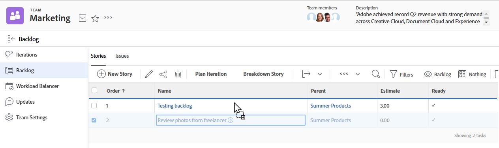
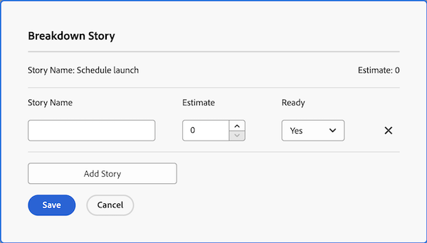
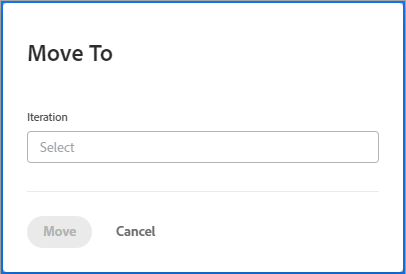

# Manage the agile backlog

The following work items can be assigned to an agile team and added to that team's backlog as stories, depending on the agile methodology the team is using:

* **[!UICONTROL Scrum agile teams]:** Tasks and issues can be assigned to the agile team and added to the backlog.
* **[!UICONTROL Kanban agile teams]:** Tasks can be assigned to the agile team and added to the backlog. Users can view the backlog directly from the agile story board, as described in [[!UICONTROL Add the backlog] to the Kanban board](../../agile/use-kanban-in-an-agile-team/view-the-backlog-on-the-kanban-board.md). The team uses this backlog to prioritize and manage their work queue.

Tasks or issues can be assigned to the team (and subsequently added to the team backlog) from anywhere in [!DNL Adobe Workfront]. For example, a single team might be assigned work assignments from multiple projects.

>[!NOTE]
>
>If you add multiple teams to a backlog item, the task or issue displays only on the primary team's backlog. The primary team is the team first assigned.

## Access requirements

You must have the following access to perform the steps in this article:

<table style="table-layout:auto"> 
 <col> 
 </col> 
 <col> 
 </col> 
 <tbody> 
  <tr> 
   <td role="rowheader"><strong>[!DNL Adobe Workfront] plan</strong></td> 
   <td> 
Any
 </td> 
  </tr> 
  <tr> 
   <td role="rowheader"><strong>[!DNL Adobe Workfront] license</strong></td> 
   <td> 
New: [!UICONTROL Standard]

Or

Current: [!UICONTROL Work] or higher
 </td> 
  </tr> 
  <tr> 
   <td role="rowheader"><strong>Access level configurations</strong></td> 
   <td> 
New: [!UICONTROL Standard]

Or

Current: [!UICONTROL Worker] or higher
 </td> 
  </tr> 
  <tr> 
   <td role="rowheader"><strong>Object permissions</strong></td> 
   <td> 
[!UICONTROL Manage] access to the project the story is on
  </td> 
  </tr> 
 </tbody> 
</table>

For more detail about the information in this table, see [Access requirements in Workfront documentation](/help/quicksilver/administration-and-setup/add-users/access-levels-and-object-permissions/access-level-requirements-in-documentation.md).

## Create and manage stories on the backlog

* [Reorder stories](#reorder-stories)
* [[!UICONTROL Break down] stories](#break-down-stories)
* [Edit stories](#edit-stories)

### Reorder stories {#reorder-stories}

You can reorder stories in the backlog list by using the drag-and-drop method.

1. Go to the agile backlog where you want to reorder stories.
1. In the **[!UICONTROL View]** drop-down menu, select the **[!UICONTROL Backlog]** view or a custom view that contains the **[!UICONTROL Order]** column.

   >[!NOTE]
   >
   >If a task or issue has an agile team assigned and the project is not in a status that equates with Current, they do not display on the backlog. However, they do still affect the backlog count in the Order column.

1. Select one or more stories, then drag the stories to the order where you want them to appear in the backlog.\
   

### Break down stories {#break-down-stories}

Because stories in a backlog vary in size, users can break them down into workable sizes for an iteration. Breaking a story down creates subtasks on the task that the story represents, and replaces the original task in the backlog. You can have a parent task or its subtasks assigned to an agile team, but you cannot have both assigned to a team simultaneously.

>[!NOTE]
>
>Consider the following limitations when breaking down stories:
>
>* Only stories that represent tasks can be broken down. You cannot break down stories that represent issues.
>* Stories can be broken down only if they are associated with a project.

To break down a story:

1. Go to the backlog that contains the story you want to break down.
1. Select the story you want to break down, then click **[!UICONTROL Breakdown Story]**.\
   The [!UICONTROL Breakdown Story] dialog box is displayed.\
   

1. Specify a name and estimate for the story, and select whether the story is ready.
1. Click **[!UICONTROL Add Story]** to create another story from the original story.
1. Click **[!UICONTROL Save]**.

### Edit stories {#edit-stories}

You can edit stories directly from the [!UICONTROL Stories] or [!UICONTROL Issues] tabs on the Backlog as you would edit any tasks or issues within a project in bulk, as described in [Edit tasks in bulk](../../manage-work/tasks/manage-tasks/edit-tasks.md#edit-tasks-in-bulk) in [Edit tasks](../../manage-work/tasks/manage-tasks/edit-tasks.md), and [Edit issues](../../manage-work/issues/manage-issues/edit-issues.md).

## Create new stories on the backlog {#create-new-stories-on-the-backlog}

You can create new stories on the backlog by creating the story directly from the backlog, or by assigning an existing task or issue to an agile team.

* [Create a story from the backlog](#create-a-story-from-the-backlog)
* [Assign a task or issue to an agile team](#assign-a-task-or-issue-to-an-agile-team)

### Create a story from the backlog {#create-a-story-from-the-backlog}

When you create a story from the backlog, the story is created as a task or issue within a project. You cannot create a story from the backlog as an issue.

To create a story from the backlog:

1. Click the **[!UICONTROL Main Menu]** icon  in the upper-right corner of Adobe Workfront, or (if available), click the **[!UICONTROL Main Menu]** icon  in the upper-left corner, then click **[!UICONTROL Teams]**.

1. (Optional) Click the **[!UICONTROL Switch team]** icon , then either select a new Scrum team from the drop-down menu, or search for a team in the search bar and select it when it appears.

1. Select **[!UICONTROL Backlog]** from the left panel.
1. Do either of the following, depending on whether you want to create a task or an issue:

   * **To create a task:** Click **[!UICONTROL Stories]**.

   * **To create an issue:** Click **[!UICONTROL Issues]**.

1. Click **[!UICONTROL New Story]** or **[!UICONTROL New Issue]**.

1. Specify the following information:

   <table style="table-layout:auto">
    <col>
    <col>
    <tbody>
     <tr>
      <td role="rowheader"><strong>[!UICONTROL Story Name]</strong></td>
      <td> Type a name for the story.</td>
     </tr>
     <tr>
      <td role="rowheader"><strong>[!UICONTROL Description]</strong></td>
      <td>(Optional) Type a description for the story.</td>
     </tr>
     <tr>
      <td role="rowheader"><strong>[!UICONTROL Ready]</strong></td>
      <td> Select whether the story is ready to be added to an iteration. This setting is informational only. Stories can be added to an iteration regardless of the status of this setting.</td>
     </tr>
     <tr>
      <td role="rowheader"><strong>[!UICONTROL Estimate]</strong></td>
      <td>Specify a point or hourly estimate for the story. Estimates affect the burndown chart. The burndown chart for an iteration is accurate only if each story contains an accurate estimate. (If you provide a point estimate, you must have already designated in the team settings how many hours each point represents.)</td>
     </tr>
     <tr>
      <td role="rowheader"><strong>[!UICONTROL Parent Project]</strong></td>
      <td>Begin typing the name of the project where this story will be created, then click the name when it appears in the drop-down list. The status of the project must be set to [!UICONTROL Current]. If the status of the project is anything but [!UICONTROL Current], it is not displayed in the drop-down menu.</td>
     </tr>
     <tr>
      <td role="rowheader"><strong>[!UICONTROL Parent Task]</strong></td>
      <td>(Optional) Begin typing the name of the parent task that this story is subordinate to, then click the name when it appears in the drop-down list.</td>
     </tr>
     <tr>
      <td role="rowheader"><strong>[!UICONTROL Custom Forms]</strong></td>
      <td> (Optional) Select any custom forms that you want to add to this story.</td>
     </tr>
    </tbody>
   </table>

1. Click **[!UICONTROL Save Story]**.

### Assign a task or issue to an agile team {#assign-a-task-or-issue-to-an-agile-team}

You can assign a task or issue to an agile team. After it is assigned, the task or issue appears as a new story on the team backlog.

To assign a task or issue to an agile team:

1. Go to the Project that contains the task that you want to assign.
1. Select the task or issue in the list.
1. Click **[!UICONTROL Edit]**.
1. Click **[!UICONTROL Assignments]**.
1. (Optional) Delete any existing assignees.
1. Click **[!UICONTROL Add Assignee]**.
1. Begin typing the name of the agile team you want to be assigned to the task or issue, then click the team name when it appears in the drop-down list.
1. Click **[!UICONTROL Save Changes]**.\
   The task or issue is now available on the team backlog.

## Move stories into or out ofthe backlog

 {#move-stories-from-the-backlog-to-an-iteration-or-kanban-board}

* [Move stories from the backlog to an iteration or + board](#move-stories-from-the-backlog-to-an-iteration-or--board)
* [Move existing stories to the backlog](#move-existing-stories-to-the-backlog)
* [Export stories from the backlog](#export-stories-from-the-backlog)

### Move stories from the backlog to an iteration or + board

1. Go to the backlog of the agile team.
1. Select the stories you want to move to an iteration or Kanban board, then click **[!UICONTROL More]** > **[!UICONTROL Move to]**.\
   If moving the story to a [!UICONTROL Kanban] board, the [!UICONTROL Move Story to the Kanban] Board is displayed.\
   If moving the story to an iteration, the [!UICONTROL Move Story to an Iteration] dialog box is displayed.\
   

1. Do either of the following:

   * **For Scrum teams:** In the **[!UICONTROL Select Iteration]** field, select the iteration where you want to move the stories.

   * **For Kanban teams:** In the **[!UICONTROL Select Kanban Board]** field, select your team [!UICONTROL Kanban] board. (Kanban teams can have only one [!UICONTROL Kanban] board.)

1. Click **[!UICONTROL Move Story]**.

### Move existing stories&nbsp;to the backlog {#move-existing-stories-to-the-backlog}

If you decide that your team is not yet ready to work on a story, you can move the story to the backlog.

For more information, see [Move an agile story](../../agile/work-in-an-agile-environment/move-an-agile-story.md).

### Export stories from the backlog {#export-stories-from-the-backlog}

You can export one or more stories (including tasks and issues) directly from the backlog.

You export stories from the backlog in the same way that you export other data in [!DNL Workfront], as described in [Export data](../../reports-and-dashboards/reports/creating-and-managing-reports/export-data.md).
