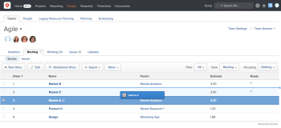
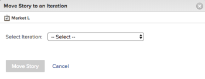

# Manage the agile backlog

The following work items can be assigned to an agile team and added to that team's backlog as stories, depending on the agile methodology the team is using:

* **Scrum agile teams:** Tasks and issues can be assigned to the agile team and added to the backlog.
* **Kanban agile teams:** Tasks can be assigned to the agile team and added to the backlog. Users can view the backlog directly from the agile story board, as described in [Add the backlog to the Kanban board](../../agile/use-kanban-in-an-agile-team/view-the-backlog-on-the-kanban-board.md). The team uses this backlog to prioritize and manage their work queue.

Tasks or issues can be&nbsp;assigned to the team (and subsequently added to the team backlog) from anywhere in Adobe Workfront. For example, a single team might be assigned work assignments from multiple projects.

## Access requirements

You must have the following access to perform the steps in this article:

<table> 
 <col> 
 </col> 
 <col> 
 </col> 
 <tbody> 
  <tr> 
   <td role="rowheader">Adobe Workfront plan*</td> 
   <td> 
Any
 </td> 
  </tr> 
  <tr> 
   <td role="rowheader">Adobe Workfront license*</td> 
   <td> 
Work or higher
 </td> 
  </tr> 
  <tr> 
   <td role="rowheader">Access level configurations*</td> 
   <td> 
Worker or higher
 
Note: If you still don't have access, ask your Workfront administrator if they set additional restrictions in your access level. For information on how a Workfront administrator can modify your access level, see <a href="../../administration-and-setup/add-users/configure-and-grant-access/create-modify-access-levels.md" class="MCXref xref">Create or modify custom access levels</a>.
 </td> 
  </tr> 
  <tr> 
   <td role="rowheader">Object permissions</td> 
   <td> 
Manage access to the project the story is on
 
For information on requesting additional access, see <a href="../../workfront-basics/grant-and-request-access-to-objects/request-access.md" class="MCXref xref">Request access to objects </a>.
 </td> 
  </tr> 
 </tbody> 
</table>

&#42;To find out what plan, license type, or access you have, contact your Workfront administrator.

## Create and manage stories on the backlog

* [Reorder stories](#reorder-stories) 
* [Break down stories](#break-down-stories) 
* [Edit stories](#edit-stories) 
* [Create new stories on the backlog](#create-new-stories-on-the-backlog) 
* [Move stories from the backlog to an iteration or Kanban board](#move-stories-from-the-backlog-to-an-iteration-or-kanban-board)

### Reorder stories {#reorder-stories}

You can reorder stories in the backlog list by using the drag-and-drop method.

1. Go to the agile backlog where you want to reorder stories.
1. In the **View** drop-down menu, select the **Backlog** view or a custom view that contains the **Order** column.

   >[!NOTE]
   >
   >If a task or issue has an agile team assigned and the project is not in a status that equates with Current, they do not display on the backlog. However, they do still affect the backlog count in the Order column.

1. Select one or more stories, then drag the stories to the order where you want them to appear in the backlog.  
   

### Break down stories {#break-down-stories}

Because stories in a backlog vary in size, users can break them down into workable sizes&nbsp;for an iteration. Breaking a story down creates subtasks on the task that the story represents, and replaces the original task in the backlog. You can have a parent task or its subtasks assigned to an agile team, but you cannot have both assigned to a team simultaneously.

>[!NOTE]
>
>Consider the following limitations when breaking down stories: >
>* Only stories that represent tasks can be broken down. You cannot break down stories that represent issues.
>* Stories can be broken down only if they are associated with a project.
>

To break down a story:

1. Go to the backlog that contains the story you want to break down.
1. Select the story you want to break down, then click **Breakdown Story**.  
   The Breakdown Story dialog box is displayed.  
   

1. Specify a name and estimate for the story, and select whether the story is ready.
1. Click **Add Story** to create another story from the original story.
1. Click **Save**.&nbsp;

### Edit stories {#edit-stories}

You can edit stories directly from the Stories or Issues tabs on the Backlog as you would edit any tasks or issues within a project in bulk, as described in [Edit tasks in bulk](../../manage-work/tasks/manage-tasks/edit-tasks.md#editing-tasks-in-bulk) in [Edit tasks](../../manage-work/tasks/manage-tasks/edit-tasks.md) and&nbsp; [Edit issues](../../manage-work/issues/manage-issues/edit-issues.md#bulk-editing-issues) in [Edit issues](../../manage-work/issues/manage-issues/edit-issues.md).

## Create new stories on the backlog {#create-new-stories-on-the-backlog}

You can create new stories on the backlog by creating the story&nbsp;directly from the backlog, or by assigning an existing&nbsp;task or issue to an agile team.

* [Create a story from the backlog](#create-a-story-from-the-backlog) 
* [Assign a task or issue to an agile team](#assign-a-task-or-issue-to-an-agile-team)

### Create a story from the backlog {#create-a-story-from-the-backlog}

When you create a story from the backlog, the story is created as a task or issue within a project. You cannot create a story from the backlog as an issue.&nbsp;

To create a story from the backlog:

1. Click the **Main Menu** icon  in the upper-right corner of Adobe Workfront, then click **Teams**.

1. (Optional) Click the **Switch team** icon , then either select a new Scrum team from the drop-down menu or search for a team in the search bar.

1. Select **Backlog** from the left panel.
1. Do either of the following, depending on whether you want to create a task or an issue:

   * **To create a task:** Click the **Stories** tab.
   
   * **To Create an issue:** Click the **Issues** tab.

1. Click **New Story** or **New Issue**.

1. Specify the following information:  

   <table>
    <col>
    <col>
    <tbody>
     <tr>
      <td role="rowheader"><strong>Story Name:</strong></td>
      <td> Type a name for the story.</td>
     </tr>
     <tr>
      <td role="rowheader"><strong>Description:</strong></td>
      <td>(Optional) Type a description for the story.</td>
     </tr>
     <tr>
      <td role="rowheader"><strong>Ready:</strong></td>
      <td> Select whether the story is ready to be added to an iteration. This setting is informational only. Stories can be added to an iteration regardless of the status of this setting.</td>
     </tr>
     <tr>
      <td role="rowheader"><strong>Estimate:</strong></td>
      <td>Specify a point or hourly estimate for the story. Estimates affect the burndown chart. The burndown&nbsp;chart for an iteration is accurate only if each story contains an accurate estimate.&nbsp;(If you provide a point estimate, you must have already designated in the team settings how many hours each point represents.)</td>
     </tr>
     <tr>
      <td role="rowheader"><strong>Parent Project:</strong></td>
      <td>Begin typing the name of the project where this story will be created, then click the name when it appears in the drop-down list. The status of the project must be set to Current. If the status of the project is anything but Current, it is not displayed in the drop-down menu.</td>
     </tr>
     <tr>
      <td role="rowheader"><strong>Parent Task:</strong></td>
      <td>(Optional) Begin typing the name of the parent task that this story is subordinate to, then click the name when it appears in the drop-down list.</td>
     </tr>
     <tr>
      <td role="rowheader"><strong>Custom Forms:</strong></td>
      <td> (Optional) Select any custom forms that you want to add to this story.</td>
     </tr>
    </tbody>
   </table>

1. Click **Save Story**.

### **Assign a task or issue to an agile team** {#assign-a-task-or-issue-to-an-agile-team}

You can assign a task or issue to an agile team. After it is assigned, the task or issue appears as a new story on the team backlog.

To assign a task or issue to an agile team:

1. Go to the Project that contains the task that you want to re-assign. 
1. Select the task or issue in the list. 
1. Click **Edit**. 
1. Click **Assignments**. 
1. (Optional) Delete any existing assignees. 
1. Click **Add Assignee**. 
1. Begin typing the name of the agile team who you want to be assigned to the task or issue, then click the team name when it appears in the drop-down list. 
1. Click **Save Changes**.  
   The task or issue is now available on the team backlog.

## Move stories from the backlog to an iteration or Kanban board {#move-stories-from-the-backlog-to-an-iteration-or-kanban-board}

* [Move existing stories to the backlog](#move-existing-stories-to-the-backlog) 
* [Export stories from the backlog](#export-stories-from-the-backlog)

1. Go to the backlog of the agile team.
1. Select the stories you want to move to an iteration or Kanban board, then click **More** > **Move to**.  
   If moving the story to a Kanban board, the Move Story to the Kanban Board is displayed.  
   If moving the story to an iteration, the Move Story to an Iteration dialog box is displayed.  
   

1. Do either of the following:

   * **For Scrum teams:** In the **Select Iteration** field, select the iteration where you want to move the stories.
   
   * **For Kanban teams:** In the **Select Kanban Board** field, select your team Kanban board. (Kanban teams can have only one Kanban board.)

1. Click **Move Story**.

### Move existing stories&nbsp;to the backlog {#move-existing-stories-to-the-backlog}

If you decide that your team is not yet ready to work on a story, you can&nbsp;move the&nbsp;story to the backlog.

For more information, see [Move an agile story](../../agile/work-in-an-agile-environment/move-an-agile-story.md).

### Export stories from the backlog {#export-stories-from-the-backlog}

You can export one or more stories (including tasks and issues) directly from the backlog.

You export stories from the backlog in the same way that you export other data in Workfront, as described in [Export data](../../reports-and-dashboards/reports/creating-and-managing-reports/export-data.md).
