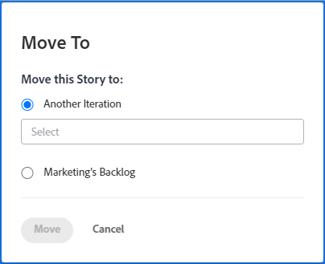

# Move an agile story

You can move an agile story either to a different iteration (for Scrum teams), or to the backlog (for Kanban and Scrum teams).

## Access requirements

+++ Expand to view access requirements for the functionality in this article.

You must have the following access to perform the steps in this article:

<table style="table-layout:auto"> 
 <col> 
 </col> 
 <col> 
 </col> 
 <tbody> 
  <tr> 
   <td role="rowheader">[!DNL Adobe Workfront] plan</td> 
   <td> 
Any
 </td> 
  </tr> 
  <tr> 
   <td role="rowheader">[!DNL Adobe Workfront] license</td> 
   <td> 
New: [!UICONTROL Standard]
 
   or
   
Current: [!UICONTROL Work] or higher
 </td> 
  </tr>
  <tr> 
   <td role="rowheader">Object permissions</td> 
   <td>[!UICONTROL Manage] access to the story</td> 
  </tr> 
 </tbody> 
</table>

For more detail about the information in this table, see [Access requirements in Workfront documentation](/help/quicksilver/administration-and-setup/add-users/access-levels-and-object-permissions/access-level-requirements-in-documentation.md).

+++

## Move a story from an iteration or Kanban board to the backlog

1. Go to the iteration or Kanban board that contains the story that you want to move to the backlog.
1. Click the iteration heading at the top of the page.
1. On the **[!UICONTROL Stories]** tab, select the stories that you want to move.
1. Click **[!UICONTROL More]**&nbsp;> **[!UICONTROL Move to]**.

   The **[!UICONTROL Move Story]** dialog box is displayed.

   

1. Select **team_name's Backlog**.
   In the above example, the team name is **Marketing**.

1. Click **[!UICONTROL Move Story]**.

## Move a story to a different iteration

You can move a story to a different iteration for your Scrum team.

>[!NOTE]
>
>The **[!UICONTROL Move to]** option is not available for parent stories on an iteration. You can only move subtasks to another iteration.

1. Go to the iteration that contains the story that you want to move.
1. Click the iteration heading at the top of the page.
1. On the **[!UICONTROL Stories]** tab, select the stories that you want to move.
1. Click **[!UICONTROL More]** > **[!UICONTROL Move to]**.

   The **[!UICONTROL Move Story]** dialog box is displayed.

   

1. Select **[!UICONTROL Another Iteration]**, then in the drop-down menu, select the iteration where you want to move the story.

   >[!NOTE]
   >
   >The work item [!UICONTROL Planned Start Date] and [!UICONTROL Planned Completion Date] are affected by a setting on the [!UICONTROL Edit Team] page. For information, see the section [[!UICONTROL Configure] how dates are applied when adding work items to an iteration](../../agile/get-started-with-agile-in-workfront/configure-scrum.md#configure-how-dates-are-applied-when-adding-work-items-to-an-iteration) in the article [Configure Scrum](../../agile/get-started-with-agile-in-workfront/configure-scrum.md).

1. Click **[!UICONTROL Move Story]**.
