# Create custom applications for Workfront with Adobe App Builder

Workfront UI Extensions, powered by Adobe App Builder, allow customers and partners to create customized user experiences. These tools enhance efficiency, deliver seamless, connected experiences, and significantly improve user satisfaction, and help enterprises realize their unique vision.

For example, without Workfront UI Extensions, a project manager might need to switch between Workfront and a separate time-tracking system to log hours. With UI Extensions, time-tracking can be integrated directly in the Workfront experience, streamlining workflow and saving time. Additionally, you can add custom components to improve usability, automate repetitive tasks, and enhance content management with features like metadata tagging and content previews. Adobe App Builder also offers scalability and robust identity management (IMS), ensuring secure and efficient customization at any scale.

Workfront UI extensions offer several key benefits:

* Precise customization: Standard software interfaces often fall short of meeting all business requirements. UI extensions allow developers to modify and extend the default user interface to address specific business needs.
* System integration: UI extensions facilitate the integration of other systems ensuring seamless workflows and data consistency.
* Scalability: As businesses grow, UI extensions can be developed to add new functionalities without the need for a complete system overhaul.
* Reduced development time: Pre-built extension points and tools significantly reduce the time and effort required to implement custom features.
* Enhanced user adoption: An optimized user experience can significantly boost software adoption. Custom UI elements designed to match user preferences can enhance adoption rates and overall satisfaction.
* Leveraging Workfront UI Extensions, businesses can create tailored user experiences that drive efficiency, integration, and user satisfaction.

After an application is created in the Adobe App Builder, a Workfront administrator can add it to the Workfront Main Menu and left navigation panel using layout templates. A user with the layout template who clicks on the application will see the application embedded in Workfront, instead of having to open it separately.

This article describes how to access the App Builder and use a template to create an application.

For information about adding a custom application to layout templates, see [Customize the main menu using a layout template](/help/quicksilver/administration-and-setup/customize-workfront/use-layout-templates/customize-main-menu.md) and [Customize the left panel using a layout template](/help/quicksilver/administration-and-setup/customize-workfront/use-layout-templates/customize-left-panel.md).

## Prerequisites  

You must have the following:  

* An IMS-enabled Workfront account  
* A dev machine with node v18 and npm

## Access Adobe App Builder  

To create UI extensions, you must have access to the Adobe App Builder in the Adobe Developer Console.  

Additional instructions are available on the [Adobe Developer site](https://developer.adobe.com/uix/docs/guides/get-access/).

### Add developers to the Adobe Admin Console  

>[!IMPORTANT]
>
>Make sure you have selected the right IMS organization for all of the following steps. If you belong to multiple organizations, it's possible to select the wrong one. Make sure you are acting under the right organization, which is usually listed in the top-right corner. 

1. Navigate to Production: https://adminconsole.adobe.com/  

1. In the **Users** section, click **Developers** > **Add developers**.

    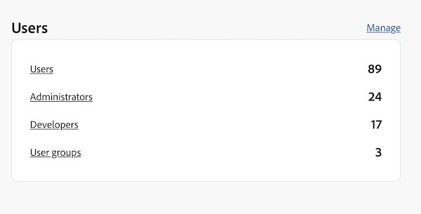

    >[!NOTE]
    >
    >If you do not see an option to manage developers, you do not have a product that allows developer access.  

1. Add the user's email. It should search existing users that have already been added from within the admin console.  

1. Add necessary products to the developer profile and click **Save**.  
    

### Get access to App Builder  

Organizations must work with their account managers to purchase App Builder.  

To test AppBuilder integration, you can request a free trial for your IMS organization here: https://developer.adobe.com/app-builder/trial/#  

If AppBuilder is configured properly, you should see Create project from template as part of creating a new project.

## Create a new project in the Adobe Developer Console  

You must use the Adobe Developer Console to build your UI extension.  

Additional instructions are available on the [Adobe Developer site](https://developer.adobe.com/uix/docs/guides/creating-project-in-dev-console/).

1. Sign in to the Adobe Developer Console with your Adobe ID.  

1. Choose your account, and your profile or organization.  

1. Click **Create project from template** in the Quick Start area, or click **Create new project > Project from template**.

    >[!IMPORTANT]
    >
    >If you do not see the option to create a project from a template, then you are misconfigured in the admin console and do not have access to the app builder catalog. This option only shows when you have access to AppBuilder.

    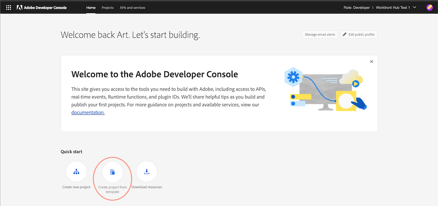

1. Select **App Builder**.  

1. Enter a **Project title** and **App name**. Both have defaults, but it will be easier to identify the project you want later if you customize the value.  

1. Leave **Include runtime** selected.  

1. Click **Save**.  

## Use Adobe IO (aio) CLI

Adobe provides an open source CLI that you can use to create the App Builder application.  

Additional instructions are available on GitHub and the Adobe Developer site: 

* https://github.com/adobe/aio-cli   
* https://developer.adobe.com/app-builder/docs/getting_started/first_app/

1. To install the tool, (make sure you are on node v18 first) run: `npm install -g @adobe/aio-cli`.
1. Launch your terminal and log in to AIO with the command: `aio login`. If you have issues logging into the correct IMS org, try `aio login -f` to force a login prompt. Use `aio where` to see which organization you are logged into the correct IMS org. for more details, use `aio config`.
1. Begin setting up your app by running: `aio app init example-app` be sure to replace "example-app" with your app name. If you are not sure of app names, you can see a list of app names with the command `aio console project list`.
1. Select your Organization and Project from the provided options.
    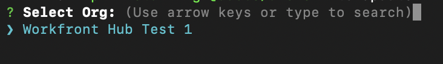
    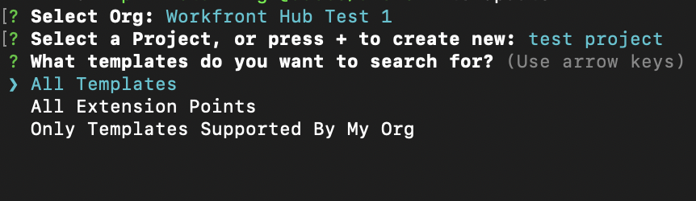

1. Browse all available templates and choose the **@adobe/workfront-ui-ext-tpl** for your project.
    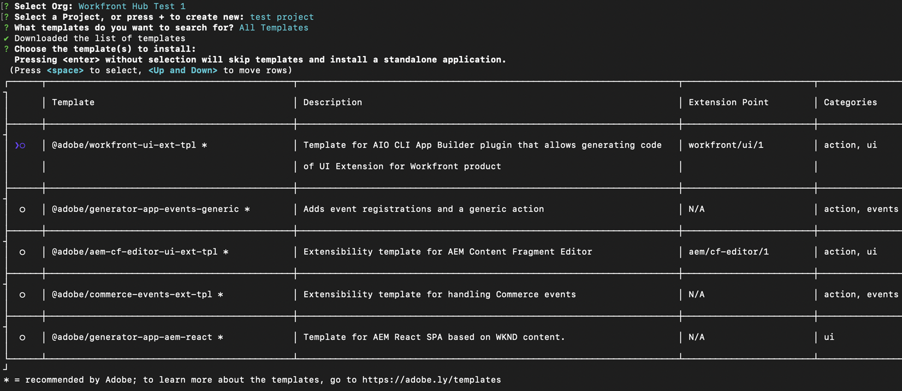
1. Select and enter the project name you created in the Adobe Developer Console.
    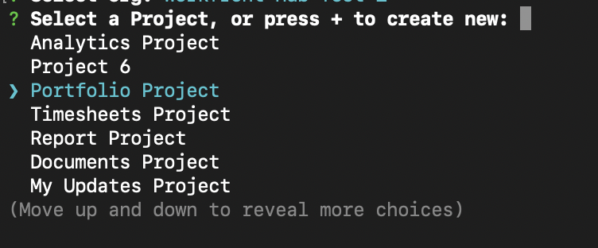

1. Answer the prompts for the application:  

    * Name the extension.  
    * Provide a descriptive summary of the extension's functionality.  
    * Select an initial version number to start with.  
    * The template will create the code for a primary navigation button if you select "Add a custom button to Main Menu Item" when prompted for "What would you like to do next?".

    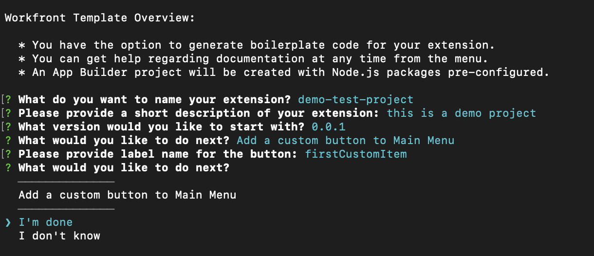

1. Confirm completion by selecting I'm done. The code generation from the template is in process.
    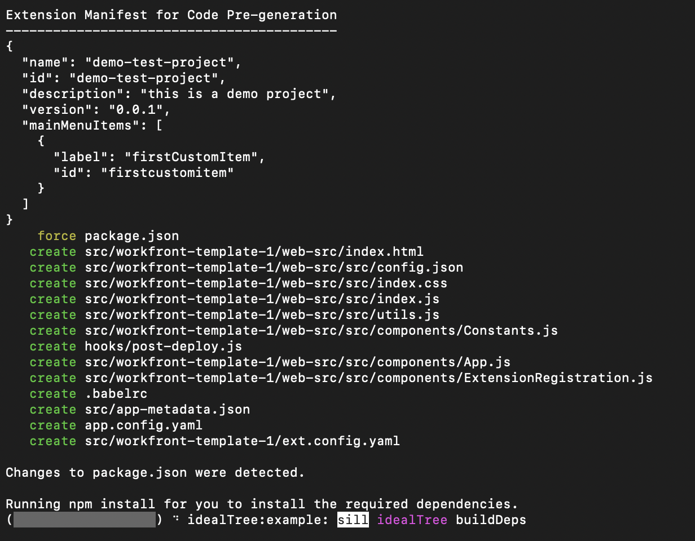
1. Wait until you see a message that the app initialization is finished. Then you can open the project in an IDE (VSCode is recommended) and access the src folder.  

    For more information on the folders and files in your project, see the [Adobe developer site](https://developer.adobe.com/app-builder/docs/getting_started/first_app/#5-anatomy-of-an-appbuilder-application).

## Build the extensions in VSCode  

The App.js file configuration is required for enabling navigation via the Workfront Main Menu or secondary navigation (left panel).  

The ExtensionRegistration.js file configuration is required to display the extensions in Workfront layout templates.  

The following examples show you how to add custom applications to the Workfront Main Menu and an object's left panel, using the UI extensions.

### Configure ExtensionRegistration.js  

To allow custom applications in the Workfront Main Menu:

1. Go to ExtensionRegistration.js.  

In the ExtensionRegistration function you should see the following code. This code was created for you by the template. This code can be added to create additional menu items. Be sure to replace IDs and URLs.

    ```
    mainMenu: { 

            getItems() { 

                return [ 

                { 

                    id: 'main-menu-label', 

                    url: '/index.html#/main-menu-label', 

                    label: 'Main menu label', 

                    icon: icon1, 

                }, 

                ]; 

            }, 

            } 
    ```

1. Add the following code snippet:
    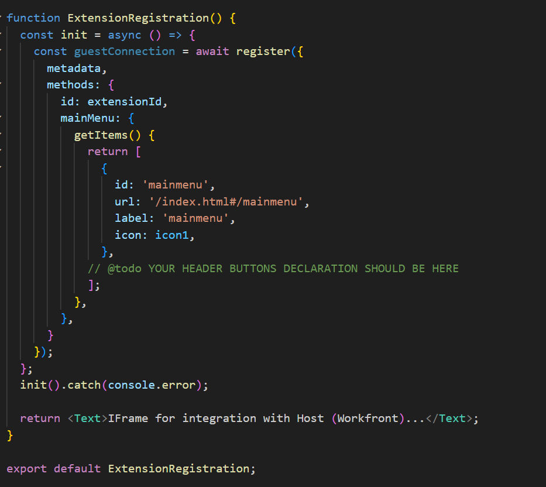
    This example shows a Main Menu item. You must update the ID, label, icon, and URL to the correct names for your application. When adding multiple items make sure that the ID is unique.

1. Save your work. 

### Allow custom applications in the Workfront left panel navigation

To allow custom applications in the Workfront left panel navigation:  

1. Go to ExtensionRegistration.js.
1. In the ExtensionRegistration function, add the following code snippet:

    ```
    secondaryNav: {  

    TASK: {  

        getItems() {       return [         {           id: "TASK", 

    label: "My TASK",           icon: metricsIcon,           url: "/myTask",  

            },  

        ];  

        },  

    },  

    },  

    ```

    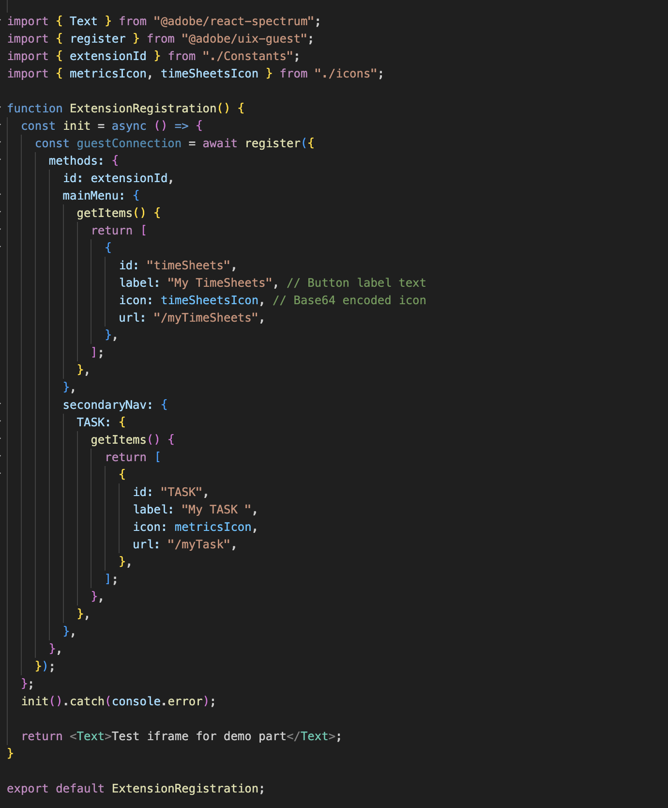

    * This example shows a left panel navigation item called My Task. You must update the ID, label, icon, and URL to the correct names for your application.  

    * This example shows a left panel navigation item for the Project object type. You must create these items separately for each object where they are supported in Workfront. The following objects are available: project, task, issue, portfolio, and program.  

1. Save your work.

### Configure App.js  

1. Go to App.js.  

1. The template will a route for a main menu option. A route defines the mapping between URL paths and the components rendered for those paths. To add a route, use the following code snippet, be sure to replace the exact path and element with yours.

    ```
        <Route 

                exact path="custom-application" 

                element={<Customapplication />} 

            /> 
    ``` 

    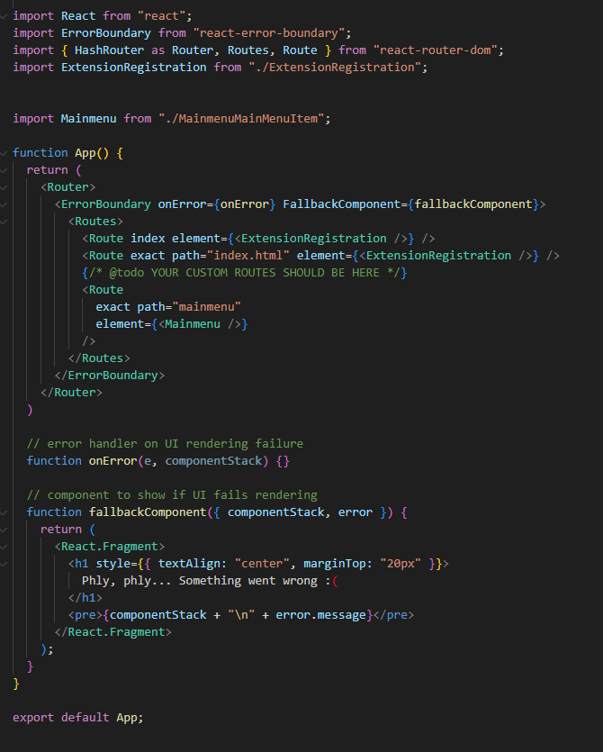
1. Save your work.  

For more information on developing and running the application, see the [Adobe developer site](https://developer.adobe.com/app-builder/docs/getting_started/first_app/#6developing-the-application).

## Shared Context 

Shared context is used to share data from Workfront to a UI Extension. The data available through shared context includes user data and the application context.  
 

 ### User 

Workfront's UI Extensions share user data. The user object available through shared context includes a Workfront user ID and the user's email address.  

`user = (conn?.sharedContext?.get("user")); // {ID: '1', email: 'test@aaa.com'} userID = user.ID userEmail = user.email `

### Application context 

When adding a custom application using a Secondary Navigation extension point it's common for the custom application to use context data like a project ID or document ID. For these data, the shared context includes an object code and object ID.

Here is an example for getting the application context for documents: 

`context = conn?.sharedContext; // Using the connection created above, grab the document details from the host tunnel. // conn?.host?.document?.getDocumentDetails().then(setDocDetails); `

## Test the app in Workfront  

While developing your App Builder application for Workfront, you might need to test your app within Workfront without publishing it.  

Within your App Builder app, you can initiate `aio app run` for local development. This will provide you with a URL, typically something like `https://localhost:9080`. Alternatively, you can execute `aio app deploy` to obtain a static Adobe domain. Make sure to note these URLs for future use.  

Next, navigate to the specific page you want to develop against in your browser. Open the developer tools and access the Local Storage for either workfront.com or workfront.adobe.com. Here, you must add an entry. Use `extensionOverride` as the key and the previously noted app builder URL as the value.  

If the configuration was completed correctly, when you reload the layout template page in Workfront, you will see the buttons from your App Builder application. Add the app buttons to the Main Menu and left panel for an object and verify that they appear correctly in those areas.  

Additional instructions are available on the Adobe developer site, using an example from AEM: https://developer.adobe.com/uix/docs/guides/preview-extension-locally/ 

  

## Publish applications and approve the submission  

To publish the application and approve it, follow the instructions on the [Adobe developer site](https://developer.adobe.com/uix/docs/guides/publication/).

  