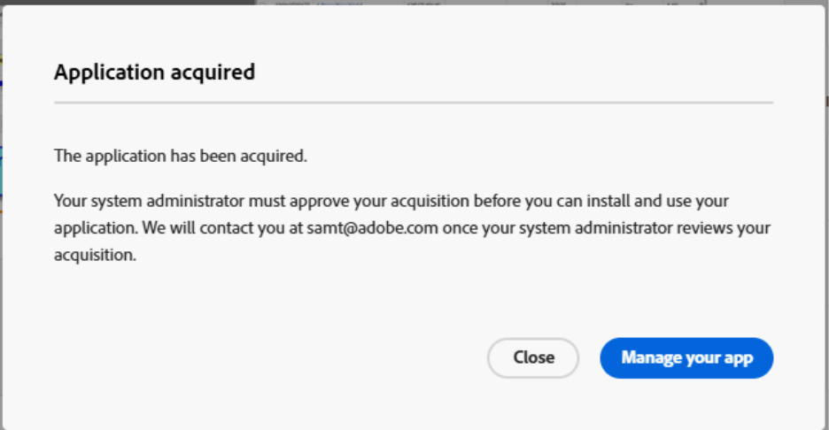
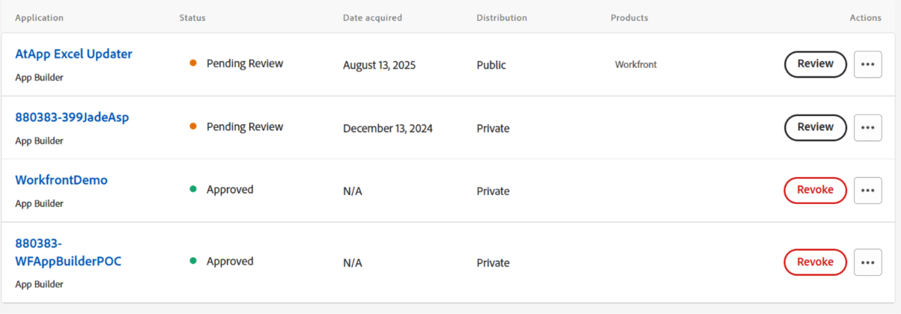
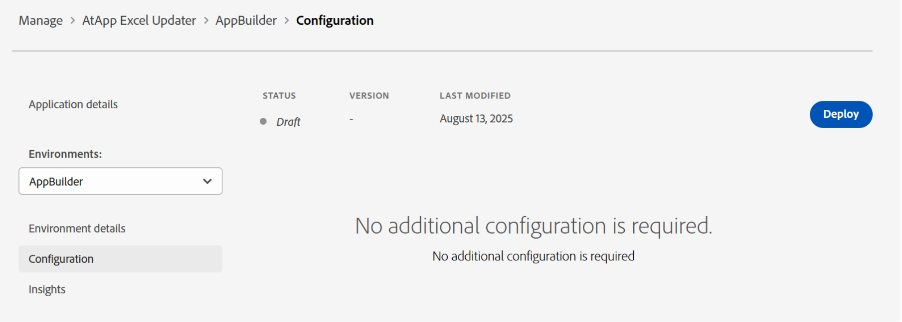
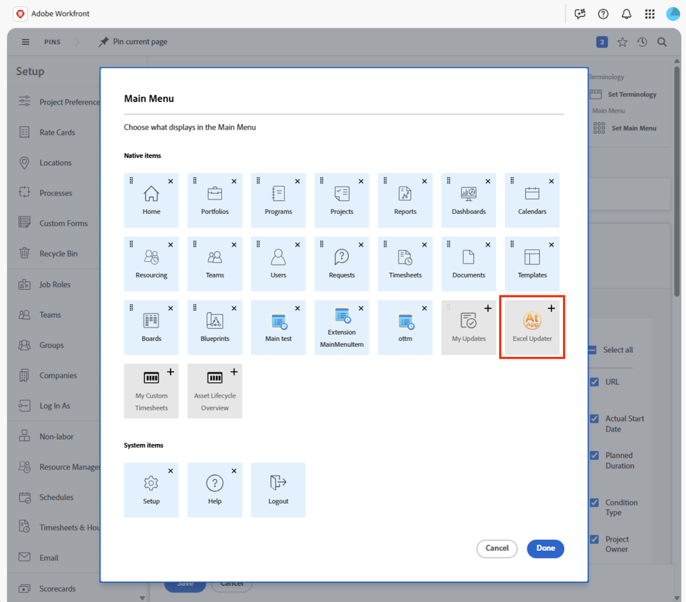

# Acquire and install apps from Adobe Exchange

You can now install partner-built apps for Workfront directly from Adobe Exchange. This capability connects customers to a growing ecosystem of Adobe partners who deliver purpose-built tools that improve productivity, streamline operations, and extend Workfront functionality. Through Adobe Exchange, customers can discover and install apps that integrate seamlessly into Workfront using UI Extensions. 

Adobe Exchange is the central marketplace for third-party applications, extensions, and integrations across Adobe Experience Cloud—including Adobe Workfront. For Workfront customers, it's the go-to destination to discover and install apps that enhance functionality, streamline workflows, and integrate with external systems. 

## Adobe partner apps

The Workfront Partner Network is a growing ecosystem of technology partners—independent software vendors (ISVs) who build scalable, secure, and extensible apps using Adobe App Builder and Workfront UI Extensions. 

Workfront partners leverage Workfront UI Extensions, a powerful framework that allows apps to be embedded directly into the Workfront interface. Once installed from Adobe Exchange, Workfront administrators can add these apps to layout templates, making them visible and accessible to users within their daily workflows. This seamless integration ensures that users can interact with partner-built tools—such as dashboards, approval flows, or campaign trackers—without leaving the Workfront environment. 

### AtApp 

#### Real-time results, right inside Adobe Workfront 

We partner with Adobe Workfront customers to turn everyday bottlenecks into repeatable solutions with predictable outcomes. Our growing library of solutions helps you drive accuracy, speed, and accountability using live data from right where people work. You can help leaders see what is happening now and plan what should happen next. Explore the AtAppStore Adobe Exchange apps currently available and ready to install, then choose the ones that match your current priorities, then scale as your needs grow. 

* [Excel Updater](https://exchange.adobe.com/apps/ec/abtt1rq7o9/atapp-excel-updater): Excel Updater solution affords you a cost-effective path to integrate data into Workfront without having to learn the API, write code, or set up a server, and is ideal for both one time and recurring data loads. 

* [Recalc Helper](https://exchange.adobe.com/apps/ec/abv755903t/atapp-recalc-helper): Recalc Helper solution provides you a quick way to easily recalculate the custom form calculated expressions, project timelines, or project finances for all items matching a selected filter, right from within Workfront. 

* UberTimesheet: UberTimesheet solution can improve and expand your users' adoption of Workfront by making it simple and convenient for everyone to track time from their browser, tablet, or smart phone, after the fact. 

### Workfocus 

Workfocus delivers advanced automation and integration solutions for Workfront. Their apps focus on: 

* Streamlining timelines 

* Automating Fusion workflows 

* Enabling cross-instance collaboration 

Workfocus apps are designed to operate natively within Workfront, leveraging UI Extensions to provide users with powerful tools that enhance productivity and reduce manual effort. 

## Prerequisites and permissions

**App Builder Provisioning**

* Customers must have App Builder provisioned in their Adobe Admin Console. This is a prerequisite for installing apps from Adobe Exchange.

**Enterprise Org Admins or Developers**

* Can search for apps, click **Get**, and proceed with installation. 

* If the app is already acquired by someone in the org, they may see **Begin Installation** or **Manage** instead. 

**Non-Admin Users**

* May initiate acquisition but will be prompted to log in and may encounter restrictions if the app requires admin consent or special licensing.

## Acquire and install apps from Adobe Exchange

Adobe customers can browse, search, and install apps directly from the Adobe Exchange Marketplace to use within Workfront.  

Apps built with Adobe App Builder are listed as _App Builder Applications_ on Adobe Exchange. Each app listing includes documentation, screenshots, and usage instructions to help customers understand the app's value. 

To view apps for Workfront, navigate to Adobe Exchange and search for Workfront-compatible apps. You can also filter listings for Workfront App Builder apps: 

1. Click on **Experience Cloud** in the left-hand panel.
1. In the left panel, find **Product**, then select **Workfront**.
1. Expand **App Type**, then choose **App Builder**.

### Acquire apps

Apps may require purchase from Adobe Exchange or allow installation but require licensing from the app developer. 

To acquire an app

1. Click the name of the app.
1. Click the button located in the top-right corner of the app listing. 
1. Click **Yes, continue** and then accept the end-user license agreement.
    

### Actions for System Administrators 

When a user acquires an app from Adobe Exchange, they may see the following message: _Your system administrator must approve your acquisition before you can install and use your application._ 

This means that the app requires admin-level approval before installation can proceed. System admins can find the request from the following areas:

**Notifications** 

System administrators are typically notified by email when a user in their organization acquires an app.

**Admin Console**

System administrators can log into the Admin Console at [https://adminconsole.adobe.com/](https://adminconsole.adobe.com/) and navigate to Products > App Integrations to view all acquired or requested apps. 

Once a system administrator has access to the requests, they can review and approve the application. Some apps may prompt the admin to consent to data access and assign the app to product profiles or specific users. 

Once approved, the app becomes available for installation. 

## Install apps

Once an app is acquired, it can be installed directly into Workfront. Administrators can manage installed apps through the Workfront interface, ensuring they are properly configured and accessible to users.

1. Find the app you want to install and open the Actions menu on the right side of the screen. 
1. Click View app details. 
1. Select an environment on the left side of the screen or add a new one. 
1. Click **Deploy**.
    
1. Assign Installation or Usage Rights (if required).

    If your organization controls app access via product profiles or user groups, assign the app to the appropriate profile or group so users can proceed with installation and use. 

## Add to Layout Template 

Once deployed, the partner app will be available in the Workfront layout template. You can add the app to primary or secondary navigation to use in Workfront. 

To add the app to the layout template, open the layout template and go to the Main Menu or secondary menu area. Add the app using the Add icon.

## Contact App support

Extensions installed from Adobe Exchange are supported by the app owners. From manage apps, you can click **Get support** to get help with any issues.
