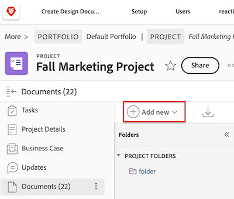

# Add documents to Adobe Workfront from your file system

You can add documents to projects, tasks, or issues in the following areas in Adobe Workfront:

* The global Documents area 
* The Documents area for a Workfront object
* A connected card on a Workfront board

You can also upload new versions of documents and add links to documents from third-party cloud vendors, such as Google Drive, Dropbox, and Microsoft OneDrive. For information about adding new versions of documents, see [Upload a new version of a document](../../documents/managing-documents/upload-new-document-version.md). For information about adding documents from third-party cloud vendors, see [Link documents from external applications](../../documents/adding-documents-to-workfront/link-documents-from-external-apps.md).

There are no restrictions on the types and sizes of files that you can upload to Workfront. However, in order to be successful, the upload must be completed within five minutes and you must have adequate storage space available.

If you need information about uploading new versions of a document to Workfront, see [Upload a new version of a document](../../documents/managing-documents/upload-new-document-version.md).

## Access requirements

+++ Expand to view access requirements for the functionality in this article.

You must have the following:

<table style="table-layout:auto"> 
 <col> 
 <col> 
 <tbody> 
  <tr> 
   <td role="rowheader">Adobe Workfront plan*</td> 
   <td> 
 Any
 </td> 
  </tr> 
  <tr> 
   <td role="rowheader">Adobe Workfront licenses*</td> 
   <td> 
Request or higher
 </td> 
  </tr> 
  <tr> 
   <td role="rowheader">Access level configurations*</td> 
   <td> 
Edit access to Documents
 
Note: If you still don't have access, ask your Workfront administrator if they set additional restrictions in your access level. For information on how a Workfront administrator can modify your access level, see <a href="../../administration-and-setup/add-users/configure-and-grant-access/create-modify-access-levels.md" class="MCXref xref">Create or modify custom access levels</a>.
 </td> 
  </tr> 
 </tbody> 
</table>

&#42;To find out what plan, license type, or access you have, contact your Workfront administrator.

+++

## Add documents to Workfront

You can add new documents to Workfront from the file system on your workstation. You can also link documents from third-party applications such as Google Drive and SharePoint.

>[!NOTE]
>
>While there is no size limit for document uploads, document downloads are limited to 4GB.

To add a document:

1. Go to the project, task, or issue where you want to add a new document.
1. Click the **Documents** tab, then click the **Add New** drop-down menu.

   

1. Depending on the type of document you want to add, do any of the following: 

   <table style="table-layout:auto"> 
    <col> 
    <col> 
    <tbody> 
     <tr> 
      <td role="rowheader">Upload documents from your file system on your workstation</td> 
      <td> 
       <ol> 
        <li value="1">From the <strong>Add New</strong> drop-down menu, select <strong>Document.</strong></li> 
        <li value="2"> 
Browse to and select the document that you want to add from the file system on your workstation. 
 
You can select multiple documents by pressing the Shift key as you select additional files.
 </li> 
        <li value="3">Click <strong>Open</strong>.</li> 
       </ol> 
       
<b>NOTE</b>: You can also drag and drop files directly from your file manager into the document list.</td> 
     </tr> 
     <tr> 
      <td role="rowheader">Upload documents from a third-party application such as Google Drive or SharePoint</td> 
      <td> 
       <ol> 
        <li value="1"> 
From the <strong>Add New</strong> drop-down menu, select <strong>From &lt;name_of_third-party_application&gt;</strong>.
 
For example, to upload a document from Google Drive, click <strong>From Google Drive</strong>.
 </li> 
        <li value="2"> 
Follow the prompts to select the document in the third-party application. 
 
For more information about linked documents, see <a href="../../documents/adding-documents-to-workfront/link-documents-from-external-apps.md" class="MCXref xref">Link documents from external applications</a>.
 </li> 
       </ol> </td> 
     </tr> 
     <tr> 
      <td role="rowheader">Request a document from another Workfront user</td> 
      <td> 
       <ol> 
        <li value="1">From the <strong>Add New</strong> drop-down menu, select <strong>Request a Document</strong>.</li> 
        <li value="2">In the <strong>Who are you requesting it from</strong> box, type the name of the user from whom you are requesting the document.</li> 
        <li value="3">In the <strong>Tell them what you're requesting</strong> box, type the name of the document.</li> 
        <li value="4"> 
Click <strong>Send Request</strong>.
 
Your request displays on your Documents tab.
 
For more information about requesting documents, see <a href="../../documents/adding-documents-to-workfront/request-a-document.md" class="MCXref xref">Request a Document</a>.
 </li> 
       </ol> </td> 
     </tr> 
    </tbody> 
   </table>

## Document security

The Workfront site prevents viruses and other malicious content from entering the site via documents in the following ways:

* [How Workfront detects corrupted files](#how-workfront-detects-corrupted-files) 
* [File name restrictions](#file-name-restrictions)

### How Workfront detects corrupted files {#how-workfront-detects-corrupted-files}

Document scanning is enabled for your organization only upon request.

If document scanning is enabled, files under 25 MB are scanned when they are uploaded. Files over 25 MB are not scanned.

If Workfront detects a corrupted document, Workfront discontinues the upload process and a message appears indicating that the file is corrupt. You also receive an email notification when Workfront detects potentially malicious content and the file is slated for removal.

Corrupted files are removed within 24 hours of detection unless you remove it manually. If you delete a corrupted file, Workfront tracks this action as an update. If you allow Workfront to remove it, then no updates are recorded.

### File name restrictions {#file-name-restrictions}

Files that are uploaded to Workfront cannot contain certain characters in file names. If a file contains any of the following characters in the file name, the characters are removed from the file name when the file is uploaded: `! # % * \ | ' " / ? < > { } [ ]`.
