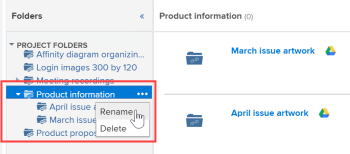

# Link documents from external applications

<!-- Audited: 01/2024 -->

You can link documents and folders to Adobe Workfront from the following sources:

<table style="table-layout:auto"> 
 <col> 
 <col> 
 <tbody> 
  <tr> 
   <td role="rowheader">Existing third party cloud document providers</td> 
   <td>These include the following: 
    <ul> 
     <li>Box</li> 
     <li>Dropbox</li> 
     <li>Dropbox Business</li> 
     <li>WebDAM</li> 
     <li>Microsoft OneDrive</li> 
     <li>Microsoft SharePoint</li> 
     <li>Google Drive</li> 
    </ul></td> 
  </tr> 
  <tr> 
   <td role="rowheader">Workfront Proof </td> 
   <td>You can make proofs that were originally created within Workfront Proof available within Workfront. For the current licenses, a Pro Workfront Plan or higher is required to use this feature. For the new licenses, all plans include this feature. For more information about the various plans available, see <a href="https://www.workfront.com/plans">Workfront Plans</a>.</td> 
  </tr> 
  <tr data-mc-conditions="QuicksilverOrClassic.Quicksilver"> 
   <td role="rowheader">Experience Manager Assets Essentials </td> 
   <td>You can link documents to Workfront from Experience Manager Assets Essentials. For more information, see <a href="../../documents/adobe-workfront-for-experience-manager-assets-essentials/workfront-for-aem-asset-essentials.md" class="MCXref xref"> Adobe Workfront for Experience Manager Assets Essentials</a>.</td> 
  </tr> 
  <tr> 
   <td role="rowheader">Workfront DAM </td> 
   <td>This requires an additional purchase. </td> 
  </tr> 
  <tr> 
   <td role="rowheader">Other document providers (through custom document integrations)</td> 
   <td> 
For the current licenses, a Pro Workfront Plan or higher is required to use this feature. For the new licenses, all plans include this feature. For more information about the various plans available, see <a href="https://www.workfront.com/plans">Workfront Plans</a>.
 </td>
  </tr> 
 </tbody> 
</table>

Before you link documents or folders, your Workfront administrator must enable this functionality for each document provider, or for a custom document integration, as described in [Configure document integrations](../../administration-and-setup/configure-integrations/configure-document-integrations.md).

You can proof and approve documents linked to an external cloud provider the same way you do so with documents uploaded directly to Workfront. 

## Access requirements

You must have the following access to perform the steps in this article:

<table style="table-layout:auto"> 
 <col> 
 <col> 
 <tbody> 
  <tr> 
   <td role="rowheader">Adobe Workfront plan</td>
   <td> 
 Any
 </td>
  </tr> 
  <tr> 
   <td role="rowheader">Adobe Workfront license</td>
   <td>
New: Contributor or higher

    
or

    
Current: Request or higher
 </td>
  </tr> 
  <tr> 
   <td role="rowheader">Access level configurations</td> 
   <td> 
Edit access to Documents
 </td> 
  </tr> 
 </tbody> 
</table>

For more detail about the information in this table, see [Access requirements in Workfront documentation](/help/quicksilver/administration-and-setup/add-users/access-levels-and-object-permissions/access-level-requirements-in-documentation.md).

## Document storage

Documents that are linked to Workfront from an external application are stored with the external cloud provider, not within Workfront.

The following exceptions apply:

* When provided by the document service, thumbnails and preview images might be stored on Workfront servers.
* When you use proofing in Workfront, the document is copied and added to the proofing servers. 

## Link a document from an external application to Workfront

You can link existing documents with an external cloud provider. This includes any shared documents.

### Prerequisites {#prerequisites}

Before you link documents or folders, your Workfront administrator must enable this functionality for each document provider, or for a custom document integration, as described in [Configure document integrations](../../administration-and-setup/configure-integrations/configure-document-integrations.md).

### Link an external document to Workfront {#link-an-external-document-to-workfront}

You can link documents to Workfront from an external application such as Google and Microsoft OneDrive.

>[!IMPORTANT]
>
>Dropbox stores documents based on the file path. Because of this, if a file linked from Dropbox is moved, renamed, or deleted, it becomes inaccessible in Workfront.

1. Go to the **Documents** area in Workfront where you want the document.
1. Click **Add New**, then click the external document provider where you want to link documents to Workfront.

   For example, to link documents from Dropbox, click **From Dropbox**.

   External providers that you have already authorized appear at the top of the list.

1. (Conditional) If you are prompted to log into the external service, type your login credentials for the service in the box that appears, then click **Sign in**.
1. (Conditional) If you are prompted to authorize the external application, click the **Authorize** button.

   You need to do this only once.

1. In the search box of the **Link External Files and Folders** box that appears, type the name of the item you want to search for, then press **Enter** to see all results from the external application, regardless of which folder they are storied in.

   Or

   Browse to and select the documents you want to link.

   Though you can select multiple documents, only documents that are selected in the current view are linked. For example, if you select a document, then go into a folder, the document you originally selected is not linked.

1. (Conditional) If you are a Workfront DAM customer, click the **Thumbnail** icon to display files as thumbnail images.

   >[!NOTE]
   >
   >Workfront DAM customers can view thumbnails when linking documents from Workfront DAM. Thumbnails might also be displayed for Workfront DAM customers for other services such as Dropbox and Box. However, viewing thumbnails for services other than Workfront DAM within Workfront is not supported, and thumbnails are never displayed when linking documents from SharePoint or Google Drive.

1. Click **Link**.

   In Workfront, the cloud provider's icon appears next to the documents.

   >[!NOTE]
   >
   >For documents that are linked to Box, the link to the document in Box does not display until you refresh the page.

### Add a new version of a linked document {#add-a-new-version-of-a-linked-document}

You can add a new version of a document linked to Workfront from an external application.

1. Go to the **Documents** area where the document is linked, then select the linked document.

   >[!IMPORTANT]
   >
   >The document must be outside of a linked folder to create a new version.

1. Click **Add New** > **Version**, then click the external document provider.

   For example, to link a new version of a document from Dropbox, click **From Dropbox**.

   External providers that you have already authorized appear at the top of the list.

1. (Conditional) If you are prompted to log into the external service, type your login credentials for the service in the box that appears, then click **Sign in**.
1. (Conditional) If you are prompted to authorize the external application, click **Authorize**.

   You need to do this only once.

1. In the search box of the **Link External Files and Folders** box that appears, type the name of the item you want to search for, then press **Enter** to see all results from the external application, regardless of which folder they are stored in.

   Or

   Browse to and select the documents you want to link.

   You can select multiple documents; however, only documents that are selected in the current view are linked. For example, if you select a document, then go into a folder, the document you originally selected is not linked.

1. (Conditional) If you are a Workfront DAM customer, click the **Thumbnail** icon to display files as thumbnail images.

   >[!NOTE]
   >
   >Workfront DAM customers can view thumbnails when linking documents from Workfront DAM. Thumbnails might also be displayed for Workfront DAM customers for other services such as Dropbox and Box. However, viewing thumbnails for services other than Workfront DAM within Workfront is not supported, and thumbnails are never displayed when linking documents from SharePoint or Google Drive.

1. Click **Link**.

   In Workfront, the cloud provider's icon appears next to the documents, indicating that they are linked to the external cloud provider.

   >[!NOTE]
   >
   >For documents that are linked to Box, the link to the document in Box does not display until you refresh the page.

For information about adding new version of a document you have uploaded to Workfront from your file system, see [Add documents to Adobe Workfront](../../documents/adding-documents-to-workfront/add-documents-from-file-system.md#add-documents-to-workfront) in [Add documents to Adobe Workfront from your file system](../../documents/adding-documents-to-workfront/add-documents-from-file-system.md).

### Link Workfront Proof documents {#link-workfront-proof-documents}

You can link proofs to Workfront that originally existed in Workfront Proof. When you link a proof from Workfront Proof, all comments and other metadata associated with the proof are available in Workfront. 

You can link only those proofs for which you have View access in Workfront Proof.

1. Go to the **Documents** area in Workfront where you want the document.
1. Click **Add New**, then click **From Workfront Proof**.

   >[!NOTE]
   >
   >The options in this menu may vary depending on what third party providers are configured in your environment.

1. In the **Link proofs from Workfront Proof** box that appears, begin typing the name of the proof you want to make available in Workfront.

   The list is filtered as you type.

1. Select up to 10 proofs to link.

   Any proof name that is dimmed is not available to link, because the proof is already associated with a document in Workfront.

1. Click **Link**.

   The most current version of the proof is linked to Workfront. When you open the proof, all versions are available in the proofing viewer.

### Create a Google document from within Workfront {#create-a-google-document-from-within-workfront}

You can create a new Google document from within Workfront. You cannot create new documents from within Workfront for other cloud providers.

1. Go to the **Documents** area in Workfront where you want the document.
1. Click **Add New** > **Google File**, then select the type of Google document you want to create.
1. If the **Add Google Drive Account** box appears, click **Authorize Google Drive**.

   A Google document is added to the **Documents** tab.

   >[!NOTE]
   >
   > My Drive and Shared with Me display two different results. If you are unable to locate a file in My Drive, check in the Shared with Me folder.

## Upload and link a document from Workfront to an external cloud provider

You can upload and link a document from Workfront to an external cloud provider. This moves storage of the document from Workfront to the external cloud provider. When the document is changed in the external application, it updates automatically in Workfront.

>[!NOTE]
>
>Sending an asset to an external document provider creates a new version of the asset.

Users without Workfront access can see the document in the external application if they have access to the application.

1. Select a document that is uploaded in Workfront.
1. Click **More** >**Send to**, then select the cloud provider that you want to store the linked document.

   You can also use the More menu  on the Document Details page to do this.  

1. Select the folder in the provider's application where you want to store the document.

   This can be any folder in the provider's application, including a shared folder. 

1. Click **Save**.

   The external provider's logo appears next to the document name to indicate that the document is now linked to Workfront and stored by the external cloud provider.

   

## Link folders

When you link a folder between Workfront and an external cloud provider, the folder and all of its contents are linked. If users without Workfront access add, remove, and modify files from the external document application, their changes are synchronized to Workfront.

### Folder access rights {#folder-access-rights}

When synchronizing folder content from an external document application, Workfront uses the credentials of the user who originally linked the folder. This results in the following user experience:

* If users do not have access to view files and folders in the external application, but do have access to view the linked folder via Workfront, they can view only the names of the files and folders in Workfront, not their contents. 
* When someone accesses content inside a linked folder in Workfront (such as a subfolder in a linked folder) that was linked to Workfront by another user, the content synchronizes to Workfront using the Workfront login credentials of the user who originally linked the folder, not the credentials of the user accessing the content.

>[!IMPORTANT]
>
>* If the user who originally linked the folder is removed from the Workfront system, users are no longer able to access content on the linked folder via Workfront. In this case, the folder must be relinked by an active Workfront user who has rights to the folder in the external application. 
>* If the user who linked a folder no longer has access to the external application, Workfront can no longer access the contents of the folder. This may happen, for example, if the user who originally linked the folder leaves the company. To ensure continued access, a user with access to the folder must re-link the folder.

### Link one or more external folders {#link-one-or-more-external-folders}

1. Go to the area in Workfront where you want the folder, then click  **Documents**  in the left panel .

1. Click **Add New**, then click the external document provider from which you want to link a folder to Workfront.
1. (Conditional) If you have not yet authorized the external service, specify your login credentials for the external provider, then click **Sign in**.

   External providers that you have already authorized appear at the top of the list.

1. In the **Link External Files and Folders** box that appears, browse to and select the folders you want to link.

   Or

   Type the name of the folder you want to search for, then press **Enter**.

   You can select multiple folders; however, only folders that are selected in the current view are linked. For example, if you select a folder, then go into a folder, the folder you originally selected is not linked.

   >[!NOTE]
   >
   >When linking folders from Google Drive, you can only link folders that are within your personal drive (My Drive) and Team Drive. You cannot link folders from the Shared with Me area.

1. Click **Link**.

   In Workfront, the cloud provider's logo displays next to the folder, indicating that it is linked to the external cloud provider.

1. (Optional) To rename the folder so that the folder name in Workfront is different from the folder name in the external document application, select the folder in the **Folders** section, click the  More menu   that displays next to the folder name, then click **Rename**.

   

This does not rename the folder in the external application.

### Add subfolders to a linked folder  {#add-subfolders-to-a-linked-folder}

You can create a new folder inside an existing linked folder. You can also drag another folder into an existing linked folder.

1. To create a new folder within an existing linked folder, go to the existing folder, then create the new folder as described in [Create document folders](../../documents/organizing-documents/create-documents-folder.md).

   Or

   To drag an existing folder into an existing linked folder, go to the Documents area where you want the subfolder, then drag it into the linked folder.

   

   >[!NOTE]
   >
   >The following limitations apply when dragging an existing Workfront folder into a linked folder:
   >
   >* The folder that you are dragging can't already be linked and can't contain any content that is already linked.
   >* The folder (including its contents) that you are dragging can't exceed 50 MB.

## Add a document to a linked folder

When you add a document to a linked folder via Workfront, it is automatically added as a linked document.

1. Select the linked folder where you want the document, click **Add New > Document**, then browse to the document and add it to the folder.

   Or

   In the **Documents** area where you want the document, drag the document into a linked folder.

   A new version of your document is automatically created in the external application and linked to Workfront. 

>[!NOTE]
>
> * The document options are not available while the document is in the process of moving.
>
> * After a document is moved to Experience Manager Assets, is no longer visible in the document list in Workfront.
>
> * Any actions or edits you make on a document while it is moving will not appear on the document in Experience Manager Assets, and will therefore be lost.

## Delete a linked document or folder

When you delete a linked document or folder from the external application, the document or folder remains in the Workfront system until you also delete it from Workfront.

1. Select the linked document or folder, then click **Delete**.
1. In the confirmation box that appears, click **Yes, Unlink it**.

   The document is unlinked from the Workfront site. It is not affected in the external application.

## About renaming linked documents and folders

When you rename a linked document or folder, the change is visible only in the application where you make it. For example, if you rename a linked document in Workfront, the new name is visible only in Workfront.

If you want the name to match in Workfront and in the external application, you must rename it in both places.

>[!IMPORTANT]
>
>Do not rename a document in Workfront that is linked to Dropbox; doing so renders the file in Workfront inaccessible. Instead, rename the file in Dropbox, then re-synchronize the file.
