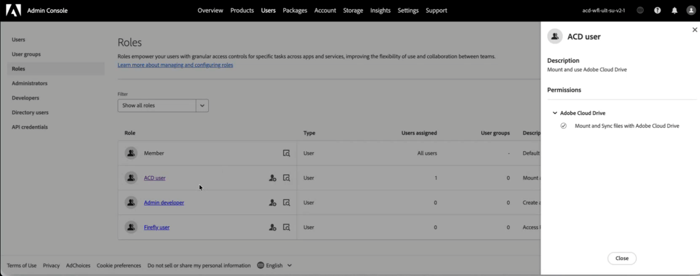
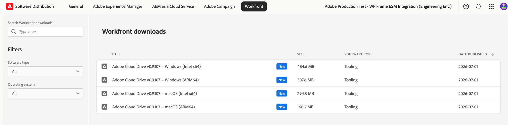

# Set up and manage Adobe Cloud Drive for your organization

As as administrator, you can set up Adobe Cloud Drive to give users direct desktop access to their project files in Adobe cloud storage, through Finder on macOS and File Explorer on Windows. This article covers how to enable access in the Adobe Admin Console, deploy the application to user devices, and manage access on an ongoing basis.

Adobe Cloud Drive is an enterprise desktop application that mounts Workfront documents on Adobe cloud storage as a virtual drive on users' Mac and Windows computers. After installation, users see their Workfront project folders in Finder or File Explorer and can open, edit, and save project files using any desktop application, without downloading files manually or working through a browser.

To use Adobe Cloud Drive, your organization must be on the Workflow Ultimate package, with Adobe cloud storage enabled.

For more information about Adobe Cloud Drive, see the following articles:

* [Adobe Cloud Drive overview](/help/quicksilver/documents/adobe-cloud-drive/adobe-cloud-drive-overview.md)
* [Install Adobe Cloud Drive](/help/quicksilver/documents/adobe-cloud-drive/install-adobe-cloud-drive.md)
* [Use Adobe Cloud Drive](/help/quicksilver/documents/adobe-cloud-drive/use-adobe-cloud-drive.md)

## Access requirements

+++ Expand to view access requirements for the functionality in this article.

<table style="table-layout:auto"> 
 <col> 
 <col> 
 <tbody> 
  <tr> 
   <td role="rowheader">Adobe Workfront version</td> 
   <td>Workflow Ultimate, with Adobe cloud storage enabled</td> 
  </tr> 
  <tr> 
   <td role="rowheader">Adobe administrator rights</td> 
   <td>You must be a Product Profile Administrator for Workfront in the Adobe Admin Console</td> 
  </tr> 
 </tbody> 
</table>

For information, see [Access requirements in Workfront documentation](/help/quicksilver/administration-and-setup/add-users/access-levels-and-object-permissions/access-level-requirements-in-documentation.md). 

+++

## Assign access to Adobe Cloud Drive in the Adobe Admin Console

Adobe Cloud Drive is included with the Workflow Ultimate package, when Adobe cloud storage is enabled. It does not appear as a standalone product in the **Products** section of the Admin Console. Instead, it is managed through the **Roles** section under **Users**.

When you go to **Users** > **Roles**, you see two roles associated with the Workfront product:

| Role | Automatically assigned to | Relevance to Adobe Cloud Drive |
| --- | --- | --- |
| **Member** | All users in the organization | Contains the org-level Adobe Cloud Drive capability switch. On by default. |
| **ACD user** | No one, by default | Grants individual access when the org-level switch is off. |

### Access controls

**Control 1: Org-level capability control (in the Member role)**

The **Member** role is automatically assigned to every user in your organization. Within this role, there is an **Adobe Cloud Drive** capability switch. When this switch is on, every user with a Workflow Ultimate license can access Adobe Cloud Drive. When it's off, no user can access Adobe Cloud Drive, regardless of their license.

The switch is on by default when Adobe activates Adobe Cloud Drive for your organization.

**Control 2: ACD user role**

The **ACD user** role is only relevant when the org-level switch is off. If you turn off the org-level switch to run a controlled pilot, you can still grant access to specific users by adding them to the **ACD user** role. Users in this role can access Adobe Cloud Drive even when the org-level switch is off. If the org-level switch is on, the **ACD user** role has no effect.

**Underlying requirement: Workflow Ultimate license**

Both controls apply only to users who have a Workflow Ultimate license. A user without a Workflow Ultimate license can't access Adobe Cloud Drive, regardless of how the switch or role is configured.

The license within the Workflow Ultimate package can be any license type: Standard, Light, or Contributor. For information about licenses, see [Licenses overview](/help/quicksilver/administration-and-setup/add-users/how-access-levels-work/licenses-overview.md).

The following table shows how these controls interact:

| Org-level switch | User in ACD user role | Workflow Ultimate license | Access result |
| --- | --- | --- | --- |
| On | Not required | Yes | Granted |
| On | Not required | No | Denied |
| Off | Yes | Yes | Granted |
| Off | No | Yes | Denied |
| Either | Either | No | Denied |

## Prerequisites

Verify the following before you start:

* The users you plan to provision have Workflow Ultimate licenses assigned.
* You've reviewed the [network requirements](#network-requirements) with your IT team.
* You've drafted communication to send to users explaining what Adobe Cloud Drive shows (Workfront project assets only) and how to install it.

   >[!NOTE]
   >
   >A user who has access enabled but doesn't have access to any Workfront projects sees an empty mounted drive after sign-in. This is expected. Workfront project access is managed separately in Workfront. For information, see [Share a project](/help/quicksilver/workfront-basics/grant-and-request-access-to-objects/share-a-project.md).

## Configure access in the Adobe Admin Console

Adobe Cloud Drive access is configured in the Adobe Admin Console. Choose the option that matches your rollout strategy.

### Option A: Enable access for your entire organization

When Adobe activates Adobe Cloud Drive for your organization, the org-level capability switch is turned on by default, and all users have access immediately. Use this procedure to confirm the switch is on before you deploy the application.

1. Sign in to [adminconsole.adobe.com](https://adminconsole.adobe.com/).
1. Click **Users** in the top navigation bar.
1. Click **Roles** in the left panel.
1. Click **Member** in the roles list.
1. In the **Member** panel that opens on the right, confirm that **Adobe Cloud Drive** appears under **Permissions** and its switch is on.

   

   >[!NOTE]
   >
   >If Adobe Cloud Drive doesn't appear under the **Member** role's **Permissions**, Adobe Cloud Drive might not yet be activated for your organization. Contact Adobe Support to confirm.

1. Click **Save** if you made any changes.

### Option B: Enable access for a specific group of users

Use this option when you want to limit access to a defined set of users, for example, during a pilot before a broader rollout. This involves turning off the org-level switch, then adding your pilot users to the **ACD user** role.

>[!IMPORTANT]
>
>Turning off the org-level switch removes Adobe Cloud Drive access for all users in your organization immediately, including users who are currently signed in. You must turn off the org-level capability and add the pilot users in the same session.

To turn off the org-level capability:

1. Sign in to [adminconsole.adobe.com](https://adminconsole.adobe.com/).
1. Click **Users** in the top navigation bar, then click **Roles** in the left panel.
1. Click **Member** in the roles list.
1. In the **Member** panel, locate **Adobe Cloud Drive** under **Permissions** and turn it off.
1. Click **Save**.

To add pilot users to the ACD user role:

1. In the left panel, click **Roles** to return to the roles list.
1. Click **ACD user** in the roles list.

   

1. Click **Add Users**.
1. Enter the email address of each pilot user.
1. Click **Save**.

   Users added to the **ACD user** role gain access immediately. Users not in this role remain without access until you add them to the role or turn the org-level switch back on.

   >[!TIP]
   >
   >To expand access over time, return to the **ACD user** role and add users as needed. When you're ready for a full rollout, turn the org-level switch back on in the **Member** role. Once the org-level switch is on, the **ACD user** role has no effect and does not need to be maintained.

## Deploy the Adobe Cloud Drive application

Configuring access in the Adobe Admin Console establishes entitlement. Deploying the application installs it on the user's device. These are two separate, required steps.

Adobe Cloud Drive is a standalone application. It is not distributed through the Creative Cloud desktop application and does not appear in the Creative Cloud package manager.

Choose the deployment method that matches your organization's device management practices.

### Method A: IT-managed deployment through Admin Console packages

Use this method when your organization uses centralized deployment tools such as Microsoft Intune, SCCM, Jamf Pro, or Apple Remote Desktop. This is the standard Adobe enterprise deployment workflow, and it follows the same package creation process used for other Adobe applications.

To create the package in the Adobe Admin Console:

1. Sign in to [adminconsole.adobe.com](https://adminconsole.adobe.com/).
1. Click **Packages** in the top navigation bar.
1. Click **Pre-generated packages** in the left panel.
1. Click the **Templates** tab.

   Adobe Cloud Drive appears twice in the template list: once for macOS and once for Windows.

   

1. Locate the **Adobe Cloud Drive** row that matches your target platform, then click the details icon on that row.

   A side panel displays the package metadata.

   

1. Click **Customize**.

   The package customization wizard opens, with four steps: **Configure**, **Choose apps**, **Options**, and **Finalize**.

1. In the **Configure** step, select the architecture for your target machines, then confirm the language setting and click **Next**.

   * **macOS:** Choose **macOS (Intel)** or **macOS (Apple Silicon)**.
   * **Windows:** Choose **Windows (64-bit)** or **Windows (ARM)**.

   

1. In the **Choose apps** step, confirm that Adobe Cloud Drive is selected with the version you want.

   Adobe Cloud Drive is pre-selected with the latest available version. To use an older version, click **Other versions** and select **Older versions**.

   

1. Click **Next**.
1. In the **Options** step, click **Next** without selecting any options.

   These settings apply to Creative Cloud desktop applications and don't apply to Adobe Cloud Drive.

   

1. In the **Finalize** step, type a name for the package and select **Flat package**.
1. Review the summary and click **Create package**.

   

   The wizard closes. Your new package appears at the top of the packages list with a **Preparing** status while it's being built. Once it's ready, the status changes to **Up to date** and a download link appears.

   

1. Click **Download** and save the package file to your chosen location.

### Method B: Self-serve direct download from Software Distribution

Use this method for smaller organizations, for self-managed devices, or when directing individual users to install the application themselves.

Before you start, confirm the following:

* Access is enabled for the users in the Adobe Admin Console.
* Users have been notified with the Software Distribution URL and sign-in instructions.
* Network connectivity to the required endpoints has been verified. For more information, see [Network requirements](#network-requirements) in this article.

To self-install Adobe Cloud Drive:

1. Confirm that access is enabled for the user in the Adobe Admin Console.
1. Direct the user to [experience.adobe.com/#/downloads](https://experience.adobe.com/#/downloads).

   >[!NOTE]
   >
   >Users must have Adobe Cloud Drive access enabled in the Adobe Admin Console to see the Adobe Cloud Drive installer. Users without access will not see the installer listed.

1. The user signs in with their Enterprise ID or Federated ID. The Adobe Cloud Drive installer appears in the **Workfront** tab of Software Distribution.
1. The user downloads the installer for their platform and follows the installation steps in [Install Adobe Cloud Drive](/help/quicksilver/documents/adobe-cloud-drive/install-adobe-cloud-drive.md).

   

After deploying, complete this verification on a test device:

1. Launch Adobe Cloud Drive from the **Applications** folder (macOS) or the **Start** menu (Windows).
1. Sign in with a user account that has Adobe Cloud Drive access enabled in the Adobe Admin Console.
1. Confirm that Workfront project folders appear in the mounted drive in Finder or File Explorer.

   >[!NOTE]
   >
   >A user who signs in successfully but sees no folders does not have access to any Workfront projects. Add the user to a project in Workfront to populate the drive.

1. Navigate to a project folder and create a small test file.
1. Open Workfront in a browser and confirm that the test file appears in the corresponding project.
1. Delete the test file after verification.

## Manage ongoing user access to Adobe Cloud Drive

Once your organization is using Adobe Cloud Drive, follow these steps to add new users, or to remove users who no longer need access.

### Add a new user

If the org-level switch is on, no Adobe Admin Console action is required. Any user with a Workflow Ultimate license already has access. Ask the user to download and install Adobe Cloud Drive. If a licensed user still can't access Adobe Cloud Drive, contact Adobe Support to confirm that their account was correctly migrated.

If the org-level switch is off:

1. Sign in to [adminconsole.adobe.com](https://adminconsole.adobe.com/).
1. Click **Users** in the top navigation bar, then click **Roles** in the left panel.
1. Click **ACD user** in the roles list.
1. Click **Add Users**, enter the user's email address, and click **Save**.

### Remove a user

If the org-level switch is on, Adobe Cloud Drive access is tied to the Workflow Ultimate license. To remove access for a specific user without removing their Workfront license, turn the org-level switch off and add all other users to the **ACD user** role, excluding the user you want to block. Alternatively, you can remove the user's Workfront license through your standard license management process.

If the org-level switch is off and the user is in the **ACD user** role:

1. Sign in to [adminconsole.adobe.com](https://adminconsole.adobe.com/).
1. Click **Users** in the top navigation bar, then click **Roles** in the left panel.
1. Click **ACD user** in the roles list.
1. Select the user and click **Remove**.

The user loses access to the mounted drive immediately. Files stored in Workfront aren't deleted. The user's local cache remains on their device until they uninstall the application.

>[!IMPORTANT]
>
>Removing a user from the **ACD user** role doesn't remove them from Workfront or from any Workfront projects. Manage Workfront project access separately.

## Manage Workfront project access

Adobe Cloud Drive shows users the Workfront projects they have access to. Project access is managed in Workfront, not in the Adobe Admin Console. A user who has Adobe Cloud Drive access but belongs to no Workfront projects sees an empty mounted drive after sign-in. This is expected behavior.

For information about managing project access, see [Manage projects](/help/quicksilver/manage-work/projects/manage-projects/manage-projects-overview.md) and [Share a project](/help/quicksilver/workfront-basics/grant-and-request-access-to-objects/share-a-project.md).

## Network requirements

Adobe Cloud Drive requires outbound HTTPS (port 443) access to a set of Adobe endpoints. No inbound firewall rules are required. For the list of endpoints, see [Adobe network endpoints](https://helpx.adobe.com/in/enterprise/kb/network-endpoints.html).

Adobe Cloud Drive reads the system-level proxy configuration on both macOS and Windows. Authenticated proxies are supported.

## Security considerations

### Authentication

Adobe Cloud Drive authenticates users through Adobe IMS (Identity Management System). Users sign in with their Enterprise ID or Federated ID. If your organization uses SSO configured in the Adobe Admin Console, users authenticate through your identity provider and don't need separate Adobe credentials.

>[!NOTE]
>
>Adobe Cloud Drive does not support personal Adobe IDs (individually created, unmanaged accounts) in enterprise deployments. Users must sign in with an Enterprise ID or Federated ID in your organization's directory.

### Data in transit and at rest

* All communication between Adobe Cloud Drive and Adobe services uses TLS 1.2 or higher.
* Files stored in Adobe cloud storage are encrypted at rest.
* Files cached locally use OS-level disk encryption when FileVault (macOS) or BitLocker (Windows) is enabled on the device.

### File access control

File access follows Workfront project permissions. Users see and interact only with projects they have permissions to, as their Workfront access level allows.

The root folder of each Workfront project is read-only in the desktop view. Users can't rename, move, or delete a project root folder from Finder or File Explorer. They can create folders, subfolders, and files at any depth inside a project folder, subject to their Workfront permissions.

## Troubleshoot common issues

For end-user troubleshooting steps, see [Troubleshoot Adobe Cloud Drive](/help/quicksilver/documents/adobe-cloud-drive/troubleshoot-adobe-cloud-drive.md). The issues listed below are specific to administrators.

### User can't find the Adobe Cloud Drive installer in Software Distribution

**Cause:** Adobe Cloud Drive access is not enabled for the user in the Adobe Admin Console.

**Resolution:**

1. Sign in to [adminconsole.adobe.com](https://adminconsole.adobe.com/) and click **Users**.
1. Search for the user and click their name.
1. Click the **Roles** tab and verify whether Adobe Cloud Drive is enabled.

### User installed the application and signed in, but sees no folders in the drive

**Cause:** The user doesn't have permissions to any Workfront projects.

**Resolution:**

1. In Workfront, confirm the user has permissions to at least one project.
1. If not, then share a project with the user.
1. Ask the user to wait up to five minutes for the project folder to appear.
1. If the folder still doesn't appear after five minutes, ask the user to quit Adobe Cloud Drive and relaunch it.

### User can't sign in to Adobe Cloud Drive

**Cause:** The user's Adobe Admin Console account is inactive, or their identity isn't configured correctly.

**Resolution:**

1. In the Adobe Admin Console, click **Users** and search for the user.
1. Confirm the user's account status is **Active**.
1. Confirm the user's email domain is a claimed domain in your Admin Console directory.
1. If your organization uses SSO, confirm the user's account is active in your identity provider.
1. Ask the user to try signing in again.

### Files are not syncing after the user saves

**Cause:** The file wasn't saved explicitly, or there is a network connectivity issue.

**Resolution:**

1. Confirm with the user that they saved the file using **File** > **Save** in the application. Closing an application or relying on auto-save doesn't trigger sync.
1. Confirm the user has internet access and can reach `*.adobe.com` and `*.workfront.com`.
1. Ask the user to check the Adobe Cloud Drive icon in the menu bar (macOS) or system tray (Windows) for an error indicator.
1. If an error is present, ask the user to quit Adobe Cloud Drive, relaunch it, and save the file again.
1. If the issue persists, collect the application log:

   * **macOS:** `~/Library/Logs/Adobe/AdobeCloudDrive/`
   * **Windows:** `C:\Users\<username>\AppData\Local\Temp\Adobe\AdobeCloudDrive\`

### A conflicted copy of a file appeared in the project folder

**Cause:** Two users saved changes to the same file before either version synced to the cloud. Adobe Cloud Drive preserved both versions automatically.

The conflicting copy uses this naming format: `filename (Conflicted copy from device_name on date_time).extension`
For example: `project_brief (Conflicted copy from jsmith's MacBook Pro on 2026-06-15-10-45-19).docx`

**Resolution:**

1. Ask both users which version is authoritative.
1. Copy any needed content from the conflicted copy into the primary file.
1. Delete the conflicted copy after reconciling the two versions.

   >[!NOTE]
   >
   >Adobe Cloud Drive doesn't use file locking. To prevent conflicts when multiple users edit the same file, coordinate editing through Workfront task assignments or approval workflows before multiple users access the same file from the desktop.

### User can't create a folder or file in the project

**Cause A:** The user is trying to create a folder or file at the project root level. Project root folders are currently read-only in Adobe Cloud Drive. Root-level folders represent Workfront projects, which are created and managed in Workfront.

**Resolution:**

1. Ask the user to navigate into any existing subfolder within the project and create the file or folder there.
1. If the user needs a new top-level folder inside the project, ask them to create it in Workfront first. It then appears in Adobe Cloud Drive.

**Cause B:** The user doesn't have editing permissions on the Workfront project.

**Resolution:**

1. In Workfront, check the user's permissions on the project (**View**, **Contribute**, or **Manage**).
1. Update the user's permissions to **Contribute** or **Manage** if they need to create or edit files.
