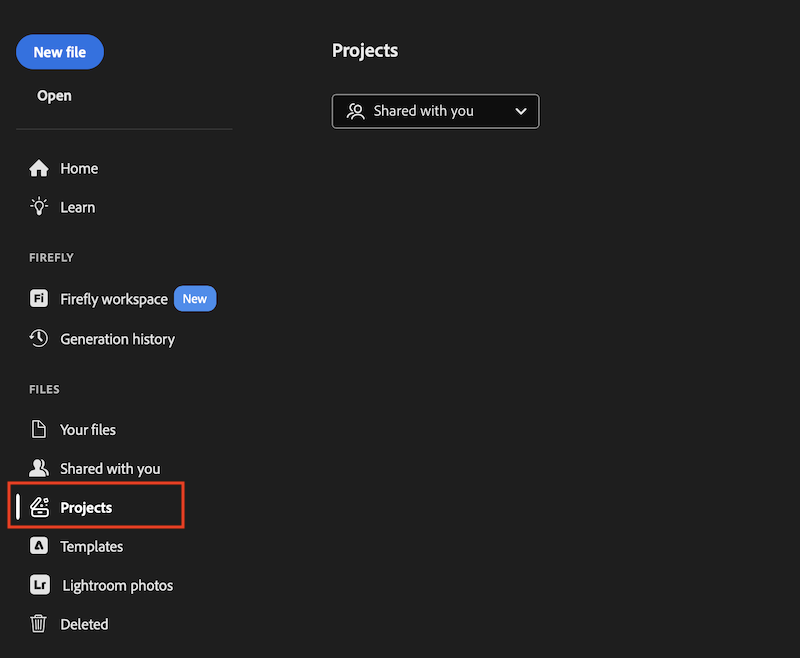

# Use Workfront documents in Creative Cloud apps

After a Workfront project is available in the Projects panel, you can work with its documents directly from Photoshop, Illustrator, or InDesign.

>[!IMPORTANT]
>
>**Open question:** Confirm exact access requirements (Workfront package, license, object permissions) for this feature before publishing. Not yet documented in the source material for this article.

## Access a Workfront project

1. Open Photoshop, Illustrator, or InDesign.
1. In the **Projects** panel on the left side of the app, select the Workfront project you want to open.

   

   >[!NOTE]
   >
   >The Projects panel includes a **Shared with you** filter at the top. **Open question:** what other filter options exist (for example, a "My projects" view), and how do they map to Workfront project ownership or sharing? Confirm before publishing.

1. Open a document in the project to edit it.

## Document folder structure

The Documents folder structure in a Workfront project is mirrored in the Creative Cloud app and in Adobe Cloud Drive. Changes you make to a document in one location are reflected in the others once you save.

For example:

* If you open a Photoshop document from a Workfront project folder — either from inside Photoshop or from Adobe Cloud Drive — and make changes, those changes appear in Workfront as soon as you save the file.
* If you open a Word document from Adobe Cloud Drive and make changes, those changes appear in Workfront as soon as you save the file. For more information, see [Edit and save a file](/help/quicksilver/documents/adobe-cloud-drive/use-adobe-cloud-drive.md#edit-and-save-a-file) in Use Adobe Cloud Drive.

>[!TIP]
>
>To edit a file type that isn't supported by Photoshop, Illustrator, or InDesign — such as a Word or Excel document — use Adobe Cloud Drive instead. For more information, see [Adobe Cloud Drive overview](/help/quicksilver/documents/adobe-cloud-drive/adobe-cloud-drive-overview.md).

## Request an approval on a document

You can add a document approval in Workfront to any document uploaded from a Creative Cloud app or from Adobe Cloud Drive, the same as any other document. For more information, see [Create a document approval workflow](/help/quicksilver/review-and-approve-work/document-reviews-and-approvals/manage-document-approvals/create-a-document-approval.md).

Creating an approval on a Creative Cloud document also creates a new version of the document. For more information, see [Manage document versions](/help/quicksilver/documents/managing-documents/manage-document-versions.md#view-the-current-file-during-an-approval).
