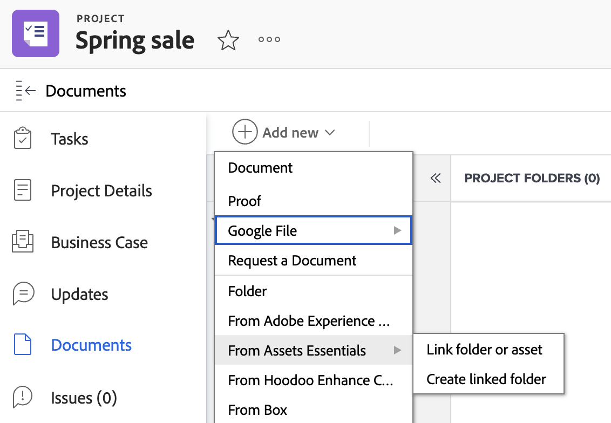

# Create a folder linked with Experience Manager Assets or Assets Essentials

You can create a folder linked with Experience Manager Assets or Assets Essentials while in Workfront. Because the folder is linked, any asset added to the folder will automatically show up in both Workfront and Experience Manger. You don't have to manually send the asset if it's in a linked folder.

## Access requirements

You must have the following:

<table>
  <tr>
   <td><strong>Adobe Workfront plan*</strong>
   </td>
   <td>Any
   </td>
  </tr>
  <tr>
   <td><strong>Adobe Workfront licenses*</strong>
   </td>
   <td>Plan
   </td>
  </tr>
  <tr>
   <td><strong>Product</strong>
   </td>
   <td>You must have Experience Manager Assets as a Cloud Service or Assets Essentials, and you must be added to the product as a user.
   </td>
  </tr>
  <tr>
   <td><strong>Experience Manager permissions</strong>
   </td>
   <td>You must have write access to the destination folder in the Experience Manger integration.
   </td>
  </tr>
  <tr>
   <td><strong>Access level configurations</strong>
   </td>
   <td>You must be a Workfront administrator to configure an Experience Manager integration. After it is configured, users with a Plan license can set up linked folders on individual projects.
   </td>
  </tr>
</table>

*To find out what plan, license type, or access you have, contact your Workfront administrator.

## Prerequisites

Before you begin,

* Your Workfront Administrator must configure an Experience Manager integration. For more information, see [Configure the Experience Manager Assets as a Cloud Service integration](/help/quicksilver/administration-and-setup/configure-integrations/configure-aacs-integration.md) or [Configure the Experience Manager Assets Essentials integration](/help/quicksilver/documents/adobe-workfront-for-experience-manager-assets-essentials/setup-asset-essentials.md).

## Create a linked folder

The linked folder is created in the location specified by the Workfront administrator when they set up the integration. Each integration can have only one folder location for linked folders.

The name for the linked folder is automatically created based on the Portfolio, Program, Project its associated with and can't be changed. If project is not associated with a Portfolio or Program, the linked folder will display the project name and creation date.

To create a linked folder:

1. Go to the Project where you want the folder.
1. Select **Add New**, then go to the Experience manager integration your administrator set up.
    >[!NOTE]
    >
    >The Workfront administrator can choose any name for this integration, so it might not specifically mention Experience Manager Assets or Assets Essentials.

1. Select **Create linked folder**. The system automatically creates a folder in Experience Manager based on the location specified when the integration was set up.

