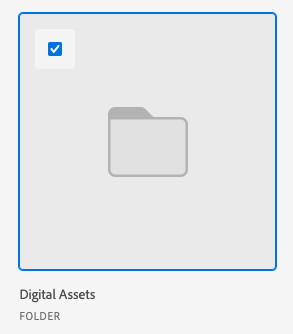

# Link assets and folders from Experience Manager Assets or Assets Essentials

You can link an asset or folder from Experience Manager Assets or Assets Essentials to any Adobe Workfront object that supports documents. Assets sent from Assets Essentials don't count towards your overall document storage in Workfront. Documents uploaded and sent from Workfront to Assets Essentials do count towards overall storage.

Metadata fields are first mapped when you send an asset from Workfront to Experience Manager Assets or Assets Essentials. If your Workfront administrator has enabled object metadata sync, fields remain up to date if they are changed in either application.

## Access requirements

+++ Expand to view access requirements for the functionality in this article.

You must have the following:

<table style="table-layout:auto"> 
 <col> 
 <col> 
 <tbody> 
  <tr> 
   <td role="rowheader">Adobe Workfront plan*</td> 
   <td> 
 Any
 </td> 
  </tr> 
  <tr> 
   <td role="rowheader">Adobe Workfront licenses*</td> 
   <td> 
Request or higher
 </td> 
  </tr> 
  <tr> 
   <td role="rowheader">Product</td> 
   <td>You must have Experience Manager as a Cloud Service or Assets Essentials, and you must be added to the product as a user in the Admin Console.</td> 
  </tr> 
   <tr> 
    <td role="rowheader">Experience Manager Permissions</td> 
    <td>You must have write access to the folder.</td> 
   </tr>
  <tr> 
   <td role="rowheader">Access level configurations*</td> 
   <td> 
Edit access to Documents
 
Note: If you still don't have access, ask your Workfront administrator if they set additional restrictions in your access level. For information on how a Workfront administrator can modify your access level, see <a href="../../administration-and-setup/add-users/configure-and-grant-access/create-modify-access-levels.md" class="MCXref xref">Create or modify custom access levels</a>.
 </td> 
  </tr> 
  <tr> 
   <td role="rowheader">Object permissions</td> 
   <td> 
View access or higher
 
For information on requesting additional access, see <a href="../../workfront-basics/grant-and-request-access-to-objects/request-access.md" class="MCXref xref">Request access to objects </a>.
 </td> 
  </tr> 
 </tbody> 
</table>

&#42;To find out what plan, license type, or access you have, contact your Workfront administrator.

+++

## Prerequisites

Before you begin, 

* Your Workfront Administrator must configure an Experience Manager integration. For more information, see [Configure the Experience Manager Assets as a Cloud Service integration](/help/quicksilver/administration-and-setup/configure-integrations/configure-aacs-integration.md) or [Configure the Experience Manager Assets Essentials integration](/help/quicksilver/documents/adobe-workfront-for-experience-manager-assets-essentials/setup-asset-essentials.md).

## Link an asset from Experience Manager Assets or Assets Essentials

You can link an asset from Experience Manager Assets or Assets Essentials to Workfront. Once the asset is linked you can

* [Proof a linked asset for Experience Manager Assets or Assets Essentials](../../documents/adobe-workfront-for-experience-manager-assets-essentials/proof-linked-asset-aem.md) 
* [Upload a new version of a document](../../documents/managing-documents/upload-new-document-version.md)

1. Go to the **Documents** area in Workfront where you want to add the document.
1. Select **Add New**, then select the Experience Manager integration your administrator set up.

   >[!NOTE]
   >
   >The Workfront administrator can choose any name for this integration, so it may not specifically mention Assets or Assets Essentials.

1. Select the assets you want.

   

1. Click **Select**.

## Link a folder from Experience Manager Assets or Assets Essentials

Permissions to view individual assets inside of a folder rely on Experience Manager Assets or Assets Essentials permissions.

1. Go to the **Documents** area in Workfront where you want the folder.
1. Select **Add New**, then select the Experience Manager integration your administrator set up.

   >[!NOTE]
   >
   >The Workfront administrator can choose any name for this integration, so it might not specifically mention Assets or Assets Essentials.

1. Select the folders you want.

   

1. Click **Select**.

## Link a new version from Experience Manager Assets or Assets Essentials

You can pull a new asset over from Assets Essentials and add it to an existing asset as a new version. If the document is already linked and a new version is added in Assets Essentials, the new version appears automatically in Workfront.

To link a new version from Assets Essentials:

1. Go to the **Documents** area in Workfront where you want to add the document.
1. Select the asset you want to replace with a new version. You can't create a new version of an asset in a linked folder. 
1. Select **Add New** > **Version**, then select the Experience Manager integration your administrator set up.

   >[!NOTE]
   >
   >The Workfront administrator can choose any name for this integration, so it might not specifically mention Assets or Assets Essentials.

1. Select the asset you want.

   

1. Click **Select**.

>[!TIP]
>
>You can view all versions of an asset if you go to **Document Details** > **Versions**.
