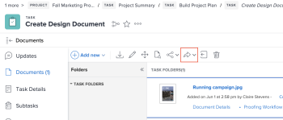

# Send a Document to Experience Manager Assets or Assets Essentials

You can send documents from Workfront to Experience Manager Assets or Assets Essentials. Documents uploaded and sent from Workfront to Assets Essentials still count against your overall document storage. Assets linked from Assets Essentials don't count towards overall storage.

Assets sent to Experience Manager through this integration have a size limit of **5 GB**.

Metadata fields are first mapped when you send an asset from Workfront to Experience Manager Assets or Assets Essentials. Any metadata configured to map for parent objects is sent as well. For more information on configuring metadata mapping, see [Configure the Experience Manager Assets as a Cloud Service integration](/help/quicksilver/administration-and-setup/configure-integrations/configure-aacs-integration.md) or [Configure the Experience Manager Assets Essentials integration](/help/quicksilver/documents/adobe-workfront-for-experience-manager-assets-essentials/setup-asset-essentials.md).

>[!INFO]
>
>**Example** When you first send an asset attached to a task, the task metadata maps to Experience Manager Assets or Assets Essentials as well as any mapped metadata from parent objects such as a project, portfolio, and program.

## Access requirements

You must have the following:

<table style="table-layout:auto"> 
 <col> 
 <col> 
 <tbody> 
  <tr> 
   <td role="rowheader"><a href="https://www.workfront.com/plans" target="_blank">Adobe Workfront plan</a>*</td> 
   <td> 
 Any
 </td> 
  </tr> 
  <tr> 
   <td role="rowheader"><a href="../../administration-and-setup/add-users/access-levels-and-object-permissions/wf-licenses.md" class="MCXref xref">Legacy licenses overview</a>*</td> 
   <td> 
Request or higher
 </td> 
  </tr> 
  <tr> 
   <td role="rowheader">Product</td> 
   <td>You must have Experience Manager as a Cloud Service or Assets Essentials, and you must be added to the product as a user in the Admin Console.
</td> 
  </tr> 
  <tr> 
   <td role="rowheader">Access level configurations*</td> 
   <td> 
Edit access to Documents
 
Note: If you still don't have access, ask your Workfront administrator if they set additional restrictions in your access level. For information on how a Workfront administrator can modify your access level, see <a href="../../administration-and-setup/add-users/configure-and-grant-access/create-modify-access-levels.md" class="MCXref xref">Create or modify custom access levels</a>.
 </td> 
  </tr> 
  <tr> 
   <td role="rowheader">Object permissions</td> 
   <td> 
View access or higher on Documents
 
For information on requesting additional access, see <a href="../../workfront-basics/grant-and-request-access-to-objects/request-access.md" class="MCXref xref">Request access to objects </a>.
 </td> 
  </tr> 
 </tbody> 
</table>

&#42;To find out what plan, license type, or access you have, contact your Workfront administrator.

## Prerequisites

Before you begin, 

* Your Workfront Administrator must configure an Experience Manager integration. For more information, see [Configure the Experience Manager Assets as a Cloud Service integration](/help/quicksilver/administration-and-setup/configure-integrations/configure-aacs-integration.md) or [Configure the Experience Manager Assets Essentials integration](/help/quicksilver/documents/adobe-workfront-for-experience-manager-assets-essentials/setup-asset-essentials.md).

## Send a Document from Workfront

When a user sends a document from Workfront to Experience Manager Assets or Assets Essentials, mapped metadata transfers along the document. After the document is sent, changes made to the document's metadata in Workfront are not reflected in Assets or Assets Essentials. If a mapped field in Workfront is changed, you must send a new version of the document with the updated metadata to Assets or Assets Essentials. To set up or edit metadata, see [Configure the Experience Manager Assets as a Cloud Service integration](/help/quicksilver/administration-and-setup/configure-integrations/configure-aacs-integration.md) or [Configure the Experience Manager Assets Essentials integration](../../documents/adobe-workfront-for-experience-manager-assets-essentials/setup-asset-essentials.md).

To send a document:

1. Go to the **Documents** area in Workfront, and select the document you want to send.
1. Click **Send to**, then choose the Experience Manager integration your administrator set up.

   >[!NOTE]
   >
   >The Workfront administrator can choose any name for this integration, so it may not specifically mention Assets or Assets Essentials.

   

1. Choose where you want the asset to go, then click **Select Folder**.
1. When you find your desired destination, click **Save**.

## Send a new version

You can add a new version to a document you have previously uploaded to Workfront. For more information, see [Upload a new version of a document](../../documents/managing-documents/upload-new-document-version.md). After the latest version is uploaded, you can send it to Assets Essentials. If a mapped field in Workfront has changed, the new version updates the metadata in Assets Essentials when it sends.

>[!IMPORTANT]
>
>Before you upload a new version to Workfront, we recommend renaming the file. If you upload a new version with the exact same file name as a previous version, only the most recent version can be downloaded from Workfront. All versions can be downloaded from Experience Manager Assets or Assets Essentials regardless of the file name.

To send the most recent version:

1. Go to the **Documents** area in Workfront, and locate the document.
1. Select **Send to**, then choose the Experience Manager integration your administrator set up.

   >[!NOTE]
   >
   >The Workfront administrator can choose any name for this integration, so it might not specifically mention Assets or Assets Essentials.

   

1. Click **Save**. The new version saves in the same location as the previous version.

## Move a document to a linked folder in Experience Manager Assets

>[!NOTE]
>
>This functionality is only available for Experience Manager Assets as a Cloud Service. It is not available for Experience Manager Assets Essentials.

You can move a document to a linked folder in Experience Manager Assets if both the document and the linked folder are in the same document list (such as the document area of a project). 

1. Locate the document that you want to move.
1. Drag and drop the document onto the linked Experience Manager Assets folder that you want to move it to.

The document options are not available while the document is in the process of moving. After the document is moved to Experience Manager Assets, is no longer visible in the document list in Workfront.

>[!NOTE]
>
> Any actions or edits you make on the document while it is moving will not appear on the document in Experience Manager Assets, and will therefore be lost.

