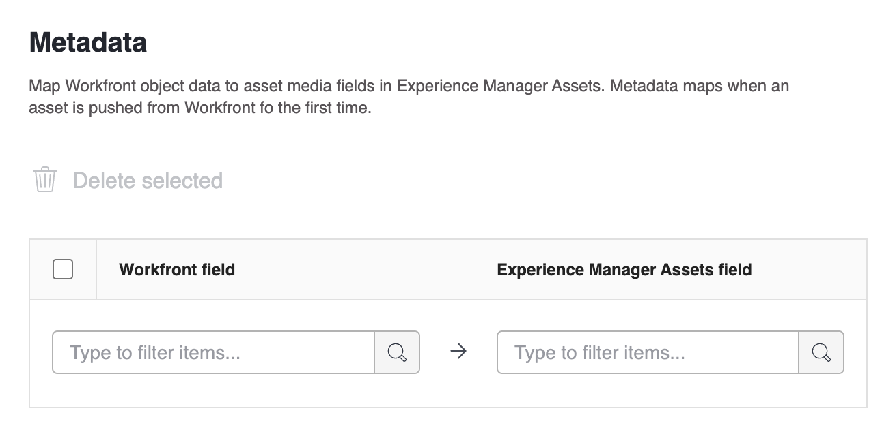

# Configure the Experience Manager Assets Essentials integration

Connect your work with your content in Experience Manager Assets Essentials​:

* Push assets and metadata from Adobe Workfront to Experience Manager Assets Essentials​
* Link assets from Experience Manager Assets Essentials to your projects and tasks in Workfront​
* Facilitate versioning workflows for assets pushed to Experience Manager Assets Essentials

## Access requirements

You must have the following:

<table>
  <tr>
   <td><strong>Adobe Workfront plan*</strong>
   </td>
   <td>Any
   </td>
  </tr>
  <tr>
   <td><strong>Adobe Workfront licenses*</strong>
   </td>
   <td>Plan
   </td>
  </tr>
  <tr>
   <td><strong>Experience Manager license</strong>
   </td>
   <td>Standard
   </td>
  </tr>
  <tr>
   <td><strong>Product</strong>
   </td>
   <td>You must have Experience Manager Assets Essentials, and you must be added to the product as a user in the Admin Console.
   </td>
  </tr>
  <tr>
   <td><strong>Access level configurations</strong>
   </td>
   <td>You must be a Workfront administrator. For information on Workfront administrators, see <strong>Grant a user full administrative access</strong>.
   </td>
  </tr>
</table>

*To find out what plan, license type, or access you have, contact your Workfront administrator.

## Set up the integration

1. Click the **Main Menu** icon in the upper-right corner of Adobe Workfront, then click **Setup**.
1. Select  **Documents**  in the left panel, then select **Experience Manager Integration**.
1. Select **Add Experience Manager Integration**.
1. Specify the following:

   <table>
   <tr>
      <td><strong>Name</strong>
      </td>
      <td>Enter the name you want users to see in the Add new button in the Documents area.
      </td>
   </tr>
   <tr>
      <td><strong>Navigation URL</strong>
      </td>
      <td>The system automatically populates the Navigation URL. This URL is used to link to your organization's Assets Essentials instance from the Main Menu for quick access.
      </td>
   </tr>
   <tr>
      <td>
      <strong>Experience Manager Assets repository</strong>
      </td>
      <td>
      The system automatically populates the Experience Manager repository associated with your Organization ID.
      </td>
   </tr>
   </table>

1. Click **Save** or move on to the [Set up metadata (optional)](#set-up-metadata-optional) section in this article.

## Set up metadata (optional)

Map Workfront object data to asset media fields in Experience Manager Assets. Metadata maps when an asset is pushed from Workfront for the first time.

### Prerequisites

Before you begin, you must

* Configure a metadata schema in Experience Manager Assets Essentials as explained in [Configure asset metadata mapping between Adobe Workfront and Experience Manager Assets](https://experienceleague.adobe.com/docs/experience-manager-cloud-service/content/assets/integrations/configure-asset-metadata-mapping.html?lang=en).
* (Optional) Configure custom form fields in Workfront. Workfront has many built-in custom fields you can use. However, you can also create your own custom fields. For more information, see [Create or edit a custom form](/help/quicksilver/administration-and-setup/customize-workfront/create-manage-custom-forms/create-or-edit-a-custom-form.md).

+++ **Supported Workfront and Experience Manager Assets fields** 

**AEM Tags**

You can map any Workfront supported field to a tag in Experience Manager Assets Essentials. 

<!--To do this, you must ensure that tag values in Experience Manager Assets match Workfront. 

* Tags and Workfront field values must be an exact match in spelling, and format. 
* Workfront field values that are mapped to experience Manager assets tags must be all lowercase, even if the tag in Experience Manager Assets appears to have uppercase letters.
* Workfront field values must not include spaces.
* The field value in Workfront must also include the folder structure of the Experience Manager Assets tag.

>[!INFO]
>
>**Example**:  To match the tag shown in the folder structure here, the field value in Workfront would be `landscapes:trees/spruce`. Note the lowercase letters in the Workfront field value.
>
>If you want the tag to be leftmost item in the tag tree, it must be followed by a colon. In this example, to map to the landscapes tag, the field value in Workfront would be `landscapes:`.
>
>

After you have created the tags in Experience Manager Assets, they will appear under the Tags drop-down in the Metadata section. 

-->
To link a field to a tag, select `dc:subject` in the Experience Manager Assets field dropdown in the metadata mapping area.

For more information on tags in Experience Manager Assets, including how to create and manage tags, see [Administering Tags]( https://experienceleague.adobe.com/docs/experience-manager-64/administering/contentmanagement/tags.html?lang=en).

<!--
**AEM custom fields**

-->

**Workfront fields**

You can map both built-in and custom Workfront fields to Experience Manager Assets. The following field values must match in both case and spelling between Workfront and Experience Manager Assets:

* Drop-down fields
* Multi-select fields

>[!TIP]
>
> To check if the field values match exactly, go to 
> * Setup > Custom Forms in Workfront or the field in the object
> * Assets > metadata schemas in Experience Manager Assets

+++

### Assets

Metadata maps when an asset is pushed from Workfront for the first time. Documents with the built-in or custom fields automatically map to the specified fields the first time an asset is sent to Experience Manager Assets Essentials.

1. In the **Workfront field** column, choose a built-in or custom Workfront field.
   >[!NOTE]
   >
   >You can map a single Workfront field to multiple Experience Manager Assets fields. You can't map multiple Workfront fields to a single Experience Manager Assets field.
1. In the **Experience Manager** field, choose an Experience Manager Assets field.
   
   To map a Workfront field to an Experience Manager Assets tag, select `dc:subject`.
1. Repeat steps 1 and 2 as needed.

1. Click **Save** or move on to the [Set up linked folders (optional)](#set-up-linked-folders-optional) section in this article.

## Set up linked folders (optional)

{{setup-linked-folder}}
