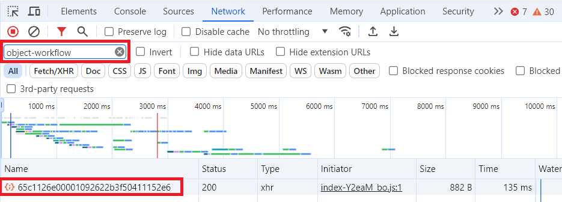
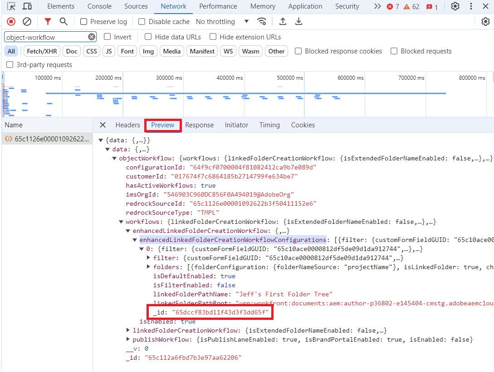

# Use Workfront Fusion to convert a Workfront issue to a project that includes Adobe Experience Manager workflows

If you are creating a project through Workfront Fusion and want to include Adobe Experience Manager workflows on the project, you must use a specific Fusion module configuration, described in this article.

>[!NOTE]
>
>Workflows are available only in an Adobe Experience Manager as a Cloud Service integration. They are not available in integrations with Adobe Experience Manager Assets Essentials.


## Access requirements

You must have the following:

<table>
  <tr>
   <td><strong>Adobe Workfront plan*</strong>
   </td>
   <td>Any
   </td>
  </tr>
  <tr>
   <td><strong>Adobe Workfront licenses*</strong>
   </td>
   <td>Request or higher
   </td>
  </tr>
  <tr>
   <td><strong>Product</strong>
   </td>
   <td><b>Adobe Experience Manager<b>:<ul><li><p>You must have Experience Manager Assets as a Cloud Service or Assets Essentials, and you must be added to the product as a user in the Admin Console.</p></li><li><p>You must have write access to the repository in Adobe Experience Manager.</p></li></ul>
  <b>Workfront Fusion</b>:<p>New:</p> <ul><li>[!UICONTROL Select] or [!UICONTROL Prime] [!DNL Workfront] Plan: Your organization must purchase [!DNL Adobe Workfront Fusion].</li><li>[!UICONTROL Ultimate] [!DNL Workfront] Plan: [!DNL Workfront Fusion] is included.</li></ul>   <p>Or</p>
   <p>Current: Your organization must purchase [!DNL Adobe Workfront Fusion].</p>
   </td>
  </tr>
  <tr>
   <td><strong>Access level configurations*</strong>
   </td>
   <td>Edit access to Documents
<p>
<strong>Note: </strong>If you still don't have access, ask your Workfront administrator if they set additional restrictions in your access level. For information on how a Workfront administrator can modify your access level, see <strong>Create or modify custom access levels</strong>.
   </td>
  </tr>
</table>

## Prerequisites

Before you begin,

* Your Workfront administrator must configure workflows in an Adobe Experience Manager integration. For more information, see [Configure the Experience Manager Assets as a Cloud Service integration](../../administration-and-setup/configure-integrations/configure-aacs-integration.md#set-up-workflows-optional).
* You must have a project template configured with an Adobe Experience Manager integration linked folder workflow.
* You must have created an OAuth application in Workfront to configure the connection for this module.

   For instructions, see [Create an OAuth application](#create-an-oauth-application) in this article.

## Module configuration

In Workfront Fusion, if you want to create a project that includes Adobe Experience Manager workflows, you must use the Workfront > Misc Action module.

1. Add the **Workfront** > **Misc Action** module to your scenario.
1. In the **Connection** field, select the Workfront connection that connects to the account this module will use.

   For instructions on creating a connection, see [Connect [!DNL Workfront] to [!DNL Workfront Fusion]](/help/quicksilver/workfront-fusion/apps-and-their-modules/workfront-modules.md#connect-workfront-to-workfront-fusion) in the article Workfront modules.

   For instructions on creating the Client ID and Client Secret you will need to create a connection, see [Create an OAuth application](#create-an-oauth-application) in this article.

1. In the **Record Type** field, select `Issue`.
1. In the **Action** field, select `convertToProject`.
1. In the **ID** field, enter or map the ID of the issue that you are converting to a project.
1. Enable **Show advanced settings**.
1. Scroll to the bottom of the module and locate the **Project (Advanced Collection)** field.
1. Paste the following text into the **Project (Advanced Collection)** field.

   ```
   {
       "aemNativeFolderTreeIDs": ["Folder Tree ID here"],
       "aemNativeFolderWorkflowEnabled": "true",
       "name": "New project name here",
       "templateID": "Template ID here"
   }
   ```

1. Replace `Folder tree ID here` with the folder IDs.

   To locate folder tree IDs, see [Locate folder tree IDs](#locate-folder-tree-ids) in this article.

   To use more than one folder tree, separate IDs with a comma:

   `"aemNativeFolderTreeIDs": ["Folder tree ID here","Second folder tree ID here"],`
1. Replace `New project name here` with the name that the new project will have.
1. Replace `Template ID here` with the ID of the template that you are using for the new project.

   You can map the template ID from a previous module (such as a Workfront > Search module) or locate it in the URL of the template's page in Workfront.

1. Click **OK** to save the module configuration.

## Locate folder tree IDs

To locate the folder tree IDs:

>[!NOTE]
>
>These instructions use the Chrome browser.

1. In Workfront, open the template that you want to use for this project. This template must include the Adobe Experience Manager configuration that you want to use for the project.
1. Open the developer tools for your browser.
1. Open the **Network** tab in the developer tools.
1. In the **Filter** box, enter `object-workflow`.
1. In the Name column, click on the alphanumeric ID that appears.

   

1. Click the **Preview** tab to the right of the alphanumeric ID.
1. Open the following collapsed sections:
   1. `data`
   1. `objectWorkflow`
   1. `workflows`
   1. `enhancedLinkedFolderCreationWorkflow`
   1. `enhancedLinkedFolderCreationWorkflowConfigurations`

    Each folder tree is represented by a number. 0 (zero) represents the first folder in the list, 1 represents the second, and so on. If the template includes only one folder tree, it is number 0.

1. Open the folder tree that you want to use for the new project. Make note of the `_id` field value. If you want to use more than one folder tree, make note of all of the `_id` field values for the folder trees you want to use.

   

   These are the `aemNativeFolderTreeIDs`  values that you will enter into the **Project (Advanced Collection)** field in the **Workfront** > **Misc Actions** Fusion module.

## Create an OAuth application  

You must set up an OAuth application in Workfront for this module's connection. You only need to do this once for a given Workfront connection in Fusion.

1. In Workfront, begin creating an OAuth application, as described in [Create an OAuth2 application using user credentials (Authorization code flow)](/help/quicksilver/administration-and-setup/configure-integrations/create-oauth-application.md#create-an-oauth2-application-using-user-credentials-authorization-code-flow) in the article Create OAuth2 applications for [!DNL Workfront] integrations.
1. Copy the Client ID and Client Secret to a secure location.
1. In the **Redirect URIs** field, enter the following:

   ```
   http://app.workfrontfusion.com/oauth/cb/workfront-workfront
   ```

1. Click **Save**.

You will use this Client ID and Client secret when configuring the module's connection in Fusion.

For instructions on creating a connection, see [Connect [!DNL Workfront] to [!DNL Workfront Fusion]](/help/quicksilver/workfront-fusion/apps-and-their-modules/workfront-modules.md#connect-workfront-to-workfront-fusion) in the article Workfront modules.
