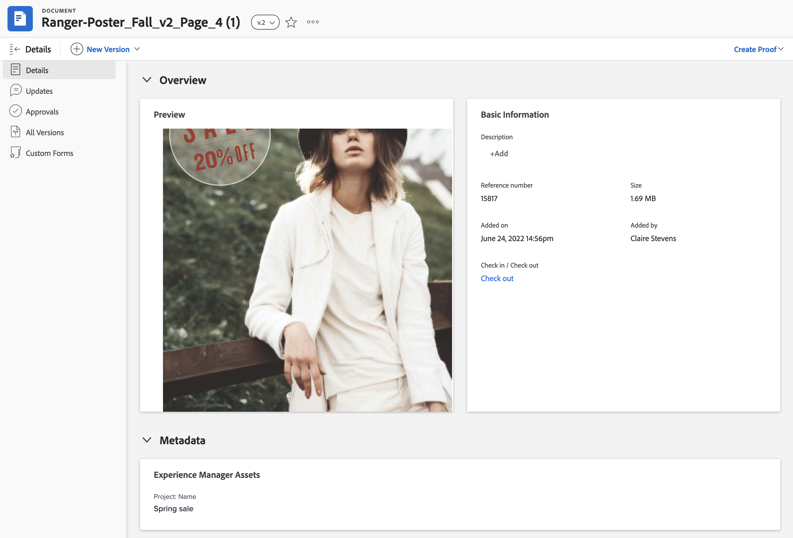
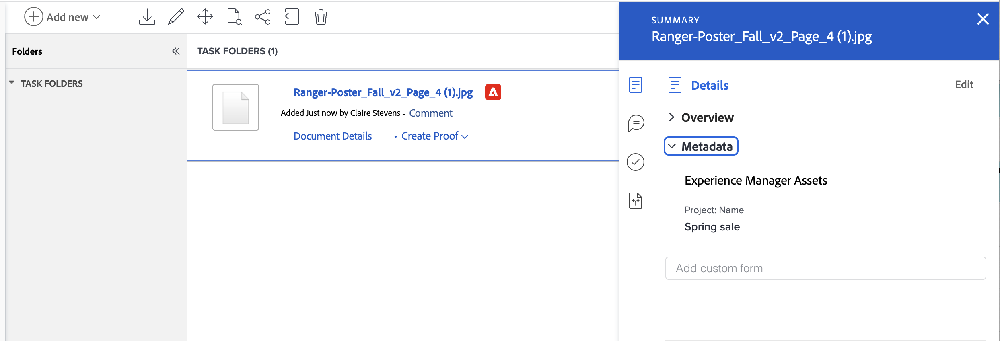

# View mapped metadata for Experience Manager Assets or Assets Essentials

You can see a real-time view of mapped metadata in the Document Details and Summary for documents panel. Metadata fields are first mapped when you send an asset from Workfront to Experience Manager Assets or Assets Essentials. If your Workfront administrator has enabled object metadata sync, fields remain up to date if they are changed in either application.

## Access requirements

+++ Expand to view access requirements for the functionality in this article.

You must have the following:

<table>
  <tr>
   <td><strong>Adobe Workfront plan*</strong>
   </td>
   <td>Any
   </td>
  </tr>
  <tr>
   <td><strong>Adobe Workfront licenses*</strong>
   </td>
   <td>Request or higher
   </td>
  </tr>
  <tr>
   <td><strong>Product</strong>
   </td>
   <td>You must have Experience Manager Assets as a Cloud Service or Assets Essentials, and you must be added to the product as a user in the Admin Console.
   </td>
  </tr>
  <tr>
   <td><strong>Access level configurations*</strong>
   </td>
   <td>Edit access to Documents

<strong>Note: </strong>If you still don't have access, ask your Workfront administrator if they set additional restrictions in your access level. For information on how a Workfront administrator can modify your access level, see <strong>Create or modify custom access levels</strong>.
   </td>
  </tr>
  <tr>
   <td><strong>Object permissions</strong>
   </td>
   <td>View access or higher

For information on requesting additional access, see <strong>Request access to objects </strong>.
   </td>
  </tr>
</table>

*To find out what plan, license type, or access you have, contact your Workfront administrator.

+++

## Prerequisites

Before you begin,

* Your Workfront Administrator must configure an Experience Manager integration. For more information, see [Configure the Experience Manager Assets as a Cloud Service integration](/help/quicksilver/administration-and-setup/configure-integrations/configure-aacs-integration.md) or [Configure the Experience Manager Assets Essentials integration](/help/quicksilver/documents/adobe-workfront-for-experience-manager-assets-essentials/setup-asset-essentials.md).

## Document Details

To open the Metadata panel in the Document Details:

1. Go to the project, task, or issue that contains the document, then select **Documents**.
1. Hover over the document you need, then select **Document Details**.
1. Find and expand the **Metadata** section.

    >[!NOTE]
    >
    >You can't edit fields in this section. They are view-only.

## Summary for documents

To open the Metadata panel in the Summary panel:

1. Go to the project, task, or issue that contains the document, then select **Documents**.
1. Find the document you need.
1. Click the **Summary icon** , then expand the **Metadata** section.

    >[!NOTE]
    >
    >You can't edit fields in this section. They are view-only.

