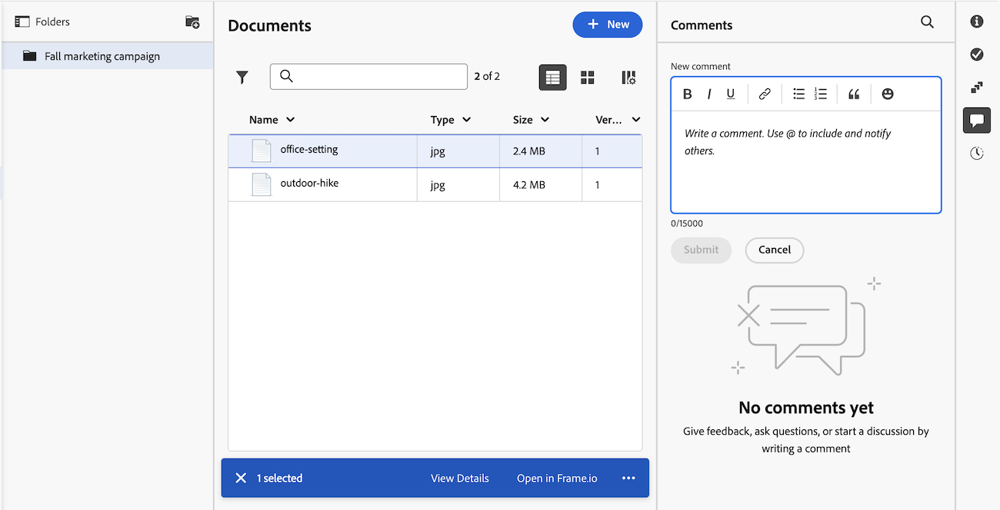

# Add an update to a document

<!--Audited: April, 2024-->

You can add or reply to updates on a document to communicate with collaborators and create an audit trail. For information about adding updates to work items, see see [Update work](../../workfront-basics/updating-work-items-and-viewing-updates/update-work.md).

## Access requirements

+++ Expand to view access requirements for the functionality in this article.

<table style="table-layout:auto"> 
 <col> 
 <col> 
 <tbody> 
  <tr> 
   <td role="rowheader">Adobe Workfront package</td> 
   <td> 
Any Workfront package to manage documents using legacy Workfront storage

Any Workflow package to manage documents using Adobe enterprise storage
 </td> 
  </tr> 
  <tr> 
   <td role="rowheader">Adobe Workfront licenses</td> 
   <td> 
Contributor or higher
 
   
Request or higher

   </td> 
  </tr> 
  <tr> 
   <td role="rowheader">Access level configuration</td> 
   <td> 
View access to Documents
 </td> 
  </tr> 

  <tr> 
   <td role="rowheader">Object permissions</td> 
   <td> 
View access to the document
 </td> 
  </tr> 
 </tbody> 
</table>

For more detail about the information in this table, see [Access requirements in Workfront documentation](/help/quicksilver/administration-and-setup/add-users/access-levels-and-object-permissions/access-level-requirements-in-documentation.md). 

+++

## Add an update to a document in the legacy documents area

If your organization is on legacy Workfront storage, you will see the legacy documents area when you access documents in Workfront. For more information about legacy Workfront storage, see [Differences between legacy Workfront storage and Adobe enterprise storage](/help/quicksilver/review-and-approve-work/esm-overview.md).

### Add or reply to an update for a document

1. Go to the object that contains the document, then select **Documents** in the left panel.
1. Find the document you need, and do one of the following:

   * Click the document in the list, click the **Open Summary** icon  in the upper-right corner, then add a new comment, or click **Reply** to add a reply to an existing comment. For information about the Summary, see [Summary for documents overview](../../documents/managing-documents/summary-for-documents.md).
   * Hover over the document, click **Document Details**, then **Updates** in the left panel. 
      For more information about adding updates to objects, see [Update work](../../workfront-basics/updating-work-items-and-viewing-updates/update-work.md).  

   The updates and replies are added to the document and also to the higher-ranking objects. For more information, see [Update section overview](../../workfront-basics/updating-work-items-and-viewing-updates/updates-tab-overview.md). 

### Add a reply to a proofing comment for a document

In the Updates area, when you reply to a comment someone made while proofing a document, the proofing viewer launches so that you can type your reply there with the context you need. Your reply displays both in the proofing viewer and in the Updates area for the document.

1. Go to the project, task, or issue that contains the document, then select **Documents**.
1. Find the document you need.

1. Click **Reply in proof**, type the comment in the proofing viewer that launches, then click **Reply**.

   If you need information about typing comments and replies in the proofing viewer, see [Comment on a proof](../../review-and-approve-work/proofing/reviewing-proofs-within-workfront/comment-on-a-proof/comment-on-proof-1.md).

## Add an update to a document in the new Documents area

If your organization uses enterprise storage, you will see the new Documents area when you access documents in Workfront. For more information about enterprise storage, see [Adobe enterprise storage overview](/help/quicksilver/review-and-approve-work/esm-overview.md).

1. Go to the object that contains the document, then select **Documents** in the left panel.
1. Find the document you need, then click the comment icon  to open the Comments panel.
1. Type your comment in the text box, then click **Submit**.
   