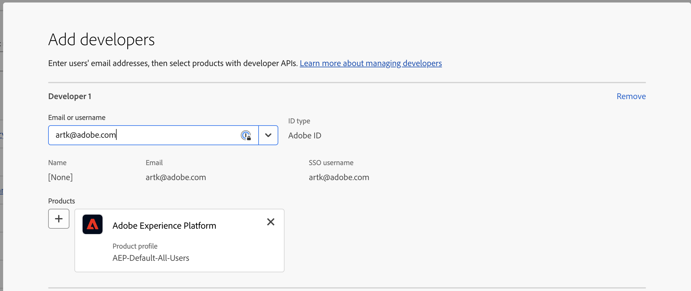
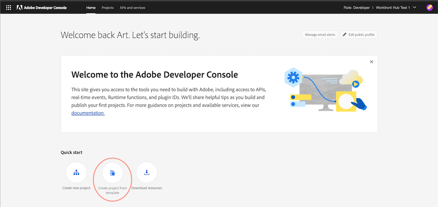
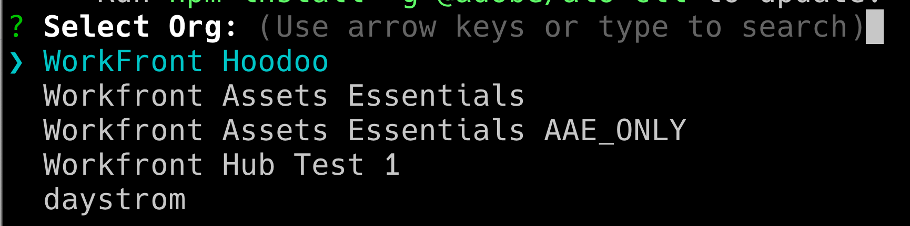
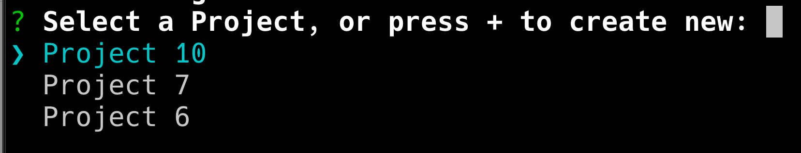
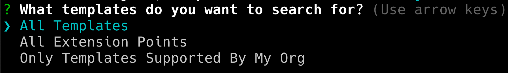
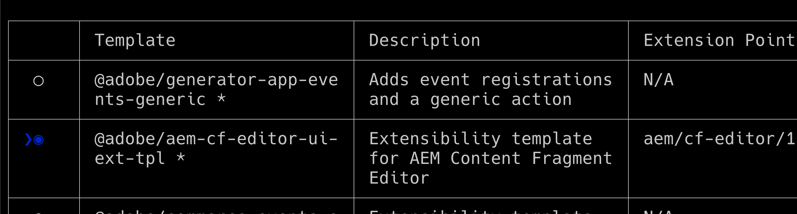
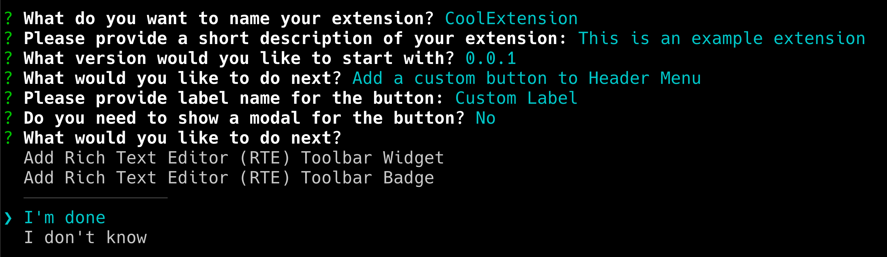
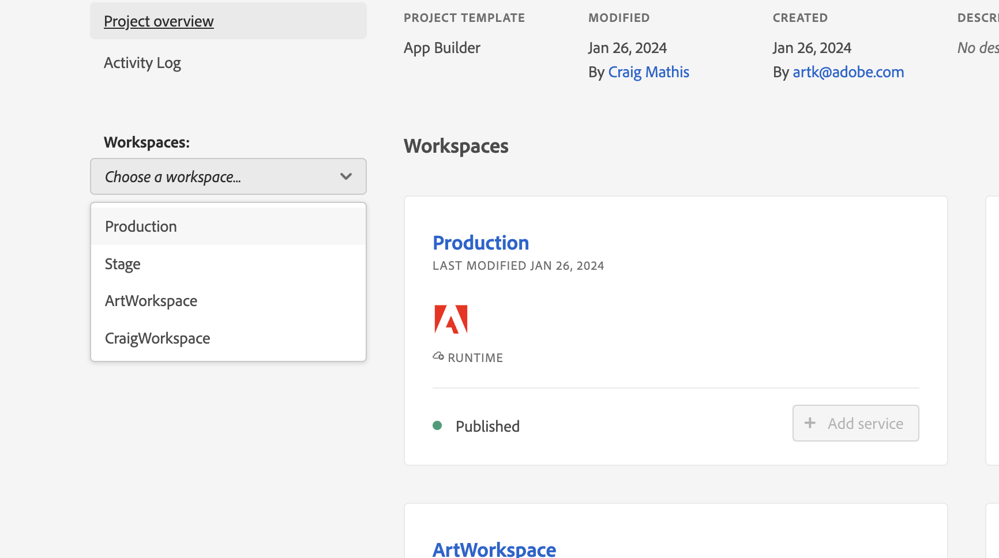

# AppBuilder within Workfront Document Details

You can install AppBuilder within Document Details.

## Prerequisites

You must have the following:

* An IMS-enabled Workfront account
* A dev machine with node v18 and npm

## Add developers to the admin console

>[!IMPORTANT]
>
>Make sure you have selected the right IMS organization for all of the following steps. If you belong to multiple organizations, it's possible to select the wrong one. Make sure you are acting under the right organization, which is usually listed in the top-right corner.


1. Navigate to either of the following:

* Stage: [https://stage.adminconsole.adobe.com/](https://stage.adminconsole.adobe.com/)
* Prod: [https://adminconsole.adobe.com/](https://adminconsole.adobe.com/)

1. In the Users section, click **Developers** > **Add developers**.

    

    >[!NOTE]
    >
    >If you do not see an option to manage Developers, you do not have a product that allows for dev access. Workfront does not provide developer access, but AEM does. If you don't see this, we will need to figure out how to get Workfront included in the list of apps that allows for developers.

1. Add the user's email. It should search existing users that have already been added from within the admin console.

1. Add necessary products to the developer profile, and click **Save**. 



## Get access to AppBuilder

Organizations need to work with their account managers to purchase AppBuilder. The exact process for this is not understood because we didn't need to do this for the POC.

If you want to test AppBuilder integration, you can request a free trial for you IMS org here: 
[https://developer.adobe.com/app-builder/trial/#](https://developer.adobe.com/app-builder/trial/#)

I am under the impression that even though it is a free 30-day trial, they won't actually deactivate the trial after that time.

If AppBuilder is configured properly, you should see "Create project from template" as part of creating a new project (which is covered in the next section).

## Create a new project in the Dev Console

1. Click **Create project from template**.

    >[!IMPORTANT]
    >
    >If you do not see this option, then you are misconfigured in the admin console and do not have access to the app builder catalog. This option only shows when you have access to AppBuilder.

    

1. Select **App Builder**. 

1. Enter a **Project title** and **App name**. Both have defaults, but it will be easier to identify the Project you want later if you customize the value.

    >[!NOTE]
    >
    >There is an option to add additional workspaces on this step. It was suggested to us that we create a workspace for each developer. This keeps secrets and deployments separate from each other as devs work. You should name the workspace with the name of the developer using it. The AIO cli has options for switching the workspace, which we'll cover later.


1. Leave **Include runtime** selected. I don't know why, really, but don't change it!

1. Click **Save**.

## Adobe IO (aio) CLI

Adobe provides an open source CLI that can be used to help create the App Builder applications. Documentation can be found here: [https://github.com/adobe/aio-cli](https://github.com/adobe/aio-cli) as well as Adobe App Builder Instructions [https://developer.adobe.com/app-builder/docs/getting_started/first_app/](https://developer.adobe.com/app-builder/docs/getting_started/first_app/).

1. Installation
    1. To install the tool, (make sure you are on node v18 first) run: `npm install -g @adobe/aio-cli `

1. Authenticate in Terminal
    1. Launch your terminal and log in to AIO with the command: `aio login`

1. Initialize Your Application
    1. Begin setting up your app by running: `aio app init example-app`

1. Configuration Selection
    1. Proceed to select your Organization and Project from the provided options.      
        
        

1. Template Selection and Setup
    1. Browse all available templates, and choose the** @adobe/aem-cf-editor-ui-ext-tpl** template for your project.
         
        

1. Define Your Extension
    1. Name your extension.
    1. Provide a descriptive summary of your extension's functionality.
    1. Select an initial version number to start with.
    1. Confirm completion by selecting **I'm done**.


1. Navigate to Your Project Folder
    1. Access the src folder
    1. Rename the folder aem-cf-editor-1 to workfront-doc-details-1

1. Modify Configuration Files
    1. Open app.config.yaml
    1. Update the line from `aem/cf-editor/1` to `workfront/doc-details/1`
    1. Adjust the include path from `src/aem-cf-editor-1/ext.config.yaml` to `src/workfront-doc-details-1/ext.config.yaml`

1. Edit the Extension Registration Component
    1. Open `src/workfront-doc-details-1/web-src/src/components/ExtensionRegistration.js`.
    1. In the methods section, add a function `secondaryNav` that contains an asynchronous function `getButtons`.
    1. `getButtons` should receive an object with the following structure: 
        ```
            {
            docId: "String",  // Document ID
            docvId: "String", // Document version ID
            sharedContext: {
                hostname: "String",
                protocol: "String",
                auth: {
                imsOrgID: "String",    // Customer's IMS Org ID
                imsToken: "String",    // User's IMS token
                imsClientId: "String"
                }
            }
            }
        ```

1. This function returns an array of button objects that will appear in the navigation: 

    ```
        methods: {
        secondaryNav: {
            async getButtons({docId, docvId, sharedContext}) {
            return [
                { label: 'Registration', url: '/index.html' },
                { label: 'Review', url: '/index.html#review' }
            ];
            }
        }
        }
    ```

1. Configure Application Routing
    1. Open your App.js file and configure the routes to include the newly developed functionalities. You will need to set up routes for the default view and any additional views like the review page. Here's how you might define these routes:

        ```
            <Route index element={<ExtensionRegistration />} />
            <Route exact path="index.html" element={<ExtensionRegistration />} />
            <Route exact path="review" element={<Review />} />
        ```

1. Access Document Details
    1. Implement the provided function `document.getDocumentDetails` within your application to fetch essential document specifics. This function retrieves an object containing `docId` and `docvId`, alongside a `sharedContext` object with `hostname`, `protocol`, and authentication details. Ensure your application appropriately handles this data.

1. Integrate Data Fetching in Your Components
    1. Add a new component to your application's components folder. Within this component, establish a connection to Workfront to retrieve document information and authentication data using the connection established with the host application. Here's an example of how you can structure your component to handle this: 
        ```

            import { useEffect, useState } from 'react';
            import { attach } from "@adobe/uix-guest";
            import { extensionId } from "./Constants";

            function Review() {
                const [conn, setConn] = useState();

                useEffect(() => {
                const iife = async () => {
                    // "attach" the guest application to the host. This creates a "tunnel" from the host app that allows data to be passed to the iframe running this app.
                    const connection = await attach({
                    id: extensionId,
                    });
                    setConn(connection);
                };

                iife();
                }, []);

                useEffect(() => {
                    if (conn) {
                        // Using the connection created above, grab the document details from the host tunnel.
                        conn?.host?.document?.getDocumentDetails().then(setDocDetails);
                        // Pull the auth tokens from the sharedContext (see host app for details)
                        setAuth(conn?.sharedContext?.get("auth"));
                        setHostname(conn?.sharedContext?.get("hostname"));
                        setProtocol(conn?.sharedContext?.get("protocol"));
                    }
                }, [conn]);

            return (<>Text</>);
            }

            export default Review;

        ```

## Configuration for Existing AIO Projects

1. Update Configuration Files
    1. Open `app.config.yaml`.
    1. Modify the configuration by updating the reference from `aem/cf-editor/1` to `workfront/doc-details/1`. This adjustment aligns the file paths with your current project structure.

1. Revise the Extension Registration Component
    1. Locate and open the file named `ExtensionRegistration.js`.
    1. In the methods section, add a function `secondaryNav` that contains an asynchronous function `getButtons`.
    1. `getButtons` should receive an object with the following structure: 

        ```
            {
            docId: "String",  // Document ID
            docvId: "String", // Document version ID
            sharedContext: {
                hostname: "String",
                protocol: "String",
                auth: {
                imsOrgID: "String",    // Customer's IMS Org ID
                imsToken: "String",    // User's IMS token
                imsClientId: "String"
                }
            }
            }

        ```

1. This function returns an array of button objects that will appear in the navigation: 

    ```
        methods: {
        secondaryNav: {
            async getButtons({docId, docvId, sharedContext}) {
            return [
                { label: 'Registration', url: '/index.html' },
                { label: 'Review', url: '/index.html#review' }
            ];
            }
        }
        }

    ```    

1. Configure Application Routing
    1. Open your `App.js`file and configure the routes to include the newly developed functionalities. You will need to set up routes for the default view and any additional views like the review page. Here's how you might define these routes: 

        ```
            <Route index element={<ExtensionRegistration />} />
            <Route exact path="index.html" element={<ExtensionRegistration />} />
            <Route exact path="review" element={<Review />} />

        ```

1. Access Document Details
    1. Implement the provided function `document.getDocumentDetails` within your application to fetch essential document specifics. This function retrieves an object containing `docId` and `docvId`, alongside a `sharedContext` object with `hostname`, `protocol`, and authentication details. Ensure your application appropriately handles this data.

1. Integrate Data Fetching in Your Components
    1. Add a new component to your application's components folder. Within this component, establish a connection to Workfront to retrieve document information and authentication data using the connection established with the host application. Here's an example of how you can structure your component to handle this: 

        ```

            import { useEffect, useState } from 'react';
            import { attach } from "@adobe/uix-guest";
            import { extensionId } from "./Constants";

            function Review() {
                const [conn, setConn] = useState();

                useEffect(() => {
                const iife = async () => {
                    // "attach" the guest application to the host. This creates a "tunnel" from the host app that allows data to be passed to the iframe running this app.
                    const connection = await attach({
                    id: extensionId,
                    });
                    setConn(connection);
                };

                iife();
                }, []);

                useEffect(() => {
                    if (conn) {
                        // Using the connection created above, grab the document details from the host tunnel.
                        conn?.host?.document?.getDocumentDetails().then(setDocDetails);
                        // Pull the auth tokens from the sharedContext (see host app for details)
                        setAuth(conn?.sharedContext?.get("auth"));
                        setHostname(conn?.sharedContext?.get("hostname"));
                        setProtocol(conn?.sharedContext?.get("protocol"));
                    }
                }, [conn]);

            return (<>Text</>);
            }

            export default Review;
        ```

## Publish applications

>[!IMPORTANT]
>
>Make sure you have the right IMS org selected for each of the following steps.

In order to have a guest application loaded within Workfront, the application needs to be pushed to the Production workspace and submitted for approval.

1. Deploy the application to the Production workspace
    1. `aio app use -w Production `
    1. `aio app deploy `

1. Navigate to [https://developer-stage.adobe.com/](https://developer-stage.adobe.com/) or [https://developer.adobe.com/](https://developer.adobe.com/).
    1. Click **Console** in the upper right-hand corner.

1. Find the project that you used to create the AppBuilder application.

1. Select the Production Workspace.
    

1. Submit the application for Private review (you will get warnings that we aren't publishing to the app exchange marketplace, which is fine).

1. Fill out the form (title, description, icon, and note to reviewer).
    

>[!IMPORTANT]
>
>Once submitted, a system admin for the organization will need to approve the submission.

## Approve the submission

1. As a system admin, navigate to [https://stage.exchange.adobe.com/](https://stage.exchange.adobe.com/) or [https://exchange.adobe.com/](https://exchange.adobe.com/).

1. Click **Manage** > **Experience Cloud Applications**. You should see the submitted apps with options to approve/reject. 
Once approved, the published application extensions should automatically load in your Workfront environment. 

## Additonal Help

Adobe has great documentation on how to get started building apps for AppBuilder and getting them deployed. Here are some helpful links:

* [https://developer.adobe.com/app-builder/docs/getting_started/first_app/#4-bootstrapping-new-app-using-the-cli](https://developer.adobe.com/app-builder/docs/getting_started/first_app/#4-bootstrapping-new-app-using-the-cli)

* [https://developer.adobe.com/uix/docs/guides/publication/](https://developer.adobe.com/uix/docs/guides/publication/)

* [https://developer.adobe.com/uix/docs/services/aem-cf-console-admin/extension-development/](https://developer.adobe.com/uix/docs/services/aem-cf-console-admin/extension-development/)

