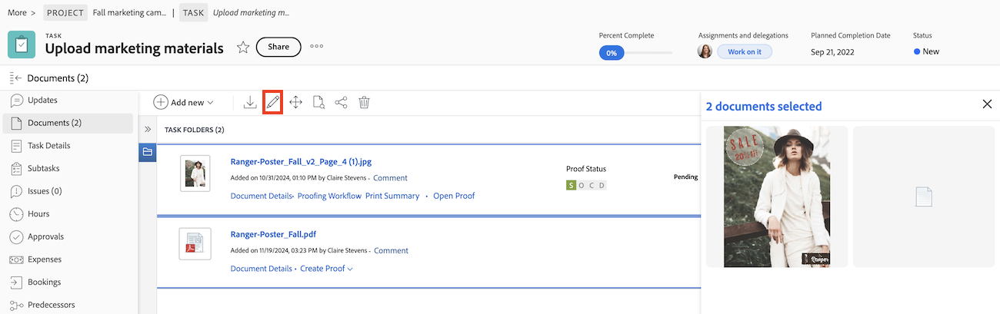

The information on this page refers to functionality not yet generally available. It is available only in the Preview Sandbox environment.

# Edit documents in bulk

You can edit the description, add custom forms, and edit custom forms across multiple documents at once. 

## Considerations when editing custom forms

Consider the following when editing document custom forms in bulk:

* The information you are changing on all the documents selected overwrites the existing information on individual documents.
* When you select documents that have different values for the same field, the field displays a "Multiple values" indicator. Fields that are checkboxes, radio buttons, and toggles have a "Multiple values" indicator next to them.
* When you update one option in a multiple-option field (such as a field that displays as a set of toggles or checkboxes), all other options must match between the selected documents.

    >[!BEGINSHADEBOX]

    **Example**
    You might have a custom form with a checkbox field with three checkboxes (Option1, Option 2, and Option 3) and Option 1 is unchecked for all selected documents, and Option 2 and 3 are checked for some and unchecked for other documents that you selected. If you want to check Option 1 for all documents, you must also make Option 2 and 3 match for all the selected projects before you can save your changes. So you must either select them or deselect them so that they can match on all the selected projects. If you do not change any of the options, you can save the field as is, and the documents maintain their current selection for all options.

    >[!ENDSHADEBOX]

## Access Requirements

+++ Expand to view access requirements for the functionality in this article.

You must have the following:

<table style="table-layout:auto"> 
 <col> 
 <col> 
 <tbody> 
  <tr> 
   <td role="rowheader">Adobe Workfront plan*</td> 
   <td> 
 Any
 </td> 
  </tr> 
  <tr> 
   <td role="rowheader">Adobe Workfront licenses*</td> 
   <td>
 New: Contributor or higher
 
   
 Current: Request or higher
 </td> 
  </tr> 
  <tr> 
   <td role="rowheader">Access level configurations*</td> 
   <td> 
Edit access to Documents
 
Note: If you still don't have access, ask your Workfront administrator if they set additional restrictions in your access level. For information on how a Workfront administrator can modify your access level, see <a href="../../administration-and-setup/add-users/configure-and-grant-access/create-modify-access-levels.md" class="MCXref xref">Create or modify custom access levels</a>.
 </td> 
  </tr> 
  <tr> 
   <td role="rowheader">Object permissions</td> 
   <td> 
Manage access to the Document
 
For information on requesting additional access, see <a href="../../workfront-basics/grant-and-request-access-to-objects/request-access.md" class="MCXref xref">Request access to objects </a>.
 </td> 
  </tr> 
 </tbody> 
</table>

&#42;To find out what plan, license type, or access you have, contact your Workfront administrator.

+++

## Edit documents in bulk

To edit documents in bulk:

1. Navigate to the Documents tab of a project or the Documents area from the main menu.
1. Press ctrl or cmd on your keyboard, and select the documents you want to edit. 
1. Click the Edit icon .
    
1. (Optional) Add or edit the **Description**. If the description on each document is different, you will see _Multiple values_ in the description box. You can add the same description for all documents, but you cannot edit individual document descriptions when editing in bulk.
1. Make the following changes with custom forms:

    <table>
    <tr>
    <td><strong>Add forms</strong></td>
    <td>In the <strong>Add custom form box</strong>, you can choose from Attached forms and forms to add. Attached forms are on some of the selected documents, but not all. A form attached to all selected document displays in the edit window automatically.  </td>
    </tr>
    <tr>
    <td><strong>Edit forms</strong></td>
    <td>Edit any attached custom forms. The information you change overwrites the existing information on individual documents. Fields with different values across documents display as "Multiple values". </td>
    </tr>
    <tr>
    <td><strong>Rearrange forms</strong></td>
    <td>Click and drag the custom form to rearrange.</td>
    </tr>
    </table>
1. Click **Save**. 

