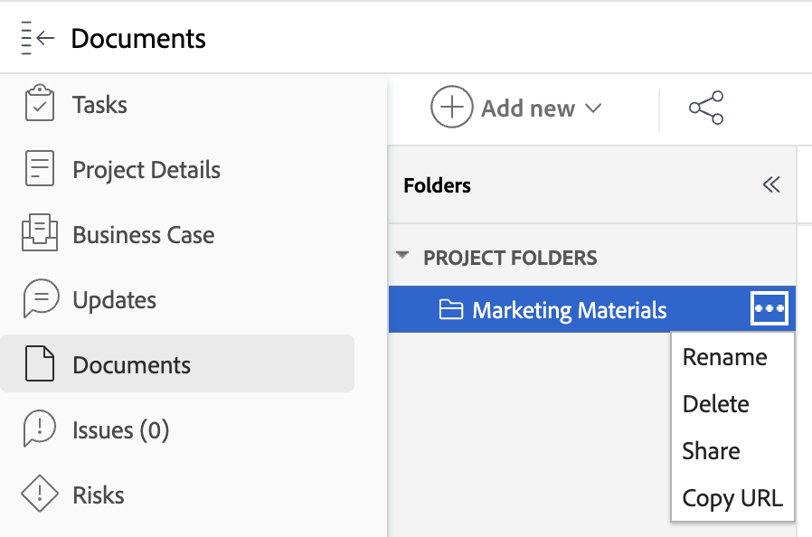

# Copy and share a link to a document folder

You can copy a direct link for any document folder contained in any of the following [!DNL Workfront] objects: [!UICONTROL Program], [!UICONTROL Portfolio], [!UICONTROL Project], [!UICONTROL Task], or [!UICONTROL Issue]. You can't copy a link for any folders contained in the [!UICONTROL Documents] area from the Main Menu, as those folders are linked directly to your user profile and can't be shared with others. 

## Access Requirements

+++ Expand to view access requirements for the functionality in this article.

You must have the following access to perform the steps in this article:

<table style="table-layout:auto"> 
 <col> 
 <col> 
 <tbody> 
  <tr> 
   <td role="rowheader">Adobe Workfront plan*</td> 
   <td> 
Any
 </td> 
  </tr> 
  <tr> 
   <td role="rowheader">Adobe Workfront license*</td> 
   <td> 
Work or higher
 </td> 
  </tr> 
  <tr> 
   <td role="rowheader">Access level configurations*</td> 
   <td> 
View access to Documents
 
Note: If you still don't have access, ask your Workfront administrator if they set additional restrictions in your access level. For information on how a Workfront administrator can modify your access level, see <a href="../../administration-and-setup/add-users/configure-and-grant-access/create-modify-access-levels.md" class="MCXref xref">Create or modify custom access levels</a>.
 </td> 
  </tr> 
  <tr> 
 </tbody> 
</table>

&#42;To find out what plan, license type, or access you have, contact your Workfront administrator.

+++

## Copy and share a link to a document folder

To copy a link to a document folder:

1. Navigate to the [!DNL Workfront] object that contains the document folder. 
1. Click the **[!UICONTROL More]** menu, then select **[!UICONTROL Copy URL]**. You can share this link to provide quick access to the folder. Users must have at least View access to the object to view the folder.
    
