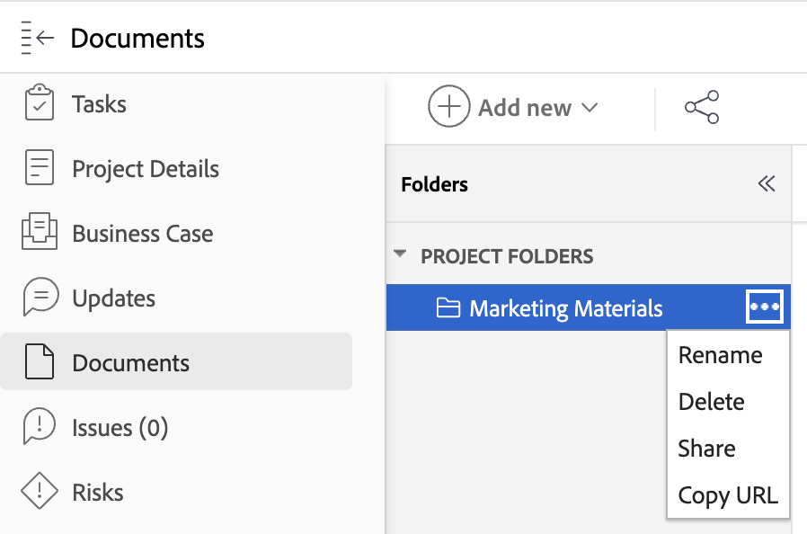

# Copy and share a link to a document folder

You can copy a direct link for any document folder contained in any of the following [!DNL Workfront] objects: [!UICONTROL Program], [!UICONTROL Portfolio], [!UICONTROL Project], [!UICONTROL Task], or [!UICONTROL Issue]. You can't copy a link for any folders contained in the [!UICONTROL Documents] area from the Main Menu, as those folders are linked directly to your user profile and can't be shared with others. 

>[!NOTE]
>
>This functionality is not available in the new Documents area. 
>If your organization uses Adobe cloud storage, you will see the new Documents area when you access documents in Workfront. For more information about Adobe cloud storage, see [Adobe cloud storage overview](/help/quicksilver/review-and-approve-work/esm-overview.md).

## Access Requirements

+++ Expand to view access requirements for the functionality in this article.

<table style="table-layout:auto"> 
 <col> 
 <col> 
 <tbody> 
  <tr> 
   <td role="rowheader">Adobe Workfront package</td> 
   <td> 
Any
 </td> 
  </tr> 
  <tr> 
   <td role="rowheader">Adobe Workfront license</td> 
   <td> 
   
Standard

   
Work or higher
 </td> 
  </tr> 
  <tr> 
   <td role="rowheader">Access level configurations</td> 
   <td> 
View access to Documents
 </td> 
  </tr> 
  <tr> 
 </tbody> 
</table>

For more detail about the information in this table, see [Access requirements in Workfront documentation](/help/quicksilver/administration-and-setup/add-users/access-levels-and-object-permissions/access-level-requirements-in-documentation.md). 

+++

## Copy and share a link to a document folder

To copy a link to a document folder:

1. Navigate to the [!DNL Workfront] object that contains the document folder. 
1. Click the **[!UICONTROL More]** menu, then select **[!UICONTROL Copy URL]**. You can share this link to provide quick access to the folder. Users must have at least View access to the object to view the folder.
    
